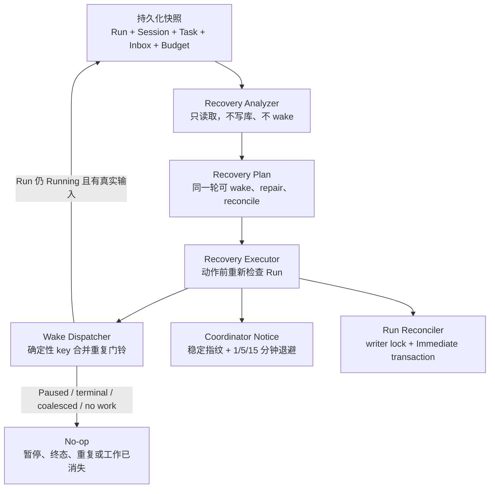
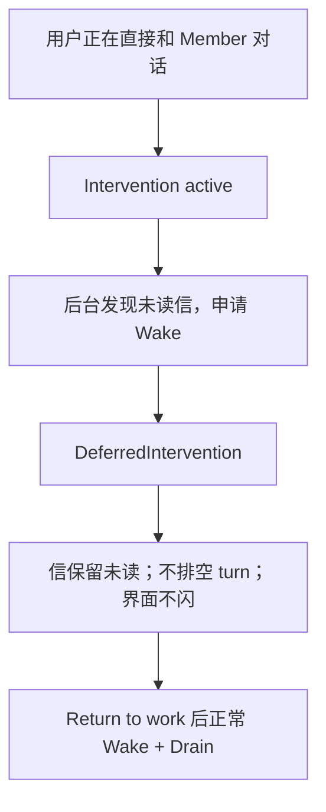
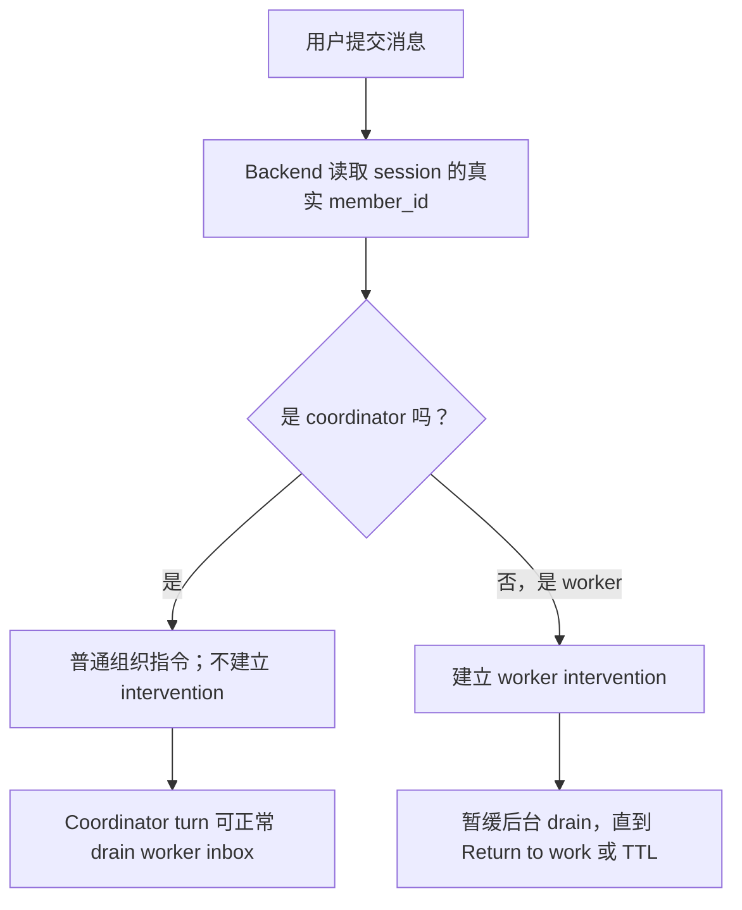
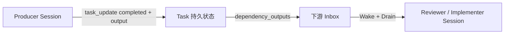
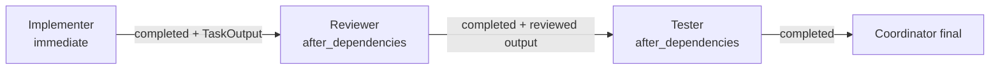

# Agent Org Recovery 与一致性加固：最终代码审计报告

> 审计日期：2026-07-13
> 分支：`fix/issue-272-agent-org-recovery-invariants`
> 基线：`develop` / `ea8516092`
> 范围：GitHub issue #272、相邻的 Agent Org 状态一致性、恢复、调度、任务原子性、CLI 能力边界和对应 UI 入口
> 结论：依赖确认门、显式 Coordinator 指派、Planner 审批、生命周期收尾和 Pause/Resume 已通过连续真人 dev 验收；最终提交仍以本次全量检查与 Husky hooks 的实际结果为准。

## 一句话结论

这次把 Agent Org 从“看见像卡住了就尝试叫人、甚至按时间抢任务”，改成了“先读数据库做无副作用诊断，再按持久预算、真实任务资格和 run 状态执行恢复”。Run、Session、Task、Inbox/Wake 四种状态不再互相冒充，重复 wake 会合并，terminal/paused run 不会被后台门铃复活，任务完成与 run 收尾也不会再互相穿透。真人运行暴露出的“蓝色运行态反复闪、成员成果没有可靠交给下游、coordinator 晚一拍仍认为 blocked、所有人完成后 run 不自动收尾”也已经按四批追加修复；随后又根据真实日志修掉了更上游的根因：普通 Coordinator 消息不再被误判成用户接管 worker。第二次 Breaking Bad 真人运行继续暴露出两个新根因：Coordinator 把有先后关系的 Implement/Review/Test 当成并行任务，以及 duplicate Wake 虽被 scheduler 合并、却在数据库留下永远 queued 的新 intent。第三次 The Boys 真人运行证明底层依赖调度正确，但 Coordinator 的文字说明写着“等写作和检查完成”，结构化 `dependency_task_ids` 却只填写 Planner；本轮因此新增无副作用的依赖确认门，漏列当前 open task 时先返回 guidance，只有补齐依赖或明确确认并行后才允许落库。

审计过程中还修复了相邻尾部问题：顶层 `org2` 编译路径错误、主动 shutdown 成员可能被 watchdog 复活、失败恢复曾直接唤醒 peer、损坏的 recovery deadline 会永久压住重试、启动恢复只扫描 500 个 run、CLI 保存错误没带 member_id、重复 Wake intent 不收口、旧 in-flight intent 不自愈、已完成 Run 重启后仍被通用策略暂停，以及 debug restart 与生产启动步骤漂移。最终设计进一步删除了失败后的 Worker 自动领取和自动 Wake，统一交回 Coordinator 明确指派。

## 大白话：现在这套设计是什么

| 代码名词        | 大白话                             | 数据库里的真相                                 |
| --------------- | ---------------------------------- | ---------------------------------------------- |
| `AgentOrgRun`   | 一次团队项目                       | `agent_org_runs`                               |
| `Session`       | 某个成员当前是否在干活             | `agent_sessions` / 历史 CLI 的 `code_sessions` |
| `Task`          | 看板工单，记录归属、依赖和完成状态 | `agent_org_tasks`                              |
| `AgentInbox`    | 不会因为进程重启而丢失的信箱       | `agent_inbox`                                  |
| Wake            | 门铃，只负责让成员起来读信/接活    | scheduler 中带幂等 key 的 turn                 |
| Watchdog        | 每分钟巡查的保安                   | 纯分析 + 恢复执行器                            |
| Recovery budget | 保安的持久重试登记簿               | `agent_org_recovery_attempts`                  |



核心原则是：

1. `Idle session` 只表示员工此刻没执行 turn，不等于项目结束。
2. `Running run` 只表示项目允许继续，不等于每个成员都健康。
3. `Pending task` 不等于任何人都能接；依赖、eligibility、现有 owner 工作量都要满足。
4. `Unread inbox` 是持久事实；wake 只是门铃，排队失败也不能把信当成已送达。
5. 任何 task mutation 和 run finality 都要经过同一 writer lock，不能出现 terminal run 下面又长出 open task。

## 真人运行诊断后的四批追加修复

这四批不是换一套 Agent Org，也不是又加了两个 AI。它们是在现有 coordinator、member、task、inbox 之下补齐“门铃、交接单、完工回执、项目验收”四个机械环节。


### 第 1 批：切断 WakeNoop 自我循环

真人测试时的“蓝色运行态闪一下、停一下、又闪一下”，根因不是模型在反复思考，而是后台门铃在一个特殊窗口里自我循环：用户正在直接和某个 member 对话时，`intervention` 会故意暂停它的组织信箱读取；旧 race guard 又看到信仍未读，于是再次 wake；这个空 turn 结束后仍未读，于是继续 wake。

修复后：

- `wake_one_member` 在排 scheduler 前检查 `AgentMemberInterventionStore`；直接用户对话期间返回 `DeferredIntervention`。
- turn 结束后的 unread race guard 同时要求：run 仍为 Running、没有 intervention、确实有未读信。
- 信仍保存在 `agent_inbox`，退出直接对话后再由正常路径读取，不会丢。



### 实机日志复核：把 Coordinator intervention 的源头一起修掉

后来复查“龙之家族概括文”那次真实运行，确认闪烁时用户并没有继续给 Coordinator 发消息。准确时间线是：更早的一条普通 Coordinator 指令错误建立了 3 分钟 `intervention`；worker 随后给 Coordinator 写入未读信；旧系统一边禁止 intervention 中的 Coordinator 读信，一边又因未读信连续创建了 270 个顺序 Wake intent。也就是说，Wake 循环是后果，普通 Coordinator 消息被误分类才是更上游的根因。

最终规则现在是：

| 用户动作                                               | 系统含义                         |         是否建立 intervention |
| ------------------------------------------------------ | -------------------------------- | ----------------------------: |
| 在 root/Coordinator 对话框正常下指令                   | 正常指挥整个 Agent Org           |                            否 |
| 切到 Planner/Implementer/Reviewer 等 worker 后直接聊天 | 用户临时接管这个 worker 的下一轮 |                            是 |
| 在 Group Chat 发消息或 @成员                           | 组织内正常投递                   | 否，并清除目标旧 intervention |
| 点击 Return to work                                    | 把 worker 交还给组织调度         |                          清除 |



实现上不是只改一个 UI 判断：

- 前端 direct-submit 和 queued-dispatch 只负责报告“这是用户直接输入”；
- Backend 用持久 session 的 canonical `member_id` 做唯一分类，不能靠当前页面标题猜；
- 通用 `agent_send_message` 不再从“有文本”反推 intervention，避免计划续跑或内部 continuation 被误判为用户接管；
- Rust adapter 中重复写 intervention 的逻辑已删除，避免多层重复建立同一状态；
- store 层永久禁止新建 Coordinator intervention；旧版本留下的 Coordinator intervention 在读取时自动清除，升级后不会继续挡信；
- Wake 前置 gate 和 lifecycle race guard 仍保留，负责防住真正的 worker intervention，不再拿它们代替源头修复。

### 第 2 批：给跨 Session 的成果一张持久交接单

以前 task 只有 `pending / in_progress / completed`，只知道“做完了”，没有可靠保存“做出了什么”。Reviewer 或 implementer 不能安全读取另一个 session 的聊天历史，所以 coordinator 可能看到上游 completed，却仍然不知道下游应该拿什么继续。

新增 `TaskOutput`：

| 字段                    | 大白话                                   |
| ----------------------- | ---------------------------------------- |
| `summary`               | 一两句话的成果摘要                       |
| `content`               | 可直接交给下游的正文（最多 20,000 字符） |
| `artifact_ids`          | 大文件或产物的持久引用                   |
| `produced_by_member_id` | 谁做的                                   |
| `produced_at`           | 什么时候做的，必须是 RFC3339 时间        |

有下游依赖的上游任务，如果没有 `output`，系统不会接受 `completed`，而是返回明确 guidance。上游一旦合法完成，`TaskAssigned.dependency_outputs` 会把成果正文或 artifact 引用直接放进下游成员的真实 inbox turn；下游不需要猜 session id，也不需要翻别人的聊天记录。



### 第 3 批：把“成员空闲”和“任务完成”分成两封不同的回执

`MemberIdle` 只表示“这个人这一轮结束了”，不能证明某张任务单已经完成。新增 system-only 的 `TaskCompleted`，明确告诉 coordinator：哪张 task、谁完成、输出摘要是什么、还剩多少 open task。

- 只有 task 当前 owner 能把它设为 completed；coordinator 不能替 member 猜完成。
- completed task 的状态是单调的，store 层禁止退回 pending/in_progress；修改需求必须新建 follow-up task。
- 完成事务产生的 before/after `TaskMutationOutcome` 决定是否发一次回执，避免并发更新重复通知。
- coordinator 收到回执后重新读持久 task board，再决定继续派工还是给用户最终答复。

### 第 4 批：把 run 的结束改成真正的“项目验收”

过去所有成员都回到 Idle 后，run 可能仍保持 Running；用户 pause/resume 会额外叫醒 coordinator，于是看起来像“暂停再恢复才突然知道做完了”。现在每个 Agent Org turn 结束都会尝试 `reconcile_run_finality`，但只有下面条件在同一个 SQLite `IMMEDIATE` transaction 内仍同时成立，才会写 Completed：

1. task board 非空，且全部 task completed；
2. root coordinator 和所有 worker 都已静止；
3. 没有未读 inbox；
4. 没有 active intervention；
5. 没有 `optimistic / queued / running` 的未终结 turn intent；
6. coordinator 的最后一个完整 turn 晚于最后一次 task 更新，证明它已经看过最新事实并有机会给用户最终答复。

`reconcile_run_finality` 和所有 task mutation 共用 writer lock，所以“刚判定完成，另一个 turn 又创建 open task”的结果不可能写进数据库。

前端新增 `runPhase`，用户不必再靠蓝色动画猜系统在做什么：

| Phase                                                 | 界面含义                                                   |
| ----------------------------------------------------- | ---------------------------------------------------------- |
| `coordinating`                                        | coordinator 正在拆解/组织                                  |
| `dispatching`                                         | 有持久消息正在派送                                         |
| `members_working`                                     | 至少一个成员真正执行中或等待用户/额度                      |
| `waiting`                                             | 有 open task，但当前无人执行；恢复系统会继续检查           |
| `finalizing`                                          | task 全部完成，正在等待最后消息排空和 coordinator 最终答复 |
| `paused / completed / failed / cancelled / abandoned` | run 的持久状态                                             |

### 四批追加审计发现并修正的尾部问题

| 发现                                        | 为什么危险                                                  | 最终修正                                                           |
| ------------------------------------------- | ----------------------------------------------------------- | ------------------------------------------------------------------ |
| 旧 history 测试会把 completed task 重新打开 | 测试在鼓励已经禁止的非法生命周期                            | 改成合法的 subject update 后再 release，仍覆盖 history 顺序        |
| Finality 最初只检查 `queued` intent         | `optimistic` 或状态同步窗口里的 `running` intent 可能被漏掉 | 改为任何未终结 intent 都阻止收尾，并覆盖三种状态                   |
| 新输出上限使用 UTF-8 byte 长度却写“字符”    | 中文会被按 3 个 byte 计算，实际限制比文案小很多             | 所有新 output/dependency summary/content 限制统一按 Unicode 字符数 |
| `produced_at` 只反序列化、不验证时间        | 直接 store 调用可留下无法审计的伪时间                       | store 层强制 RFC3339，并加 malformed metadata 回归                 |
| UI 活跃数漏掉 `waiting_for_funds`           | 后端认为成员工作中，界面却显示 active=0                     | 前端 phase 和 active badge 使用同一状态集合                        |

## Breaking Bad 真人运行后的顺序派工与 Wake intent 修复

### 1. 任务不再因“漏写 blocked_by”静默抢跑

旧 `task_create` 把 `blocked_by=[]` 当成默认值。Coordinator 只要忘记填这个数组，Reviewer 和 Tester 就会立刻收到 `TaskAssigned`，即使任务描述明明写着“在概述和审核结果基础上”。现在工具协议强制每次创建任务明确选择：

| 新字段                                                         | 含义                         | 何时派工                    |
| -------------------------------------------------------------- | ---------------------------- | --------------------------- |
| `dispatch_policy="immediate"`                                  | 当前信息已经足够、可独立开工 | 创建后立即派工              |
| `dispatch_policy="after_dependencies"` + `dependency_task_ids` | 必须消费上游持久成果         | 所有上游 completed 后才派工 |

`blocked_by` 仍是数据库里的底层表示，但不再暴露为 `task_create` 的易漏默认项。新协议还拒绝空依赖、未知 task id、self-cycle，以及 `immediate` 偷带 dependency id。最初使用 Rust tagged enum 会产生部分 LLM provider 不支持的 `oneOf`；审计测试捕获后，wire schema 改成扁平字符串 + 数组，在工具边界解析为 typed `TaskDispatchPolicy`。



三阶段回归测试证明：初始只有 Implementer 收到任务；Implementer 完成后 Reviewer 才收到且带上游 output；Reviewer 完成后 Tester 才收到且带审核 output。

### 2. Scheduler 负责把每个 enqueue 决定写成终态

旧路径会先写一条 `queued` intent，再调用 scheduler。scheduler 发现相同 `client_message_id` 时正确返回 duplicate，但新 intent id 没人更新，于是它永远停在 queued，阻止 `reconcile_run_finality`。现在新增两个精确终态：

- `coalesced`：请求与已排队/运行的同一逻辑 turn 合并，本 intent 从未执行；
- `rejected`：queue full/closed，本 intent 从未被接受。

更新动作放进 Scheduler 本身，而不是要求 message、Wingman 或未来入口分别善后。`coalesced/rejected/stale` 都是 pre-durable terminal，不创建聊天 round，也不阻塞 Run 收尾。20 个并发相同 Wake 仍是 1 个 accepted、19 个 coalesced，但现在数据库 20 条 intent 全都有正确归宿。

### 3. 升级后自动修旧数据，启动时先收尾再暂停

进程重启后，内存 scheduler 已消失，因此旧 `optimistic/queued` 必然不可能再执行，启动时统一转为 `stale`；旧 `running` 转为 `failed`。实机数据库确认 Breaking Bad 的坏 intent `a7e69850-3f29-4e1c-a439-f35d1f53b659` 已从 `queued` 变为 `stale`。

启动顺序现在是：intent 自愈 → 用 durable terminal marker 修正已结束 session → 其余 in-flight session abandoned → task failure disposition → 清 intervention → 原子完成所有 task 已 resolved 的 Run → 只暂停仍需继续的 Run。这样真正未完成的项目仍可恢复，而已经完成、只是被假 queued 卡住的项目不再要求用户手动 Resume 才收尾。debug `simulate-app-restart` 与生产入口使用相同七步顺序，并通过 pause/resume rendered E2E。

## 实际改了什么

### 1. Watchdog 从“边看边改”改为“先分析、后执行”

- `inspect_stalled_run` 只读取 run、tasks、sessions、inbox 和 budget，生成可组合计划。
- 一轮可以同时唤醒 Alice、让 Bob 接 ready task、把坏任务交给 coordinator，并尝试 reconcile。
- 所有 `SessionStatus` 都被显式分类；没有用 `_ => false` 把未来状态静默吞掉。
- 保留已决定的 E3 限制：任一 worker 处于 `Running`、`WaitingForUser` 或 `WaitingForFunds` 时，不做 peer 自动恢复；只允许发 stale/unsupported 的观察性 coordinator notice。
- `Pending` 有 2 分钟 materialization grace；`Paused` 不自动 wake；Missing、Archived、历史 CLI transport 会升级给 coordinator。

### 2. Wake 真正幂等，并把 Running 状态放回正确时刻

- Agent Org wake 使用 `agent-org-wake:{run_id}:{member_id}`。
- 20 个并发相同 wake 只接受一个 turn，其他返回 coalesced。
- enqueue 前不再把 session 写成 Running；scheduler 真正执行 turn 时才更新。
- 对 Agent Org wake，run 复核和 session→Running 在同一 writer lock + SQLite `IMMEDIATE` transaction 中完成。
- wake 排队后 run 若变为 Paused/terminal，执行时直接 no-op，不 drain inbox，不调用 provider。
- drain 后没有任何真实输入时返回空结果，不制造空 nudge，也不花一次 provider call。

### 3. Recovery budget 持久化

- 新增 `agent_org_recovery_attempts`，按 `(run, action_kind, target)` 保存指纹、次数和 UTC deadline。
- 退避为 1/5/15 分钟，重启后仍然有效。
- wake 只有真正 Enqueued 才消耗 member rewake attempt；coalesced 或 enqueue failure 不消耗。
- member 成功 turn 后清除自己的预算；repair reason 指纹改变时 coordinator notice 自动获得新预算。
- 非 Running run 的预算定期清理。
- 损坏的 `next_allowed_at` 现在 fail-open 并告警；不会因为坏时间戳永久压住恢复，下一次成功动作会覆写为合法 UTC。

### 4. Task eligibility 和显式指派逻辑统一

> 2026-07-14 设计更新：后续真实运行证明自动领取会让任务责任边界变模糊，因此本节原有 claim 方案已被显式 Coordinator 指派取代。

- Ownerless 只表示“当前没人负责”，不会触发 Worker 自动领取、自动 Wake 或执行模式切换。
- Watchdog 看到 ready ownerless task 时只通知 Coordinator 明确选择 `owner_member_id`；Inbox drain 和 resume 不改变任务 owner。
- `eligible_member_ids` 现在是 Coordinator 可选择的候选白名单，不是 Worker 的抢单许可。
- 新建 ownerless pending task 必须有非空 eligibility；owner 和 eligibility 必须属于 launch snapshot roster。
- `metadata` 必须是 object，保留字段类型和值会在 store 层再次校验，不能只相信 tool 层。

### 5. 成员失败、shutdown 和 restart 使用明确 disposition

成员异常失败：

```text
open task
  -> owner=NULL, status=pending, metadata 保留
  -> 不 wake failed owner，也不 wake eligible peer
  -> coordinator 收到 awaiting_coordinator_assignment + task ids
  -> coordinator 明确选择新的 owner 后，TaskAssigned 才能唤醒该成员
```

这条最终语义刻意不再区分“是否存在 peer”：eligibility 只是 Coordinator 的候选白名单，不是 Worker 的抢单许可。

成员明确接受 shutdown：

```text
有合法 peer -> released_to_pool
没有合法 peer -> owner=coordinator, status=pending
```

第二条是本轮审计补上的关键边界。主动 shutdown 是行政性停止，不应再被当成 provider failure 自动复活；交给 coordinator 后，任务仍合法、仍可见、但不会把已离开的成员叫回来。

App restart 时，遗留 Running session 先转为 Abandoned，再走相同的 failure disposition，然后 run 转为 Paused，等待用户明确恢复。扫描不再只取前 500 个 Running run。

### 6. Run finality 与 task mutation 原子化

- create/update/delete/reassign/requeue/shutdown disposition 都在 transaction 内检查 parent run 必须是 Running。
- `reconcile_if_terminal` 在统一 writer lock + `IMMEDIATE` transaction 内读取 run、root session、worker sessions 和全部 task 状态，再 CAS 写 terminal status。
- 新增 reconcile 与并发 task_create 测试；合法结果只能是：reconcile 先赢、create 被拒绝，或 create 先赢、run 因 open task 进入 Abandoned。
- update 返回事务内的 `TaskMutationOutcome`，side effect 依据 before/after transition 触发，避免并发更新重复发送 TaskAssigned。

### 7. 删除 stale 自动抢任务

- 删除按 15 分钟年龄自动清 owner 的 production path、debug endpoint、常量和测试。
- Running session 的旧任务只会提醒 coordinator，不会被 watchdog 偷走。
- 只有明确 Failed/Cancelled/Abandoned/Timeout、accepted shutdown 或 restart recovery 才能改变 ownership。
- 无法解析的 task/session timestamp 会告警并生成 repair，不会永久静默。

### 8. CLI Agent Org 能力边界变得诚实

当前 CLI member 没有 production inbox drain、Agent Org task tools 和正确的 resume bridge，因此本 PR 不再假装它能运行：

- 新建/更新 org 时拒绝 CLI coordinator/member。
- launch 前再次 preflight，必须在创建 run/root session 前失败。
- 错误包含 `member_id` 和 `cli:*` transport。
- Agent Org 设置和 Session Creator 的成员选择器不再展示 CLI agent。
- 已有旧定义仍能反序列化和打开，用户可删除不支持的 CLI member。
- 删除了宣称 CLI Agent Org 已可运行的正向 E2E；保留历史数据解析和负向 validation 覆盖。

## 用户现在看到的界面与行为

| 场景                                | 现在的界面/行为                                                                                                    |
| ----------------------------------- | ------------------------------------------------------------------------------------------------------------------ |
| 新建 Agent Org                      | coordinator 和 member 下拉只显示 Rust-native built-in/custom agents，不显示 CLI agents。                           |
| 编辑旧 CLI Agent Org                | 旧数据仍能打开；CLI 选项不会继续提供，保存前需移除/替换不支持成员。                                                |
| 启动含 CLI member 的旧 Org          | 启动前明确报错，且不会留下半成品 run 或 root session。                                                             |
| Run 被暂停                          | unread inbox 保留，后台 wake 不调用 provider；恢复后由正常 progress wake 继续。                                    |
| Run 已结束                          | task mutation 返回结构化不可变 guidance；排队中的 wake 执行时 no-op，不会复活成员。                                |
| 成员失败                            | 看板任务按 eligibility 释放或保留；coordinator 收到含 disposition、eligible_member_ids、required_role 的恢复说明。 |
| 成员主动 shutdown                   | 有 peer 时回池；无 peer 时交给 coordinator，不再自动复活已停止成员。                                               |
| 多个来源同时 wake                   | 用户不会看到多个空 turn；scheduler 只执行一个，其余 coalesced。                                                    |
| 用户给 Coordinator 普通指令         | 不显示 intervention pin；Coordinator 仍能在该 turn 读取 worker 发来的未读信。                                      |
| 用户直接切到 worker 聊天            | 只对该 worker 显示 intervention pin；后台信保留，Return to work 后继续。                                           |
| 升级前留下 Coordinator intervention | 第一次读取时自动清除，不再要求用户 Pause/Resume 才恢复。                                                           |
| Running 成员长时间没更新            | 只提醒 coordinator，不自动清 owner。                                                                               |
| App 重启                            | 旧 intent 先收口；任务已全部 resolved 的 run 尝试原子完成；仍有工作/未读交接的 run 才暂停并保持看板可见。          |

## 本轮代码审计发现并修复的问题

| 优先级 | 发现                                                                              | 风险                                                                                | 修复                                                                                                                                                                 | 状态                       |
| ------ | --------------------------------------------------------------------------------- | ----------------------------------------------------------------------------------- | -------------------------------------------------------------------------------------------------------------------------------------------------------------------- | -------------------------- |
| P0     | debug task seed 使用错误 crate 根路径                                             | `agent_core` check 通过但顶层 `org2` 无法编译                                       | 改为公开的 `agent_core::...` import，并补跑 `cargo check -p org2`                                                                                                    | 已修复                     |
| P0     | 普通 Coordinator 指令被当成 worker takeover                                       | 未读 worker 回执与 3 分钟 intervention 冲突，形成 270 个顺序 Wake intent 和蓝色闪烁 | Backend 按 canonical member_id 分类；Coordinator 永不建立 intervention；store 自愈旧记录；真实 UI 回归覆盖                                                           | 已修复                     |
| P1     | 通用 `agent_send_message` 从“非空文本”推断 intervention                           | 自动 continuation 或内部程序化消息也可能被当成用户接管 worker                       | 只有 direct-submit / queued-dispatch 显式发 takeover 信号；generic command 不再推断；direct-member API 保留显式语义                                                  | 已修复                     |
| P0     | accepted shutdown 的 sole-owner task 仍留给 Cancelled member                      | watchdog 会把主动停止成员当异常终止重试                                             | 无 peer 时把 owner 改为 coordinator，并写 `escalated_to_coordinator` history                                                                                         | 已修复                     |
| P1     | failure hook 按 eligibility 唤醒 peer                                             | Worker 会在未经过 Coordinator 明确分配时收到任务 Wake                               | 删除失败后的 peer 自动领取/Wake；任务变成 ownerless pending，并向 Coordinator 报告具体 task ids                                                                      | 已修复                     |
| P1     | recovery deadline 损坏时 budget probe 返回错误                                    | member 既不重试也不升级，可能永久静默                                               | 告警并 fail-open，成功动作覆写 deadline；新增测试                                                                                                                    | 已修复                     |
| P1     | restart recovery 只扫 500 个 running run                                          | 大量历史 run 时后面的遗留任务得不到 disposition                                     | 使用 `usize::MAX`，SQL 安全 clamp 到 `i64::MAX`                                                                                                                      | 已修复                     |
| P2     | CLI 保存错误只显示成员名字                                                        | 同名成员难定位，未满足 validation contract                                          | 错误加入 `member_id=<id>` 和 `cli:*`                                                                                                                                 | 已修复                     |
| P2     | 全局 rustfmt/prettier 带入无关格式变化                                            | 增加 review 噪声                                                                    | 逐文件反向清除确认的 formatting-only diff                                                                                                                            | 已修复                     |
| P0     | Review/Test task 漏写 `blocked_by` 会静默当成可立即执行                           | Reviewer/Tester 在没有上游产物时反复空跑，真实顺序与任务描述矛盾                    | `task_create` 强制 `dispatch_policy`；依赖策略映射为底层 `blocked_by`；三阶段顺序测试                                                                                | 已修复                     |
| P0     | The Boys 实机中 Coordinator 文字说等待 Implement/Review，结构化依赖却只列 Planner | Scheduler 忠实执行错误图，Tester 在 Implementer 完成前先交付                        | `after_dependencies` 漏列非传递 open task 时返回 `requires_dependency_confirmation` 且不落库；补齐依赖或显式 `allow_parallel_with_unlisted_open_tasks=true` 后才创建 | 已修复并经后续真人运行复验 |
| P0     | scheduler 合并 duplicate Wake 后新 intent 仍为 queued                             | 所有人完成后 Run 永久无法 finality，用户必须 Pause/Resume                           | Scheduler 原子收口为 `coalesced`；queue full/closed 为 `rejected`                                                                                                    | 已修复                     |
| P1     | 旧版本遗留 queued intent 升级后仍卡住                                             | 修复只对新数据有效，历史 Run 仍坏                                                   | 启动时 queued/optimistic→stale、running→failed；实机坏行已自愈                                                                                                       | 已修复                     |
| P1     | 所有 task 已完成的 Running Run 在 restart 后仍被通用策略暂停                      | 用户仍需手动 Resume 才完成                                                          | 启动 pause sweep 前先走正常原子 finality，仅暂停仍需工作的 Run                                                                                                       | 已修复                     |
| P1     | `simulate-app-restart` 与生产启动序列漂移                                         | rendered E2E 测到的是假流程                                                         | debug endpoint 与生产统一为七步同序，并扩展 typed E2E result                                                                                                         | 已修复                     |
| P1     | tagged dispatch enum 生成 LLM provider 不兼容的 `oneOf`                           | Coordinator 可能无法调用 task_create                                                | wire schema 扁平化，边界内再解析为 typed enum；schema portability 测试                                                                                               | 已修复                     |

审计结束时没有遗留本次范围内的 P0/P1/P2 actionable finding。

## Architecture Audit：10 层检查

| Layer                      | 检查内容                                                                      | 结论                                                                                                                                                                                                                                             |
| -------------------------- | ----------------------------------------------------------------------------- | ------------------------------------------------------------------------------------------------------------------------------------------------------------------------------------------------------------------------------------------------ |
| 1. Compilation correctness | `org2`、`agent_core`、`e2e-test`、TypeScript、ESLint、Node syntax             | 本次改动编译/类型/语法通过；Agent Core Clippy 有 36 条仓库既有基线，见验证章节。                                                                                                                                                                 |
| 2. Dead code / duplication | 从 watchdog、resume、task tools、failure finalize、scheduler 业务入口正向追踪 | 删除 dead `find_available`、`blockers_resolved`、旧 stale-release path、旧 wake wrapper、自动 claim helper 和失真的 CLI 正向 E2E。Ownerless 统一进入 Coordinator repair。                                                                        |
| 3. Naming consistency      | 搜索 stale/release/wake/owner 旧名和注释                                      | stale 常量只表示 notice，不再暗示 release；failure 与 shutdown history 使用不同 disposition 名称。旧符号 sweep 为零。                                                                                                                            |
| 4. Semantic overloading    | Run / Session / Task / Delivery / Budget 对照                                 | 五个状态源独立持久化。Idle 不代表 terminal，unread 不代表 wake accepted，Pending/eligible 不代表 Worker 可以自领。                                                                                                                               |
| 5. Default branches        | 审查 `SessionStatus`、run status、wake outcome 和时间戳 fallback              | Session recovery 显式穷举；DB/read error fail-closed；损坏 deadline/timestamp 不静默。E3 是具名且有测试的限制。                                                                                                                                  |
| 6. Cross-domain leakage    | Rust/CLI transport、core task store、UI picker                                | 历史 CLI 只在边界被识别，不再落入 Rust wake；shared picker 用 `hideCliAgents` 参数，不改变其他 CLI-only surface。                                                                                                                                |
| 7. New-developer clarity   | 函数/事件/注释是否准确表达副作用                                              | Analyzer、executor、doorbell、disposition、finality transaction 的职责明确；shutdown 不再复用 failure 的 kept-owner 含义。                                                                                                                       |
| 8. Wire / serialization    | scheduler response、task metadata、inbox payload、tool guidance               | scheduler 的 duplicate/rejected 映射为持久终态；task dispatch schema 为 provider-compatible 扁平字段，边界内解析 typed policy；依赖遗漏用成功形态的 structured guidance 返回，不制造 trajectory error；typed metadata 在 tool + store 双层校验。 |
| 9. Init parity             | production setup、unit sandbox、debug seed、restart path                      | recovery schema 在 production 和测试初始化；production startup 与 `simulate-app-restart` 同为七步；debug seed 生成合法 eligibility；launch preflight 在 run 创建前执行。                                                                         |
| 10. Resolver symmetry      | member identity、assignment、run gate、session resolution                     | watchdog/resume/task/failure 都把 ownerless 解释为等待 Coordinator 指派；身份始终以 member_id 为主；wake 的 run_id 用 typed 参数，不从字符串反解析。                                                                                             |

## 状态所有权表

| 状态维度            | 唯一真相源                     | 允许从其他状态猜吗？ |
| ------------------- | ------------------------------ | -------------------- |
| Run 是否允许继续    | `agent_org_runs.status`        | 不允许               |
| Member 是否正在执行 | `agent_sessions.status`        | 不允许               |
| Task 归属/完成/依赖 | `agent_org_tasks`              | 不允许               |
| 信是否未读          | `agent_inbox.read_at`          | 不允许               |
| Wake 是否已排队     | scheduler idempotency registry | 不允许               |
| 自动恢复是否可再试  | `agent_org_recovery_attempts`  | 不允许               |

## 入口一致性矩阵

| 入口                           |                                                                 Running gate |                   显式 assignment |         持久 inbox |                         幂等 wake |                 Budget |
| ------------------------------ | ---------------------------------------------------------------------------: | --------------------------------: | -----------------: | --------------------------------: | ---------------------: |
| Watchdog                       |                                             analyzer + executor + turn start |   ownerless 只 repair Coordinator |                 是 |                                是 |                     是 |
| Resume progress                |                                                      dispatcher + turn start |       只投递已有 owner 的真实输入 |                 是 |                                是 |    terminal retry 才计 |
| Task create/update side effect |                                            mutation transaction + dispatcher |     Coordinator 写 owner 后才投递 |                 是 |                                是 |    terminal retry 才计 |
| Member failure finalize        |                                                task transaction + dispatcher |        清 owner，等待 Coordinator | coordinator notice |                                是 | 不在 failure hook 消耗 |
| Accepted shutdown              |                                                             task transaction | peer pool / coordinator ownership |   MemberTerminated |             coordinator wake 合并 |  不复活 stopped member |
| App restart                    | intent reconcile + failure disposition + resolved finality + remaining pause |                                是 |               保留 | 旧队列收口；resume 后新 wake 生效 |    持久保留/按状态清理 |

## 验证记录

| 命令/检查                                                      | 结果                                                                                                                                                              |
| -------------------------------------------------------------- | ----------------------------------------------------------------------------------------------------------------------------------------------------------------- |
| `cargo check -p org2`                                          | 通过                                                                                                                                                              |
| `cargo check -p e2e-test`                                      | 通过                                                                                                                                                              |
| Watchdog tests                                                 | 21 通过                                                                                                                                                           |
| Inbox drain tests                                              | 30 通过                                                                                                                                                           |
| Lifecycle tests（单线程隔离）                                  | 5 通过                                                                                                                                                            |
| Task store/tool/run finality/scheduler targeted tests          | 通过；41 个 task tool 测试含三阶段依赖链、The Boys 同形漏依赖确认、明确并行保留，scheduler 含 20 并发 wake，另含 startup intent/finality 与 reconcile/create race |
| `cargo test -p agent_core --lib -- --test-threads=1`（沙箱外） | **2951 通过，2 个既有基线失败**                                                                                                                                   |
| `pnpm typecheck`                                               | 通过                                                                                                                                                              |
| `pnpm run lint`                                                | 通过；修复 1 个本 diff 内的 Prettier 换行后全量复验通过                                                                                                           |
| `pnpm run check:circular`                                      | 通过；5073 files，零 circular dependency                                                                                                                          |
| 两份修改的 `.mjs` 执行 `node --check`                          | 通过                                                                                                                                                              |
| 隔离 desktop/WebDriver `agent-org-recovery-ui.spec.mjs`        | **2/2 真实渲染场景通过**；证明 Coordinator 普通指令不建立 intervention、可 drain Planner 未读信，同时 Planner 直接聊天仍建立 intervention                         |
| 隔离 desktop/WebDriver `agent-org-pause-resume-ui.spec.mjs`    | **8/8 真实渲染场景通过**；覆盖生产同序 restart simulation、暂停/恢复、历史 Run 自动恢复、成员/Coordinator 历史和侧栏                                              |
| `session_persistence` 单线程全量                               | **31/32 通过**；唯一失败是既有测试硬编码另一开发者 `/private/var/folders/10/.../Users_junyu/...` 临时路径，与本 diff 无关                                         |
| `git diff --check`                                             | 通过                                                                                                                                                              |
| stale/dead symbol sweep                                        | 旧 stale release、旧 wake helper、旧 availability helper均为 0 命中                                                                                               |

完整 Rust suite 的两个已知失败：

1. `core::session::turn::entry::tests::skill_slash_command_accepts_newline_after_name`：测试期待 bundled e2e-testing skill content，但本地返回原始 slash command；与 Agent Org 改动无关。
2. `core::tools::search_tool_tests::repo_path_and_repo_paths_conflict_returns_error`：search tool 既有参数冲突行为与测试期待不一致；与本 PR 无关。

`cargo clippy -p agent_core -p session_persistence --all-targets --no-deps -- -D warnings` 仍被仓库既有 Clippy 基线挡住，分布在 interaction、provider、memory、session launch 等旧代码；包含 `doc_lazy_continuation`、`too_many_arguments`、`clone_on_copy` 等。此次新增的 dispatch policy、scheduler intent 终态、startup recovery 和 parity 入口没有新增 Clippy 命中，按本 PR 约定未扩大为无关重构。

本机已构建带 WebDriver automation 的最新桌面二进制，并在全新隔离 home 上运行 `agent-org-recovery-ui.spec.mjs`：失败成员恢复 UI、默认 Agent Org 启动、生产 run phase、Coordinator 普通指令读取 Planner inbox、worker-only intervention 共 2 个 rendered 场景全部通过。数据库证据中 Planner→Coordinator 的目标信从 unread 变为 read，同时 intervention 表只出现 `sde-planner`，没有 Coordinator 记录。未运行与本轮直接修复无关的整套 `agent-org-settings-ui.spec.mjs`。

## 有意保留的设计边界

- **E3 仍延后**：一个 worker active 时，暂不做 member-level peer recovery。代码注释和测试明确锁定，未来应作为独立设计升级。
- **Eligibility 仍在 metadata JSON**：目前通过 typed tool + store invariant + SQL JSON1 加固；join table 规范化留给独立 schema PR。
- **CLI Agent Org 是明确禁用，不是“半支持”**：完整支持需要 CLI inbox drain、Agent Org tools、resume bridge 和 production E2E。
- **DispatchCategoryPalette 有两套相近 option-building 实现**：本次为保持行为一致同时加了 `hideCliAgents`；后续可单独抽共享 selector，避免 UI picker 规则双写。本 PR 不为此扩大重构范围。
- **`WakeNoop` 是执行期结果**：request 侧能区分 Enqueued/Coalesced/Paused/Terminal/Unavailable/Failed；排队后工作消失由 processor no-op 并记录日志，当前没有再向最初 caller 反向传播异步 NoWork。

## Commit-ready 判定

自动化层面可以提交，理由：

- 本次范围内的编译、类型、lint、targeted tests 和 diff hygiene 均通过。
- 完整 Rust suite 中所有 Agent Org/Recovery/Task/Wake 测试通过。
- 两个全量失败和 36 条 Agent Core Clippy 报告均为可复现的既有基线，未由本 diff 引入；workspace Clippy 还会先被未修改的 `cursor-bridge-app` `question_mark` 告警阻断。
- 审计发现的 P0/P1/P2 已全部修复并复验。
- 无关 untracked 文件 `.atomcode/`、`docs/PR-GUIDE-issue-194.md`、`docs/cli-agent-launch-args-plan-2026-07-04.md` 未被修改或纳入本次范围。

但按仓库 `github-issue-fix-workflow`，The Boys 之后新增的依赖确认门属于可见调度行为变化，仍需用户在最新 dev 上做一次真人 Agent Org 验收。验收通过后才能把结论更新为最终 commit-ready 并执行 Husky commit。

建议提交标题：

```text
fix(agent-org): harden recovery, wake delivery, and run finality
```

提交前还需真人确认依赖遗漏会被 Coordinator 修正或明确确认并行；两份审计文档应随代码一并纳入 commit，无关本地文件继续排除。
