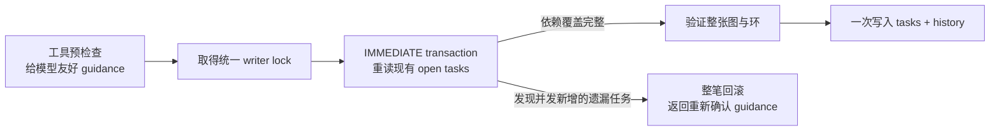
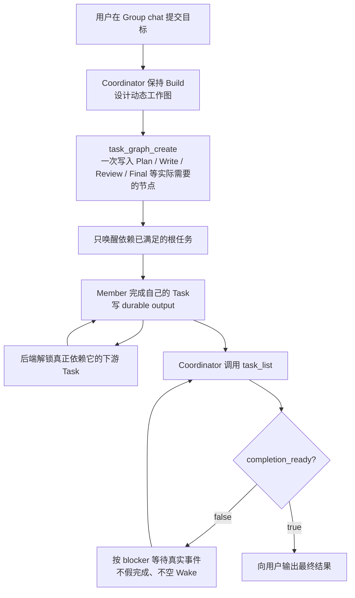

# Agent Org “Modern Family” 五批修复架构审计

日期：2026-07-13
分支：`fix/issue-272-agent-org-recovery-invariants`
范围：用户实测中出现的根 Coordinator 错误进入 Plan、任务链创建不完整、消息绕过任务、Reviewer 尚在运行却提前收尾、暂停与空筛选红错。
结论：五批修复已接入生产工具装配和持久化路径；本范围没有遗留的 P0/P1 问题。审计额外发现并修复了“任务图检查与落库之间可能插入一张并发任务”的窄竞态。

## 验收标准与结果

| 用户看到的问题                                                | 必须成立的新行为                                                                                                   | 结果 |
| ------------------------------------------------------------- | ------------------------------------------------------------------------------------------------------------------ | ---- |
| Group chat 要求用户切 Plan mode                               | 活跃 Agent Org 的根 Coordinator 不暴露通用 mode-switch 工具；计划由带 `execution_mode=plan` 的成员任务承载         | 通过 |
| Plan / 写作 / Review 的卡片对不上                             | Coordinator 可用一个 `task_graph_create` 原子写入完整动态依赖图；失败时零任务落库                                  | 通过 |
| 创建 Review task 失败后，Coordinator 仍用聊天叫 Reviewer 干活 | 发给 Worker 的正式 plain 消息必须绑定真实、未完成、依赖已就绪且对收件人有权限的 `related_task_id`                  | 通过 |
| Reviewer 还在 Running，Coordinator 已宣布全部完成             | `task_list.run_summary.completion_ready` 同时检查 Task、Session、Inbox、Turn intent、Intervention 和 Plan approval | 通过 |
| `status=""` 形成红色工具失败；Pause 误伤未启动成员            | 空 status 当作未筛选；`OrgPause` 不把没有 live runtime 的惰性成员修成 Failed                                       | 通过 |

## 十层架构审计

| Layer            | Line / Element                                             | Verdict          | Reason                                                                                                                                       | Suggested change                       |
| ---------------- | ---------------------------------------------------------- | ---------------- | -------------------------------------------------------------------------------------------------------------------------------------------- | -------------------------------------- |
| 1 编译与验证     | Rust / TypeScript / task tests                             | keep             | `cargo check -p org2`、typecheck、格式和 diff 检查通过；任务工具 58/58、task store 43/43、消息 14/14 通过。                                  | 无。                                   |
| 1 编译与验证     | `cargo test -p agent_core --lib`                           | keep with reason | 2995/2997 通过；剩余 skill-content 与 search-tool 两项是本分支之前已存在且与 Agent Org 无关的基线。                                          | 另开基线清理，不混入本修复。           |
| 1 编译与验证     | strict Clippy                                              | keep with reason | 新增任务图、消息门和完成证书没有产生 Clippy 诊断；全 crate 仍被 Provider、Memory、Channel 等既有告警阻塞。                                   | 另开 Clippy cleanup PR。               |
| 2 活代码/重复    | `task_dependency_closure`                                  | fixed            | 单任务、批量任务和 transaction-time recheck 曾各自可能定义“依赖覆盖”；现共享一个 closure 算法。                                              | 无。                                   |
| 2 活代码/重复    | `task_graph_create` production/debug/test wiring           | keep             | 工具已接到 builtin metadata、policy、production overlay、debug runtime、test API、Rust/TS tool names 与前端事件识别，不是只在测试里存在。    | 无。                                   |
| 3 命名           | `TaskGraphCreate` / `related_task_id` / `completion_ready` | keep             | 名称分别表示“原子任务图”“消息所属任务”“完成证书”，没有用含糊的 `state` 或 `done`。                                                           | 无。                                   |
| 4 语义维度       | Run / Session / Task / Delivery / Approval                 | keep             | Run 是否继续、成员是否正在工作、任务是否完成、消息是否已送达、计划是否获批分别保存；不再用 `open=0` 猜整个组织完成。                         | 无。                                   |
| 5 FSM 完整性     | `session_is_quiescent_for_completed_run`                   | keep             | 每个 `SessionStatus` 显式分类；Running、Pending、Waiting、Paused 都会阻止完成证书。                                                          | 新增状态时继续让编译器强制补齐 match。 |
| 5 FSM 完整性     | task dispatch                                              | keep             | 只有依赖已完成的根任务收到 assignment；下游由真实 TaskCompleted 事件解锁。                                                                   | 无。                                   |
| 6 跨域边界       | root Plan vs member Plan task                              | fixed            | 通用 root mode switch 不再参与活跃 Agent Org 编排；用户显式以 Plan 启动普通 root session 的能力仍保留。                                      | 无。                                   |
| 6 跨域边界       | Chat routing vs task authority                             | fixed            | Hierarchy Mode 仍决定“谁能联系谁”；Task authority 决定“谁能给谁派活”。可聊天不等于可绕过任务。                                               | 无。                                   |
| 7 新开发者理解   | Coordinator prompt / tool descriptions                     | fixed            | Prompt 解释原子图、动态依赖、task-bound message、Plan task 和 completion certificate；非代码写作不会因工具存在就误入 GitHub issue workflow。 | 后续修改继续保留字符串契约测试。       |
| 8 Wire / schema  | Rust + TS `TASK_GRAPH_CREATE`                              | keep             | 工具名、provider JSON schema、event extraction 与前端识别一致；schema compatibility 测试通过。                                               | 无。                                   |
| 8 Wire / schema  | recoverable guidance                                       | keep             | 依赖遗漏、plain 消息缺 task、空 after-dependencies 等返回结构化 guidance，不制造用户可见的红色失败卡。                                       | 长期可由 UI 渲染成专用提示卡。         |
| 9 初始化一致性   | production overlay / debug runtime / test API              | keep             | Coordinator 才注册跨成员 graph tool；所有测试与调试入口使用同一实现。                                                                        | 无。                                   |
| 10 Resolver 对称 | member owner / eligibility / recipient                     | keep             | owner、eligible member 与 message recipient 都从 run roster 的稳定 member_id 解析；不接受 display name 猜测。                                | 无。                                   |

## 审计过程中额外修复的竞态

原本工具会先读取当前开放任务，再决定新图是否需要依赖它们，然后进入 transaction 插入新图。极窄情况下，另一条执行流可以刚好在两步之间新增任务：新图本身仍是完整的，但它会漏掉刚出现的开放工作。

现在 store 在真正写入的同一笔 SQLite IMMEDIATE transaction 里再检查一次：

回归测试确认：事务内发现遗漏时，数据库只保留原来的任务，不会留下半张新图。

## 最终流程

## 明确保留的边界

1. 依赖链不是写死的 `Planner → Implementer → Reviewer → Tester`。Coordinator 根据本次请求动态生成；无依赖的任务可以并行，消费上游产物的任务必须声明依赖。
2. `HierarchyMode::Soft` 没有被删除。它管理通信可达性，不授予跨成员任务修改权。
3. `completion_ready` 是给 Coordinator 的持久化完成证书，不是新的大模型，也不取代 Coordinator 的判断和最终表达。
4. 本报告不背书当前 dirty worktree 中 Git、Key Vault、Provider、其他 UI 等无关改动；本轮没有修改 `*.tsx`，因此没有新增 frontend-ui-audit 报告。

## 最终判断

这五批把 Agent Org 从“模型靠聊天和局部看板猜下一步”收紧为“Coordinator 设计任务图，数据库保证任务与依赖，消息只能补充上下文，完成必须拿到多维证书”。Modern Family 实测暴露的三条错误捷径——根 Plan、消息绕任务、Reviewer 未完先收尾——都已在代码边界被阻断，而不是只靠提示词劝模型别犯错。
