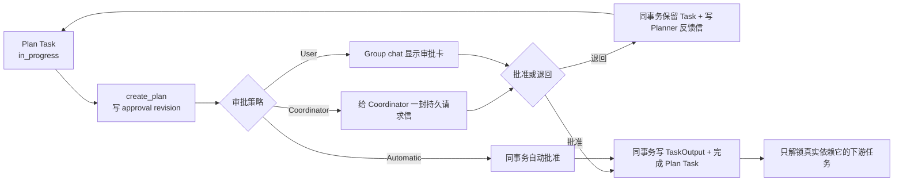

# Agent Org Planner、审批与 Wake 加固架构审计

日期：2026-07-13
范围：#272 恢复链路，以及本轮五批 Planner 任务、动态依赖、审批、Wake 和 Group chat 状态投影。
结论：本范围内没有遗留的 P0/P1 架构问题；审计发现的三组“数据库写了一半”风险已经改成单事务。工作区中其余 Git、Key Vault、Provider 等改动不属于本报告，也没有被本轮修改或背书。

## 验收结果

| 检查                    | 结果                        | 说明                                                                                   |
| ----------------------- | --------------------------- | -------------------------------------------------------------------------------------- |
| Rust 编译               | 通过                        | `cargo check -p org2`                                                                  |
| TypeScript              | 通过                        | `npm run typecheck`                                                                    |
| Agent Org approval 单测 | 11/11                       | 包含审批、退回、编辑、暂停、自动审批与事务回滚                                         |
| `create_plan` 单测      | 7/7                         | 包含空标题、空内容、错误 session 与动态说明                                            |
| Agent Org 真实桌面 E2E  | 通过                        | task-driven Plan → 审批 → 下游解锁                                                     |
| `agent_core` 全量单测   | 2984 通过，2 个既有基线失败 | 沙箱外运行后端口测试正常；剩余两项是无关的 skill 内容与 search 参数冲突基线            |
| Clippy                  | 项目基线未清零              | 全依赖被既有 dependency warning 阻塞；`--no-deps` 有既有警告。本轮新增的两条警告已修掉 |
| Diff 空白检查           | 通过                        | `git diff --check`                                                                     |

## 十层审计

| Layer                | Line / Element                                | Verdict          | Reason                                                                                                                                                 | Suggested change                                           |
| -------------------- | --------------------------------------------- | ---------------- | ------------------------------------------------------------------------------------------------------------------------------------------------------ | ---------------------------------------------------------- |
| 1 编译               | `src-tauri` / frontend                        | keep with reason | Rust 与 TypeScript 均编译；本轮新增代码没有留下项目 warning。全仓 Clippy 仍受既有基线影响。                                                            | 本 PR 不顺手清理无关 Clippy 基线，单独建 cleanup PR。      |
| 2 死代码与重复       | `agent_org_plan_approvals.rs:256,286,391`     | fixed            | Coordinator 请求、自动批准、退回反馈原先存在各写各的风险；现在共享事务 helper。                                                                        | 无。                                                       |
| 2 死代码与重复       | `agent_inbox.rs:714`                          | fixed            | 新增 `insert_in_tx`，审批和 Inbox 不再各开一个 transaction。                                                                                           | 无。                                                       |
| 2 死代码与重复       | legacy `ExecModeSetRequest` reader            | keep with reason | 当前生产端不再生成这种消息，但仍需读取旧数据库历史行；保留的是反序列化兼容，不是第二套调度机制。                                                       | 等明确放弃旧本地 DB 兼容时再删除。                         |
| 3 命名               | `agent_org_tasks::TaskExecutionMode`          | keep             | 名字明确表示“这张任务卡下一次应以 Plan 还是 Build 执行”，不会和整个 session 的通用执行模式混淆。                                                       | 无。                                                       |
| 3 命名               | `AgentOrgPlanInboxDelivery`                   | keep             | 类型明确表达“审批状态与哪封持久信件一起提交”，没有用模糊的 `Result`/`Context`。                                                                        | 无。                                                       |
| 4 语义维度           | Run / Session / Task / Approval / Delivery    | keep             | 五个状态分开保存：run 是否继续、session 是否工作、task 是否完成、plan 是否获批、inbox/wake 是否送达，互不冒充。                                        | 继续要求新 UI 标明自己显示的是哪一维。                     |
| 4 语义维度           | `org_tasks.rs:118` `AwaitingPlanApproval`     | keep             | 这是从 durable approval 投影出的界面阶段，不会把 Run 改成 Paused，也不会把 Task 假装 Completed。                                                       | 无。                                                       |
| 5 默认分支           | `PlanApprovalPolicy`                          | keep             | `Coordinator`、`User`、`Automatic` 三种策略在创建与提示词中显式匹配；没有 `_ => automatic` 之类危险兜底。                                              | 新增策略时让编译器强制所有 match 补齐。                    |
| 5 默认分支           | historical missing `execution_mode`           | keep with reason | 旧 task / inbox 行缺字段时按 Build 读取，只用于历史兼容；新 `task_create` 强制显式传值。                                                               | 保持“旧读宽松、新写严格”。                                 |
| 6 跨域泄漏           | Agent Org approval vs top-level Plan approval | keep             | 两者没有复用同一状态：单 agent 的 Build/Skip 机制保持原样；Agent Org 审批绑定 run + member + source task。                                             | 无。                                                       |
| 7 新开发者理解       | `create_plan.rs:168` tool description         | fixed            | 工具说明现在写清：必须绑定 owned in-progress Plan task；提交后停止；批准负责完成任务；不会制造 fake Build turn。                                       | 无。                                                       |
| 7 新开发者理解       | `section_builders.rs:680-768`                 | fixed            | Coordinator 的 prompt 同时解释 dynamic dependency、dispatch policy、execution mode 和审批结果。                                                        | 后续提示词变更继续有字符串契约测试。                       |
| 8 Wire/序列化        | `TaskAssigned.execution_mode`                 | keep             | 扁平 typed field，历史缺失默认 Build；成员从真实 assignment 决定 Plan/Build。                                                                          | 无。                                                       |
| 8 Wire/序列化        | `task_create` schema                          | fixed            | `dispatch_policy` 和 `execution_mode` 都是 required；依赖确认返回结构化 guidance，不制造 trajectory-visible tool failure。                             | 无。                                                       |
| 8 Wire/序列化        | Plan 内容边界                                 | keep             | 审批保存完整 markdown 与 artifact path；注入 Inbox/TaskOutput 的文本有总量边界，避免无界 prompt 膨胀。                                                 | 后续可加 payload-size telemetry，但不是正确性前提。        |
| 9 Init parity        | setup / test env / debug Agent Org fixtures   | fixed            | 新审批表在 production setup、测试 DB 与 E2E 初始化一致；遗漏的 `plan_approval_policy` fixture 已补齐，`cargo check -p org2` 能抓住。                   | 新增 OrgDefinition 字段时继续编译所有 desktop/E2E target。 |
| 9 Init parity        | `external_import/tests.rs` 全局 HOME guard    | fixed            | 全量并行测试曾能在 lifecycle 建表过程中切走 `ORGII_HOME`，造成“no such table”假失败；所有本地 HOME guard 现先取得 workspace canonical lock。           | 新增 env-mutating test 必须使用 `test_helpers::test_env`。 |
| 10 Resolver symmetry | owner / member / task / execution mode        | keep             | `create_plan` 从 runtime member identity 找到同 run 的 owned in-progress Plan task；ownerless task 不参与 mode prepeek，也不会由成员自领。             | 无。                                                       |
| 10 Resolver symmetry | explicit assignment                           | fixed            | Watchdog、resume、Inbox drain 和 task side effect 都把 ownerless 解释为“等待 Coordinator 指派”；只有真实 `TaskAssigned` 决定 Worker 的下一次执行模式。 | 无。                                                       |

## 事务审计发现并已修复的问题

| 问题类               | 旧风险                                                                            | 现在                                                                |
| -------------------- | --------------------------------------------------------------------------------- | ------------------------------------------------------------------- |
| 退回计划             | approval 先变 `changes_requested`，写 Planner Inbox 失败后 Planner 永远收不到意见 | approval 状态与反馈信同一 SQLite transaction；任一步失败全部回滚    |
| Coordinator 审批请求 | 可能有 pending approval，却没有给 Coordinator 的请求信                            | approval revision 与请求信同事务创建                                |
| Automatic 审批       | 可能 approval 已 approved，但 source Plan task 仍 in_progress                     | approval 创建、批准、TaskOutput 与 Plan task 完成在同一 transaction |

对应测试会主动删除 `agent_inbox` 表制造失败，确认数据库不会留下“半成功”状态。这不是只测 happy path。

## 状态与事件边界

## Wake 审计结论

- 保留 #272 的恢复能力：未读 Inbox、刚解锁且已有 owner 的任务、审批反馈和受预算控制的真实恢复输入仍可触发 Wake；ownerless task 只提醒 Coordinator 明确指派。
- 删除“只因还有一个未完成任务就每分钟叫醒”的假输入。
- 等待用户审批时没有可消费输入，所以不调用模型、不闪烁、不消耗 recovery attempt。
- Coordinator 或 member 真有未读持久信时仍会 Wake；Wake 只是门铃，Inbox row 才是事实。
- 同一 member 的并发 Wake 使用确定性 key 合并；只有 Scheduler 真开始 turn 才把 session 写成 Running。

## 保留项与明确边界

1. SQLite 与计划 markdown 文件不能形成跨文件系统的真正原子 transaction。正常写文件失败会报错并保持 DB 未批准；进程在极窄窗口硬崩溃时，DB 中保存的 `plan_content` 仍是权威内容，文件可重建。这是已记录的边界，不是双真相。
2. 历史 `ExecModeSetRequest` 只读兼容暂留；新代码没有 producer。
3. 此报告只审计 Agent Org 范围；当前 worktree 的无关用户改动没有被格式化、删除或纳入结论。

## 最终判断

这轮设计已经从“Coordinator 用消息临时命令成员切模式”变为“任务本身携带执行契约”。Planner 的 Plan 模式、审批等待、退回反馈、批准完成和依赖解锁都有持久状态与事务边界；Wake 只负责把真实事件送进 turn，不再负责猜测工作。范围内没有需要阻止提交的审计发现。
