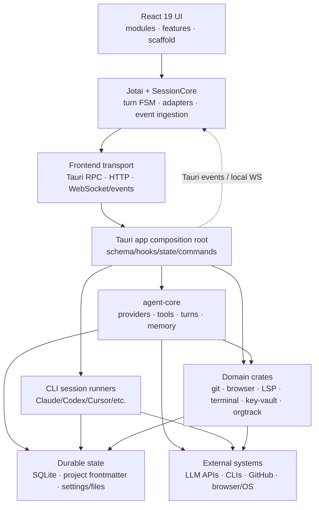

# ORGII Repository Architecture Audit

**Date:** 2026-07-16  
**Scope:** Entire repository (`src/`, `src-tauri/`, `packages/`, CI and architecture docs)  
**Mode:** Audit only; no source code changed  
**Method:** `.orgii/skills/architecture-audit/SKILL.md`, all 10 layers

## Executive verdict

ORGII has a sound macro-architecture for a local-first agent IDE: React/Jotai owns presentation, Tauri is the native boundary, Rust crates own agent execution and OS integrations, and SQLite-backed services own durable state. The strongest parts are the generation-aware frontend turn FSM, the canonical Rust session-identity resolver, provider-compatible tool schemas, and an acyclic Rust workspace with clear leaf crates.

The repository is nevertheless in a **high-integration-risk** state. The main issue is not the number of components by itself; it is that several supposedly single-authority boundaries still have bypasses or lossy adapters. Message dispatch has three paths outside the turn FSM, linked-session persistence silently converts pending/unknown states into completed, production schema setup contains duplicate work while the shared test primer omits two production schemas, and the default development branch is outside CI's trigger. The current checkout also fails both frontend typecheck and Rust workspace compilation.

### Priority summary

| Priority | Finding                                                                                             | Impact                                                                          |
| -------- | --------------------------------------------------------------------------------------------------- | ------------------------------------------------------------------------------- |
| P0       | CI excludes the default `develop` branch while the current quality baseline is red                  | Regressions can merge to the default branch without any required gate           |
| P1       | Three message-send paths bypass the authoritative turn FSM                                          | Queueing can dispatch into a turn already running in Rust                       |
| P1       | Linked-session conversion maps pending, idle, paused, archived and unknown statuses to `Completed`  | Work-item frontmatter can record false completion timestamps and terminal state |
| P2       | Production schema initialization calls unified session init twice with contradictory error policies | Startup ownership is misleading and failures cannot behave as documented        |
| P2       | The shared test schema primer omits two production schemas                                          | Tests do not reproduce the production database contract                         |
| P2       | Session status and model-family semantics remain split across owners                                | New variants/models can drift or be converted inconsistently                    |
| P2       | Architecture boundaries and hygiene tools are partly documentary rather than mechanically enforced  | Package direction, circular checks and architecture docs can drift unnoticed    |
| P3       | Several composition and feature modules are exceptionally large                                     | Change blast radius and review cost remain high                                 |

## Current architecture



### Frontend

- `src/index.tsx` performs pre-React initialization, mounts the app after i18n/theme/Tauri/background setup, and owns emergency startup handling.
- `src/App.tsx` is intentionally thin: providers, top-level error boundary, then `AppBootstrap`.
- `modules/` owns page surfaces, `features/` owns reusable domain UI, `scaffold/` owns persistent shell UI, and `engines/` owns stateful subsystems such as SessionCore, ChatPanel, BrowserCore and TerminalCore.
- `SessionService` and per-session adapters are the intended operation boundary. SessionCore ingests backend events and projects them into Jotai/UI state.
- The frontend communicates through Tauri IPC, a local HTTP/WebSocket server and Tauri/event channels. This flexibility is useful, but it makes transport ownership important.

### Rust backend

- `src-tauri/src/lib.rs` is the composition root. It registers schema callbacks and inversion-of-control hooks before building Tauri, then installs plugins, process-wide state, HTTP/WebSocket services, schedulers and watchers.
- The workspace has 41 crates. Foundation leaves include `core_types`, `app_paths`, `app_platform`, `database` and `transport`; domain crates include git, browser, LSP, terminal, key vault, project management and orgtrack.
- `agent_core` is the central Rust-native runtime and dependency hub. It owns providers, model context, prompts, tools, turn execution, memory, skills, MCP and orchestration.
- CLI sessions are a separate runtime family under the app crate. Both runtime families are projected into a shared frontend session model.
- The Rust crate graph is acyclic, but `agent_core` and the root app are broad aggregators. `session_persistence`, `git_api` and `key_vault` also depend upward into substantial domain/runtime crates, so their names understate their integration role.

### Canonical message path

```text
useUserIntentSubmit
  -> useMessageDispatch.dispatchMessageBySessionType
  -> beginTurnDispatch(sessionId)
  -> SessionService.sendMessage
  -> session adapter
  -> invoke agent_send_message
  -> Rust identity resolution + runtime init + scheduler
  -> session::process_message
  -> provider/tool turn loop
  -> EventStore / Tauri events
  -> SessionCore ingestion + Jotai projection
```

This path has good generation-based concurrency protection. The problem is that not every send uses it.

## Evidence-backed findings

| Priority | Line                                                                                      | Element                        | Verdict                               | Reason                                                                                                                                                                       | Suggested change                                                                                                             |
| -------- | ----------------------------------------------------------------------------------------- | ------------------------------ | ------------------------------------- | ---------------------------------------------------------------------------------------------------------------------------------------------------------------------------- | ---------------------------------------------------------------------------------------------------------------------------- |
| P0       | `.github/workflows/ci.yml:12`                                                             | CI trigger                     | **fix**                               | `origin/HEAD` points to `develop`, but CI only runs for PRs targeting `release` or `master`.                                                                                 | Add `develop` to PR triggers and make frontend/Rust jobs required; optionally gate protected-branch pushes.                  |
| P0       | `src/engines/ChatPanel/InputArea/components/ContextInfoButton.tsx:468`                    | Frontend baseline              | **fix**                               | `pnpm typecheck` fails because an optional session id is passed to a required `string` prop.                                                                                 | Narrow/render-gate the optional id; keep typecheck required in CI.                                                           |
| P0       | `src-tauri/crates/e2e-test/src/housekeeping.rs:383`                                       | Rust workspace baseline        | **fix**                               | Root `cargo check` passes, but `cargo check --workspace` fails because `seed_aged_file` is missing at four calls.                                                            | Restore the helper or remove the incomplete E2E cases; keep workspace check as the canonical gate.                           |
| P1       | `src/engines/ChatPanel/InputArea/ModeSwitchCard/useModeSwitchActions.ts:182`              | Mode-switch resume dispatch    | **fix**                               | It calls `beginOptimisticTurn` and `SessionService.sendMessage`, but never reserves an FSM generation.                                                                       | Route through one dispatch coordinator that reserves, confirms and terminalizes the same generation.                         |
| P1       | `src/engines/SessionCore/services/PlanExecutionService.ts:32`                             | Plan execution dispatch        | **fix**                               | It directly invokes `agent_send_message`; UI status changes but `getTurnPhase()` can remain `idle`.                                                                          | Use the same dispatch coordinator; keep raw IPC below the adapter boundary.                                                  |
| P1       | `src/scaffold/GlobalSpotlight/palettes/AgentControlPalette/useAgentControlPalette.ts:191` | ADE control dispatch           | **fix**                               | Existing control sessions use another raw send path with no FSM reservation.                                                                                                 | Route existing-session control prompts through the unified coordinator.                                                      |
| P1       | `src/engines/SessionCore/hooks/session/useQueueDispatch.ts:348`                           | Queue gate                     | **keep with reason**                  | The queue correctly uses `getTurnPhase()` as its only authority. The defect is upstream bypasses, not this gate.                                                             | Preserve the gate and add concurrency tests for every dispatch origin.                                                       |
| P1       | `src-tauri/crates/agent-core/src/state/commands/session/persistence.rs:386`               | Linked status conversion       | **fix**                               | The catch-all maps valid `Pending`, `Idle`, `Paused`, `Archived` and unknown strings to `Completed`; the caller then sets `completed_at`.                                    | Make the conversion exhaustive and fallible. Add a non-terminal linked state if required; reject unsupported/unknown values. |
| P1       | `src-tauri/crates/agent-core/src/state/commands/session/persistence.rs:399`               | Linked runtime type conversion | **fix**                               | Every branch, including unknown values, returns `LinkedSessionType::Native` even though the domain also has `Cli`.                                                           | Map known runtime types explicitly and return an error for unknown values.                                                   |
| P2       | `src-tauri/src/setup/hooks.rs:18`                                                         | Unified session schema init    | **fix**                               | The exact same init is called again at line 48. The first call is fatal (`?`), making the second call's “optional warning” policy impossible.                                | Delete the duplicate and choose one documented error policy.                                                                 |
| P2       | `src-tauri/src/test_utils/test_env.rs:39`                                                 | Test schema primer             | **fix**                               | The primer claims to provide the full multi-table test schema but omits production's goal-loop and housekeeper-compaction schemas.                                           | Derive production and test init from the same ordered schema registry, with an assertion over registered domains.            |
| P2       | `src-tauri/crates/agent-core/src/core/session/types/enums.rs:27`                          | Application `SessionStatus`    | **unify/rename**                      | Application, persistence, CLI and frontend domains use overlapping status names with different state spaces and terminal/resume policies.                                    | Rename by domain and colocate explicit, exhaustive conversions.                                                              |
| P2       | `src-tauri/crates/agent-core/src/core/turn_executor/screenshot.rs:29`                     | Model vision capability        | **move**                              | Model-family substring logic lives outside the intended capability resolver. Similar exceptions remain in tokenizer/prompt logic.                                            | Add vision/tokenizer/cutoff dimensions to `ModelCapabilities` and reduce the enforcement-test allowlist to zero.             |
| P2       | `package.json:44`                                                                         | Circular dependency check      | **fix**                               | The script uses undeclared `npx madge`; in a restricted/offline environment it tries to fetch npm and never analyzes the graph.                                              | Pin `madge` in devDependencies and invoke it with `pnpm exec`.                                                               |
| P2       | `packages/README.md:12`                                                                   | OSS/package split              | **keep as transition, enforce later** | `orgii_core` and `orgii_marketplace` are skeletons and intentionally excluded from the pnpm workspace, so the documented one-way dependency rule is not machine-checked.     | When extraction starts, add an import/dependency boundary check and independent package CI.                                  |
| P2       | `docs/contributing/wiki/Architecture-Overview.md:111`                                     | Architecture documentation     | **fix**                               | It describes `crates/event-store/`, which no longer exists as a workspace crate; EventStore now lives in the app event pipeline.                                             | Generate the crate inventory from Cargo metadata and assign owners/update dates to narrative docs.                           |
| P3       | `src/modules/MainApp/WorkManagement/GitHubWorkItemsSurface.tsx:1`                         | 2,356-line UI surface          | **split**                             | Rendering, state, effects and transport coordination share one change surface. Rust has similar hotspots, including 2,481-line key-vault and 2,042-line CLI session modules. | Extract by stable responsibilities, not arbitrary file size; add characterization tests first.                               |

## Ten-layer audit coverage

| Layer                                 | Result            | Notes                                                                                                                                                                                                            |
| ------------------------------------- | ----------------- | ---------------------------------------------------------------------------------------------------------------------------------------------------------------------------------------------------------------- |
| 1. Compilation correctness            | **Fail**          | Root Rust app passes; TypeScript and Rust workspace checks fail. ESLint also finds one formatting error in a currently modified user file, so that item is not treated as stable architecture evidence.          |
| 2. Dead code & structural duplication | **Fail**          | Duplicate schema init is confirmed; large compatibility/deprecated surface and oversized modules raise cleanup cost.                                                                                             |
| 3. Naming consistency                 | **Fail**          | `SessionStatus` and related session terms name different domains; some crates are integration adapters despite leaf-like names.                                                                                  |
| 4. Semantic overloading               | **Fail**          | `agent` is both a table-family prefix and a session-category value “by historical accident”; session/native/runtime terms require local knowledge.                                                               |
| 5. Default branch analysis            | **Fail**          | Linked-session catch-alls turn non-terminal or unknown values into terminal/native/coding defaults.                                                                                                              |
| 6. Cross-domain leakage               | **Partial fail**  | Model-family decisions escape `ModelCapabilities`; the composition root relies on many manual IoC hooks. The Rust crate graph itself remains acyclic.                                                            |
| 7. New-developer confusion            | **Fail**          | Green root build vs red workspace, stale crate docs, transitional empty packages and generated handler registration are not obvious from the top-level layout.                                                   |
| 8. Wire protocol & serialization      | **Pass (static)** | `params_schema` emits Draft 7 without `$schema`/`$ref` and normalizes nullable arrays. No live provider request was made.                                                                                        |
| 9. Init parity                        | **Fail**          | Production duplicates one init; the shared test primer omits two production schemas.                                                                                                                             |
| 10. Resolver symmetry                 | **Pass**          | `resolve_session_identity` uniformly checks override -> runtime -> DB for model/account/workspace/native harness, errors on unknown harness values and limits workspace fallback to personal-workspace sessions. |

## Term-overload table

| Term             | Meanings                                                                                              | Risk                                                                                   |
| ---------------- | ----------------------------------------------------------------------------------------------------- | -------------------------------------------------------------------------------------- |
| `SessionStatus`  | Rust application lifecycle, Rust persistence subset, CLI lifecycle, frontend row/runtime status       | Callers can import or convert the wrong policy while code still compiles.              |
| `session`        | Rust-native session, external CLI process, imported history, UI row, active turn                      | “Session supports X” is often false without a category qualifier.                      |
| `agent`          | Native runtime, table namespace, generic session category, CLI-like product concept                   | Persistence and dispatch code use the same word at different abstraction levels.       |
| `EventStore`     | Current app-owned event pipeline/state versus a removed/documented crate                              | Docs send contributors to a non-existent boundary.                                     |
| `workspace_root` | User-visible project root in some layers; effective worktree `working_dir` in the identity projection | The canonical resolver handles this correctly, but the name still invites bypass bugs. |

## Init parity matrix

| Initialization step              | Production | Shared test primer | Verdict              |
| -------------------------------- | ---------: | -----------------: | -------------------- |
| Base session tables              |        Yes |                Yes | Match                |
| Session snapshots                |        Yes |                Yes | Match                |
| Unified session schema           |  **Twice** |               Once | Production duplicate |
| CLI / inbox / orgtrack / lineage |        Yes |                Yes | Match                |
| Agent-org coordination tables    |        Yes |                Yes | Match                |
| Plan approval                    |        Yes |                Yes | Match                |
| Goal loop                        |        Yes |                 No | Test omission        |
| Housekeeper compaction           |        Yes |                 No | Test omission        |

## Resolver symmetry matrix

| Field                   | Override | Runtime |  DB | Fallback/error                                                         | Verdict |
| ----------------------- | -------: | ------: | --: | ---------------------------------------------------------------------- | ------- |
| Model                   |      Yes |     Yes | Yes | Error if missing                                                       | Pass    |
| Account                 |      Yes |     Yes | Yes | Optional by design                                                     | Pass    |
| Workspace/effective cwd |      Yes |     Yes | Yes | Personal workspace only for eligible session prefixes; otherwise error | Pass    |
| Native harness          |      Yes |     Yes | Yes | Optional; unknown DB value errors                                      | Pass    |

## Recommended execution order

1. **Restore enforcement first:** run CI on `develop`, then make typecheck and workspace compilation green.
2. **Close behavioral bypasses:** introduce a transport-independent dispatch coordinator and migrate mode-switch, plan execution and ADE control sends; add queue-concurrency tests.
3. **Repair data integrity:** replace linked-session catch-alls with exhaustive/fallible conversions and backfill any frontmatter incorrectly marked completed.
4. **Unify initialization:** one ordered production/test schema registry; remove the duplicate call and prove parity in a test.
5. **Consolidate semantics:** rename status types by domain and migrate all model-derived behavior into the capability owner.
6. **Make boundaries executable:** pin architecture tools, generate crate inventory, and add checks when the OSS/package split becomes real.
7. **Reduce hotspots last:** split large modules after the authority and conversion boundaries above are stable.

## Verification performed

| Command/check                                           | Result                                                                        |
| ------------------------------------------------------- | ----------------------------------------------------------------------------- |
| `pnpm typecheck`                                        | Fail: 1 TypeScript error at `ContextInfoButton.tsx:468`                       |
| `pnpm exec eslint src/ --ext .ts,.tsx,.js,.jsx --quiet` | Fail: 1 Prettier/import-order error in an already modified model-palette file |
| `pnpm check:circular`                                   | Not reproducible: undeclared `madge` attempted a network fetch and failed     |
| `cargo check -q`                                        | Pass                                                                          |
| `cargo check -q --workspace`                            | Fail: missing `seed_aged_file` in `e2e-test`                                  |
| Cargo metadata dependency inventory                     | Pass: 41 workspace crates; no Cargo cycle is possible/present                 |
| Static wire-schema review                               | Pass                                                                          |
| Static init/resolver parity review                      | Init fail; resolver pass                                                      |

The checkout contained 44 pre-existing modified tracked files plus untracked work. This audit did not modify or attribute those source changes; only this report was added.
