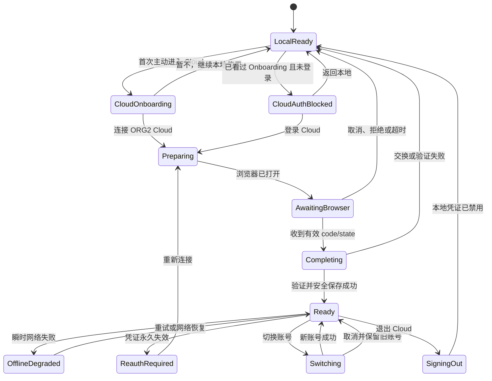
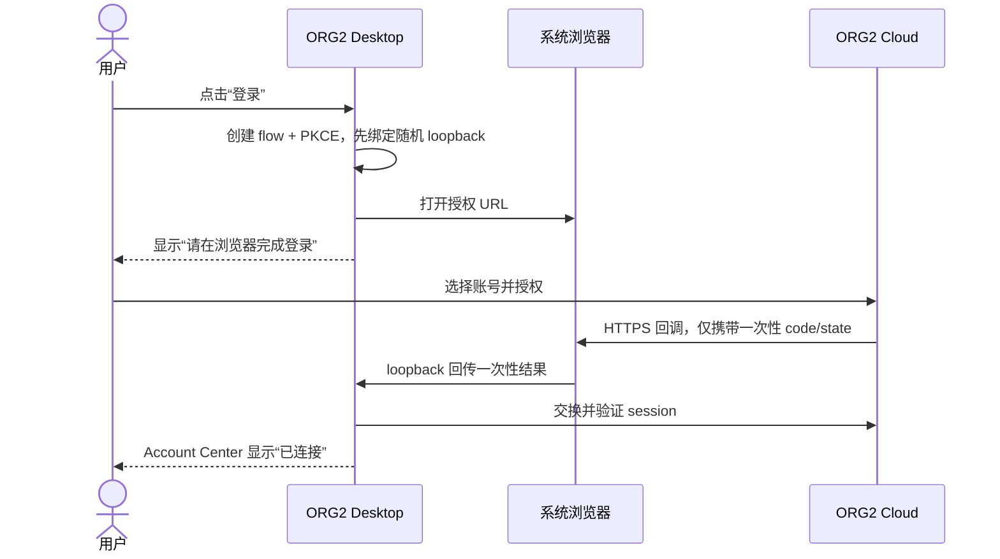

# ORG2 Identity & Authentication 交互规范

> 文档类型：产品 / UX / 开发交互合同
>
> 对应架构：[`IdentityAuthenticationRearchitecturePlan.md`](./IdentityAuthenticationRearchitecturePlan.md)
>
> 人工验收：[`IdentityAuthenticationManualAcceptance.md`](./IdentityAuthenticationManualAcceptance.md)
>
> 编制日期：2026-08-18
>
> 当前状态：Cloud Onboarding 与局部登录 Block 已实现；部分 Broker 状态反馈仍待补齐，生产 Desktop OAuth 配置尚未开放

本文档定义 ORG2 Desktop 登录重构的用户交互，不重复描述 OAuth 密码学和存储实现。产品、设计、Desktop 与 Cloud 开发应以本文档对齐“用户从哪里开始、每一步看到什么、能做什么、失败后如何恢复、什么时候算完成”。

规范中的“必须”表示 P0 行为；“建议”表示可在不破坏状态机的前提下调整视觉呈现。

---

## 1. 用户结果与范围

### 1.1 用户结果

用户应能：

1. 不登录 ORG2 Cloud 也能启动并使用本地 IDE、项目、终端和本地 Agent。
2. 只有在触发 Cloud 功能时才登录，并在系统浏览器完成授权。
3. 登录后自动回到刚才的安全操作，不需要重新输入或重新导航。
4. 清楚知道当前连接的是哪个账号、哪个服务端点、是否离线或需要重新连接。
5. 切换账号、退出或修复凭证时，不影响 Hosted、GitHub、Agent 和本地工作。
6. 在网络中断、浏览器关闭、授权拒绝或安全存储不可用时，得到有限、可恢复的反馈。

### 1.2 成功信号

一次交互只有同时满足以下条件才算成功：

- Account Center 显示目标账号及“已连接”。
- 原始 Cloud 操作恢复且只执行一次。
- 旧账号私有数据没有闪现或写入新账号作用域。
- 本地 shell 与其他身份域没有被打断。
- URL、UI、日志和公开事件中没有 access token、refresh token 或 PKCE verifier。

### 1.3 非目标

- 不设计 ORG2 Cloud 网页端的账号注册、密码找回和 MFA 页面细节；Desktop 只负责打开系统浏览器并接收安全结果。
- 不把 Hosted、GitHub、Agent 合并成一个“全局登录”。它们仍是独立连接。
- 不在 renderer 中展示或持久化 refresh token。
- 不通过全屏登录墙阻止本地使用。
- 不在本文档定义品牌视觉、图标造型或完整 Settings 信息架构重做。

---

## 2. 交互原则

### 2.1 本地优先

- 启动默认进入本地 shell。
- 未登录时，Cloud 入口显示“登录”，而不是弹出全局模态框。
- Cloud 不可用时，只降级 Cloud 功能；本地编辑、终端和本地 Agent 保持可用。

### 2.2 就地修复

- 登录、重新认证、切换和失败恢复都在动作发生的位置反馈。
- 用户从邀请、分享、创建组织或 Billing 发起登录时，成功后回到原动作。
- 不把所有失败统一导航到 Settings；Settings 是长期管理入口，不是唯一修复入口。

### 2.3 状态持续可见

- 有效的中间态必须显示，不通过突然隐藏按钮表达状态。
- 处理期间保留账号和端点上下文，避免用户不知道正在处理哪个连接。
- loading、失败、离线和锁定不能只靠颜色表达。

### 2.4 单一身份域影响

- Cloud 401 只改变 Cloud 账号行。
- Hosted、GitHub、Agent 各自拥有独立修复入口。
- “退出 Cloud”不得清除其他 provider 或本地数据。

### 2.5 安全不转嫁给用户

- 用户不应看到 token、code、verifier、client secret 或底层 provider 原始响应。
- 系统安全存储的合理首次授权可以解释，但普通重启不得反复要求输入钥匙串密码。
- 失败文案说明“发生了什么”和“下一步能做什么”，不暴露秘密或内部堆栈。

---

## 3. 入口与信息架构

### 3.1 长期管理入口

主入口：`设置 → 协作 → Cloud`。

当前 Cloud 与 Self-hosted 使用同一设置分区下的两个 tab：

- `Cloud`：官方托管 ORG2 Cloud，显示 Account Center 账号行。
- `Self-hosted`：自托管端点配置，切换端点时必须触发独立身份作用域。

### 3.2 按需登录入口

| 用户入口         | 未登录时行为        | 登录成功后恢复            | Sign-in Intent        |
| ---------------- | ------------------- | ------------------------- | --------------------- |
| Settings Cloud   | 打开系统浏览器登录  | 留在 Cloud 设置并显示账号 | `open_cloud_settings` |
| 创建 Cloud 组织  | 暂存创建动作        | 返回创建组织流程          | `create_org`          |
| 接受邀请         | 暂存 invite ID      | 恢复邀请确认              | `accept_invite`       |
| 导入分享         | 暂存 share ID       | 恢复分享导入              | `import_share`        |
| 分享 Session     | 暂存 session ID     | 恢复分享设置              | `share_session`       |
| 打开 Billing     | 暂存固定 `/billing` | 浏览器进入 Billing        | `open_billing`        |
| Cloud 受保护路由 | 暂存安全内部路径    | 返回原路由                | `resume_route`        |

规则：

- Sign-in Intent 只存在于当前 Desktop 进程内，最长保留 10 分钟。
- 同一时刻只保留一个待恢复意图；新的明确用户动作替代旧动作。
- 外部 URL、`//` 开头路径、反斜杠路径、控制字符和超长参数必须拒绝。
- 意图只在绑定的登录 flow 完成并产生 Ready session 后消费一次。

### 3.3 Cloud Onboarding 与局部登录 Block

Cloud Onboarding 只在用户首次主动进入 Cloud 范围时出现，不在 Desktop 冷启动时自动弹出。它同时承担首次用户的 Cloud 登录 Block：解释价值、安全边界和退出方式，然后由用户决定连接或继续本地使用。

首次用户：

```text
┌──────────────────────────────────────────────────────────────┐
│                     连接 ORG2 Cloud                          │
│                                                              │
│  跨设备同步 Session     与团队安全协作     本地工作仍属于你   │
│                                                              │
│  登录会在系统浏览器完成，凭证保存在操作系统安全存储中。       │
│                                                              │
│              [暂不，继续本地使用] [连接 ORG2 Cloud]          │
└──────────────────────────────────────────────────────────────┘
```

已看过 Onboarding、当前处于 SignedOut 的用户：

```text
┌──────────────────────────────────────────────────────────────┐
│  此功能需要连接 ORG2 Cloud                                   │
│  用于团队协作、同步和安全分享。本地工作不受影响。             │
│                                 [返回本地] [登录 Cloud]       │
└──────────────────────────────────────────────────────────────┘
```

政策：

- Onboarding 只 block 当前 Cloud 内容区域，不 block 应用 shell、侧栏、本地项目、终端或本地 Agent。
- 用户点击“暂不”后立即返回原本地页面；不得在本次启动内反复弹出。
- `cloud_onboarding_version` 只记录非敏感的已确认版本。只有用户点击“连接”或“暂不”时才写入；仅展示后关闭窗口不算完成。
- 已确认用户再次进入 Cloud 时显示精简登录 Block，不重复完整 Onboarding。
- Invite/share 等明确业务入口直接显示带原动作说明的精简 Block；“了解 ORG2 Cloud”可展开 Onboarding，但不得强迫用户先走多页向导。
- Onboarding 点击“连接”时绑定当前 Sign-in Intent，登录成功后仍恢复原动作一次。
- Onboarding 文案或版本升级不得让已登录用户退出；只有安全范围发生实质变化时才展示“有什么新变化”，并另行取得必要同意。

实现映射：renderer 使用 `orgii:org2-cloud-v1:onboarding-version` 保存当前已确认版本，owner 为 `cloudOnboardingPreference.ts`；共享 `CloudOnboardingGate` 由 Settings、Cloud Org 创建、邀请、分享导入与 Team Runtime 入口复用。明确业务意图默认显示精简 Block，“了解 ORG2 Cloud”才展开完整介绍。

---

## 4. Account Center 结构

### 4.1 默认布局

```text
┌──────────────────────────────────────────────────────────────┐
│ ORG2 云  [推荐]                                              │
│ 托管式会话共享、团队权限与安全分享                           │
│                                                              │
│ 已登录：junyu@example.com   [已连接]                          │
│ 服务端点：org2-cloud-infra.vercel.app                        │
│                                [切换账号] [退出登录]          │
└──────────────────────────────────────────────────────────────┘
```

账号行包含：

1. Provider 名称：ORG2 Cloud。
2. 身份标签：优先显示 display name，其次 email，最后为不可读 ID 的安全替代标签。
3. 状态 badge：已连接、正在恢复、离线可用、需要重新连接、正在退出、凭证存储已锁定、仅本次会话保存。
4. endpoint host：始终可见，避免官方 Cloud 与 Self-hosted 混淆。
5. 主动作：登录、重新连接或重试。
6. 次动作：切换账号、退出登录；仅在适用状态出现。

### 4.2 未登录布局

```text
┌──────────────────────────────────────────────────────────────┐
│ ORG2 云  [推荐]                                              │
│ 尚未连接。登录后可同步 Session 并使用团队功能。              │
│                                                   [登录]     │
└──────────────────────────────────────────────────────────────┘
```

未登录不是错误状态，不使用红色警告，不自动抢焦点。

### 4.3 浏览器等待布局

```text
┌──────────────────────────────────────────────────────────────┐
│ ORG2 云                                                      │
│ [转圈] 请在浏览器完成登录                                    │
│ 浏览器没有打开？ [重新打开浏览器]                [取消]      │
└──────────────────────────────────────────────────────────────┘
```

- 原登录按钮保留位置并转为状态，不应突然消失造成布局跳动。
- “重新打开浏览器”复用同一个有效 flow/authorization URL；不得创建第二个 listener。
- “取消”终止当前 flow，使之后到达的旧 callback 无效。

### 4.4 错误布局

```text
┌──────────────────────────────────────────────────────────────┐
│ ORG2 云                                                      │
│ [!] 登录未完成                                               │
│ 无法连接 ORG2 Cloud，请检查网络后重试。                      │
│ 参考编号：AB12-CD34                              [重试]      │
└──────────────────────────────────────────────────────────────┘
```

- 错误保留在账号行/原动作附近，直到用户重试、关闭提示或状态恢复。
- correlation ID 可以显示；flow ID、session ID、email 全文和 provider 原始错误不得显示。

---

## 5. 状态所有权

| 值                                    | 权威所有者                    | 生命周期                         | UI 用法                                   |
| ------------------------------------- | ----------------------------- | -------------------------------- | ----------------------------------------- |
| 登录 flow、generation、phase          | Rust Identity Broker          | 当前进程，terminal 后销毁        | renderer 只读 snapshot，决定 loading/提示 |
| session、账号 metadata、realm、issuer | Rust Identity Broker registry | 跨窗口；Release 可跨重启恢复     | Account Center 与 Cloud 消费者读取        |
| refresh credential                    | 平台安全存储                  | Release 跨重启；开发构建仅进程内 | UI 永不读取                               |
| access lease                          | Rust Broker 签发              | 短期、按 audience                | Cloud client 临时使用，不持久化           |
| Sign-in Intent                        | Desktop runtime               | 最长 10 分钟、一次消费           | 登录成功后恢复原操作                      |
| `cloud_onboarding_version`            | Desktop 非敏感设置            | 跨重启、按版本                   | 决定首次 Onboarding 或精简登录 Block      |
| rename draft、局部弹层开关            | React 组件                    | 当前组件                         | 取消/卸载后丢弃                           |
| Cloud 账号作用域缓存                  | 对应 Cloud store              | 当前账号/generation              | 身份变化前同步清除                        |

任何交互实现不得再创建第二份“当前 Cloud 账号”权威状态。旧 `auth` 投影只用于兼容期，显示身份时必须与 Broker 的 subject/issuer 一致。

---

## 6. 状态机与可见行为

### 6.1 用户旅程



`LocalReady` 表示本地 shell 可用，不等于用户必须停留在 Settings。

Onboarding/CloudAuthBlocked 属于 renderer 的局部展示状态；真正的登录 flow 与 session 仍由 Broker 持有。组件 remount 不能重置已确认版本，也不能伪造登录状态。

### 6.2 Broker phase 到 UI 的映射

| Broker 状态                | 主文案             | 控件                   | 退出条件             | 持久化影响                     |
| -------------------------- | ------------------ | ---------------------- | -------------------- | ------------------------------ |
| 无 session / 无 flow       | 尚未连接           | 登录                   | begin sign-in        | 无                             |
| flow `preparing`           | 正在准备安全登录…  | 取消                   | URL 构建成功或失败   | 无                             |
| flow `browser_open`        | 正在打开浏览器…    | 取消                   | opener 返回          | 无                             |
| flow `awaiting_callback`   | 请在浏览器完成登录 | 重新打开、取消         | callback、拒绝、超时 | 无                             |
| flow `exchanging_code`     | 正在完成登录…      | 取消本次结果           | token exchange 完成  | 尚不提交 session               |
| flow `verifying_session`   | 正在验证账号…      | 取消本次结果           | 验证并持久化         | 成功才提交                     |
| flow `failed`              | 登录未完成         | 重试、关闭             | 新 flow 或关闭       | 无新 credential                |
| session `restoring`        | 正在恢复连接…      | 保持本地使用           | Ready/Offline/Reauth | 不改旧账号                     |
| session `ready`            | 已连接             | Cloud 操作、切换、退出 | 刷新/切换/退出       | 有效 session                   |
| session `offline_degraded` | 离线可用           | 重试、退出、本地工作   | Ready/Reauth/退出    | 保留 credential/metadata       |
| session `reauth_required`  | 需要重新连接       | 重新连接、退出         | Ready/退出           | 保留 metadata，禁用 credential |
| session `signing_out`      | 正在退出…          | 无；失败后重试清理     | SignedOut            | 本地 credential 优先失效       |

### 6.3 安全存储覆盖状态

安全存储状态是 session 状态的覆盖提示，不是另一个账号：

| Secure store  | Badge / 辅助文案      | 主动作          | 交互政策                            |
| ------------- | --------------------- | --------------- | ----------------------------------- |
| `available`   | 使用 session 本身状态 | 按 session 决定 | 正常行为                            |
| `locked`      | 凭证存储已锁定        | 重试            | 不清除账号；聚焦/用户点击时有限重试 |
| `unavailable` | 仅本次会话保存        | 了解详情 / 重试 | 不落明文；说明重启后需重新登录      |

---

## 7. 核心交互流程

### 7.1 首次 Cloud Onboarding

触发：用户尚未确认当前 `cloud_onboarding_version`，并首次主动进入 Settings Cloud 或 Team Runtime 范围；Cloud Org 创建、分享和邀请等明确业务意图先显示精简 Block。

步骤：

1. 在当前 Cloud 内容区显示单屏 Onboarding，不打开全局模态框。
2. 用三项以内说明 Cloud 价值：同步、协作、安全分享。
3. 明确说明本地数据仍可本地使用，登录将在系统浏览器完成。
4. 主动作“连接 ORG2 Cloud”写入已确认版本、保留 Sign-in Intent 并开始登录。
5. 次动作“暂不，继续本地使用”写入已确认版本并返回安全的本地页面。

恢复政策：

- 用户从 Onboarding 发起登录后取消，返回精简 Cloud 登录 Block；不重新播放完整 Onboarding。
- 登录失败时保留精简 Block、错误与重试，不把 `cloud_onboarding_version` 回滚。
- 如果用户只看到了 Onboarding 就关闭窗口，没有点击任一动作，下次主动进入 Cloud 可以再次展示。
- 多窗口同时展示时，以较新持久化版本为准；另一个窗口应收敛到精简 Block 或 Ready，不重复写入副作用。

### 7.2 从 Settings 登录



详细行为：

1. 点击后立即将按钮置为 loading/disabled，防止双击。
2. 若浏览器 2 秒内未成功打开，显示“重新打开浏览器”，但保留同一 flow。
3. 浏览器授权期间 Desktop 可以切到其他本地页面，顶部或原入口保留非阻塞状态提示。
4. callback 成功后自动聚焦 Desktop 属于建议行为；不得强制关闭用户其他浏览器标签。
5. Ready 后把焦点放回触发控件或恢复动作的标题，屏幕阅读器播报“ORG2 Cloud 已连接”。

完成：账号行 Ready；无 Sign-in Intent 时停留原页面。

### 7.3 Cloud 动作触发登录

步骤：

1. 用户点击需要 Cloud 身份的动作。
2. Desktop 在内存中暂存 allowlisted intent 和必要的不透明 ID。
3. 原表单/对话框保留输入，Cloud 提交不执行。
4. 显示轻量就地说明：“登录 ORG2 Cloud 后继续此操作”。
5. 用户完成登录后，绑定的 intent 消费一次并恢复。

取消政策：

- 用户取消登录后回到原表单，输入仍在。
- 不自动再次弹出登录。
- 继续按钮恢复可用；再次点击创建新 flow。
- 超过 10 分钟或应用重启后 intent 失效，回到安全默认页并提示“登录已完成，请重新发起原操作”。

### 7.4 重新认证

触发：refresh 被永久拒绝、issuer/subject 验证失败或明确的 session invalidation。

交互：

1. 保留账号标签和 endpoint，badge 变为“需要重新连接”。
2. 禁用 Cloud 写操作；只读缓存可保留但标注可能不是最新。
3. 主动作改为“重新连接”，次动作保留“退出登录”。
4. 点击重新连接时创建 `open_cloud_settings` 或原业务 intent，不使用 rename 流程。
5. 成功后原动作恢复一次；失败仍保持 ReauthRequired，不抹掉其他连接。

不允许：无限自动打开浏览器、无限 refresh、把用户导航到全局登录页。

### 7.5 切换账号

步骤：

1. 用户点击“切换账号”。
2. 保留当前账号标签，行状态显示“正在切换账号”；Cloud 写操作禁用。
3. 打开系统浏览器选择账号。
4. 新身份通过验证后，先清除旧账号作用域缓存，再发布新 Ready snapshot。
5. UI 一次性显示新账号和新组织数据。

取消/失败政策：

- 在新 session 提交前，取消应保留旧账号 A 为 Ready。
- 不显示“头像是 B、数据是 A”的混合状态。
- 旧 flow callback、旧 refresh 和旧 Cloud 请求到达后不得写回。
- 若产品未来要求“先退出再切换”，必须在 UI 中明确提示；不得默默丢失旧会话。

### 7.6 退出 Cloud

默认不需要确认框，除非存在尚未同步的 Cloud 写操作。

步骤：

1. 点击“退出登录”。
2. 账号行进入“正在退出”，所有 Cloud 新操作禁用。
3. 本地 credential 先被隔离/禁用；服务端 revoke 可以异步尝试。
4. Cloud 账号作用域缓存同步清除。
5. 回到未连接布局。

失败政策：

- 服务端 revoke 失败不能阻止本地退出。
- 本地安全存储删除失败时显示“本机登录信息清理未完成”，提供重试；不得假装已完全清理。
- 退出期间到达的 refresh 结果必须丢弃，不能让会话复活。
- Hosted、GitHub、Agent、本地项目和未同步本地草稿保持不变。

### 7.7 启动恢复

| 场景                | 首屏                                  | 后续行为                                         |
| ------------------- | ------------------------------------- | ------------------------------------------------ |
| 无 Cloud credential | 本地 shell 立即可用                   | Cloud 显示登录                                   |
| credential 有效     | 本地 shell 立即可用，账号行“正在恢复” | 静默变为 Ready，不打开浏览器                     |
| 启动时离线          | 本地 shell 立即可用                   | 账号行 OfflineDegraded，网络恢复后有限重试       |
| credential 永久失效 | 本地 shell 立即可用                   | 账号行 ReauthRequired，不自动打开浏览器          |
| 安全存储锁定        | 本地 shell 立即可用                   | 显示 locked 与重试，不清空账号                   |
| 开发构建重启        | 本地 shell 立即可用                   | 进程内 credential 已丢失，重新登录；无钥匙串弹窗 |

### 7.8 离线与网络恢复

- 已显示的只读 Cloud 缓存可以保留，但必须标注“离线，内容可能不是最新”。
- Cloud 写按钮保持可见但 disabled，并通过 tooltip/辅助文本解释原因。
- 网络恢复、窗口重新聚焦或用户点击重试时，只允许一轮 restore/refresh。
- 瞬时失败不删除 credential；只有明确的 permanent rejection 才进入 ReauthRequired。
- 多次失败采用有上限的退避，不在隐藏窗口持续高频请求。

---

## 8. 控件状态矩阵

| 状态                  | 登录    | 重新打开浏览器 | 取消       | 重新连接 | 切换账号     | 退出           | Cloud 写操作 |
| --------------------- | ------- | -------------- | ---------- | -------- | ------------ | -------------- | ------------ |
| CloudOnboarding       | 主动作  | 隐藏           | 暂不/返回  | 隐藏     | 隐藏         | 隐藏           | disabled     |
| CloudAuthBlocked      | 主动作  | 隐藏           | 返回本地   | 隐藏     | 隐藏         | 隐藏           | disabled     |
| SignedOut             | 可用    | 隐藏           | 隐藏       | 隐藏     | 隐藏         | 隐藏           | disabled     |
| Preparing/BrowserOpen | loading | 条件显示       | 可用       | 隐藏     | 隐藏         | 隐藏           | disabled     |
| AwaitingCallback      | 状态化  | 可用           | 可用       | 隐藏     | 隐藏         | 隐藏           | disabled     |
| Exchanging/Verifying  | 状态化  | 隐藏           | 可取消结果 | 隐藏     | 隐藏         | 隐藏           | disabled     |
| Ready                 | 隐藏    | 隐藏           | 隐藏       | 隐藏     | 可用         | 可用           | 可用         |
| OfflineDegraded       | 隐藏    | 隐藏           | 隐藏       | 重试网络 | 可用但需联网 | 可用           | disabled     |
| ReauthRequired        | 隐藏    | 隐藏           | 隐藏       | 可用     | 隐藏         | 可用           | disabled     |
| Switching             | 隐藏    | 条件显示       | 可用       | 隐藏     | loading      | disabled       | disabled     |
| SigningOut            | 隐藏    | 隐藏           | 隐藏       | 隐藏     | disabled     | loading        | disabled     |
| StoreLocked           | 隐藏    | 隐藏           | 隐藏       | 重试存储 | disabled     | 可用或重试清理 | disabled     |

交互锁规则：

- 按钮在合法中间态保持位置，只改变 label、loading、disabled 和辅助说明。
- disabled 控件必须有可发现的原因；不要只降低透明度。
- 连续点击、键盘 Enter 重复触发和多个窗口同时触发都必须幂等。

---

## 9. 文案规范

### 9.1 状态文案

| 场景             | 中文主文案         | 辅助文案                                 |
| ---------------- | ------------------ | ---------------------------------------- |
| 首次 Onboarding  | 连接 ORG2 Cloud    | 同步、协作和安全分享；本地工作不受影响   |
| 精简登录 Block   | 此功能需要 Cloud   | 登录后继续当前操作，或返回本地           |
| 未登录           | 登录 ORG2 Cloud    | 登录后可同步 Session 并使用团队功能      |
| Preparing        | 正在准备安全登录…  | 请稍候                                   |
| AwaitingCallback | 请在浏览器完成登录 | 浏览器没有打开？可重新打开或取消         |
| Exchanging       | 正在完成登录…      | 正在安全交换登录结果                     |
| Verifying        | 正在验证账号…      | 请不要关闭 ORG2                          |
| Ready            | 已连接             | 已登录：{identity}                       |
| OfflineDegraded  | 离线可用           | Cloud 内容可能不是最新，本地功能不受影响 |
| ReauthRequired   | 需要重新连接       | 此 Cloud 登录已过期，重新连接后继续      |
| Switching        | 正在切换账号…      | 完成前不会显示新账号数据                 |
| SigningOut       | 正在退出…          | 正在清理本机 Cloud 登录信息              |
| StoreLocked      | 凭证存储已锁定     | 解锁系统凭证存储后重试                   |
| StoreUnavailable | 仅本次会话保存     | 重启 ORG2 后需要重新登录                 |

### 9.2 错误分组

UI 不直接展示 Rust error code；按下表映射为安全文案和动作：

| 错误组     | 包含错误                                                                           | 用户文案                     | 主动作              |
| ---------- | ---------------------------------------------------------------------------------- | ---------------------------- | ------------------- |
| 浏览器     | `BrowserOpenFailed`                                                                | 无法打开浏览器               | 重新打开            |
| 本地回调   | `LoopbackBindFailed`                                                               | 无法准备安全登录通道         | 重试                |
| 取消/超时  | `FlowCancelled`, `FlowExpired`, `FlowSuperseded`                                   | 登录未完成                   | 重试                |
| 授权拒绝   | `AuthorizationDenied`                                                              | 你取消了授权                 | 重新登录            |
| 安全校验   | `StateMismatch`, `IssuerMismatch`, `AudienceMismatch`, `SubjectVerificationFailed` | 登录结果无法验证             | 重新登录            |
| 网络/服务  | `NetworkUnavailable`, `ProviderUnavailable`, `CodeExchangeFailed`                  | 暂时无法连接 ORG2 Cloud      | 重试                |
| 响应无效   | `TokenResponseInvalid`                                                             | 登录服务返回了无法识别的结果 | 重试并报告          |
| 存储       | `SecureStoreLocked`                                                                | 凭证存储已锁定               | 解锁后重试          |
| 存储不可用 | `SecureStoreUnavailable`                                                           | 无法安全保存登录             | 仅本次会话 / 重试   |
| 会话失效   | `RefreshRejected`, `ReauthenticationRequired`                                      | 此登录已过期                 | 重新连接            |
| 权限不足   | `ScopeInsufficient`                                                                | 当前账号没有所需权限         | 切换账号 / 了解详情 |

错误区域可以显示脱敏参考编号。禁止显示 raw HTTP body、完整授权 URL、authorization code、token、verifier 或完整 email。

---

## 10. 并发、重复操作与迟到响应

| 场景                   | 交互政策                                             |
| ---------------------- | ---------------------------------------------------- |
| 双击登录               | 第一次立即锁定；第二次不创建新 flow                  |
| 登录中再次点击同入口   | 聚焦/复用现有 flow，或提示正在等待浏览器             |
| 新入口触发新 intent    | 显式 supersede 旧 flow/intent；旧 callback 无效      |
| callback 重复          | 第一次消费，后续显示安全完成页但不改变 Desktop       |
| 切换账号时旧请求返回   | generation 不匹配，丢弃；UI 不闪回旧数据             |
| refresh 中退出         | 退出 generation 获胜；刷新结果丢弃                   |
| refresh 中切换账号     | 新账号 generation 获胜；旧凭证不提交                 |
| 多窗口同时操作         | Broker 串行化；较新 revision 获胜；所有窗口收敛      |
| 组件卸载/重挂载        | flow/session 继续由 Broker 持有；UI 从 snapshot 恢复 |
| 应用在 callback 前退出 | listener 随进程关闭；重启不恢复 pending flow         |

任何异步结果要更新 UI 前，必须匹配 realm、flow/session ID、generation 和当前 issuer/subject 作用域。

---

## 11. 键盘、焦点与可访问性

### 11.1 键盘

- Tab 顺序：身份与状态说明 → 主动作 → 次动作 → 危险动作。
- Enter/Space 触发当前聚焦按钮，但 loading 时不能重复提交。
- Escape 在等待浏览器或确认弹层中执行“取消”，不退出整个应用。
- rename 输入中 Escape 只取消改名，不触发退出或重新认证。

### 11.2 焦点

- 点击登录后，焦点保留在状态化按钮或移动到可读的等待状态区域。
- 失败后焦点移动到错误标题；Retry 为下一个可聚焦控件。
- 登录成功后焦点回到原始触发动作或恢复内容标题。
- 切换/退出完成后焦点回到账号行的首个可用动作。

### 11.3 屏幕阅读器

- 状态变化通过 `aria-live="polite"` 播报；安全失败可用 `assertive`，但不得重复播报轮询结果。
- icon-only 改名按钮必须有完整 `aria-label`。
- 状态 badge 需要可读文本，不能只使用颜色和图标。
- endpoint 应提供完整 title/accessible name，视觉上可截断。

### 11.4 响应式与本地化

- 窄窗口下动作允许换行，但账号、状态与退出不能互相覆盖。
- 支持 200% 缩放，不依赖固定高度。
- 文案使用 i18n key；不拼接英文状态枚举。
- 较长语言下优先保留主动作文字，endpoint 可在第二行截断。

---

## 12. 安全与隐私交互

### 12.1 浏览器与 URL

- 登录必须打开系统浏览器。
- 系统浏览器到 Cloud HTTPS 回调可短暂包含一次性 `code/state`。
- Desktop 自身 URL、deep link 和 loopback 回调不得包含 access/refresh token。
- 浏览器成功页只显示“可以返回 ORG2”，不回显 code、state 或账号私密信息。

### 12.2 日志与截图

- 用户可复制的错误只包含安全文案和 correlation ID。
- “复制诊断信息”必须先由后端完成脱敏。
- 发现地址栏带 access/refresh token 时，立即停止流程并要求撤销凭证；不得引导用户截图发送。

### 12.3 系统安全存储提示

- 签名 Release 首次使用平台安全存储时，可以出现一次由系统产生的合理授权。
- 提示前后的应用 UI 应说明“ORG2 正在安全保存登录信息”，但不得索取或自定义收集系统密码。
- 开发构建使用进程内凭证，不应触发 macOS Keychain。
- 普通重启反复弹系统密码框是 P0 缺陷，不应以“始终允许”作为产品解决方案。

---

## 13. 当前实现映射与差距

本节用于区分“已经存在的行为”和“本文档要求补齐的行为”，不代表差距已经授权在本次文档任务中修改代码。

### 13.1 已有基础

- [x] Desktop shell 已是本地优先，不由全局产品登录 gate 阻塞。
- [x] Settings `协作 → Cloud` 已显示身份、状态 badge 和 endpoint。
- [x] 已有登录、重新连接、切换账号和退出动作。
- [x] active Cloud flow 会让登录/切换按钮进入 loading/disabled。
- [x] 新 OAuth 入口由系统浏览器启动，Rust Broker 持有 flow 与 credential。
- [x] Sign-in Intent 已有 allowlist、10 分钟 TTL、flow 绑定和一次消费。
- [x] Broker snapshot 切换前会同步清理 Cloud 身份作用域缓存。
- [x] Cloud sign-out 只针对 `org2_cloud` realm。
- [x] secure store locked/unavailable 已有状态 badge。

### 13.2 需要补齐的 UI 交互

- [ ] flow phase 目前主要表现为按钮 loading；需要显示 Preparing、Awaiting browser、Completing、Verifying 的可读文案。
- [ ] 等待浏览器时需要显式“取消”和“重新打开浏览器”。
- [ ] Broker 登录失败目前缺少稳定的就地错误卡片、脱敏参考编号和 Retry。
- [ ] `flow.failed` 需要成为可见 terminal state，而不是仅让 loading 消失。
- [ ] secure store locked/unavailable 需要修复/重试入口和解释文案。
- [ ] OfflineDegraded 需要在 Cloud 写操作上统一显示 disabled 原因。
- [ ] 切换账号需要显式 Switching 反馈，并完成 A/B 数据无闪现的 rendered E2E。
- [ ] Sign-in Intent 的取消、过期和恢复一次行为需要在真实入口统一反馈。
- [x] 首次 Cloud Onboarding 与 returning-user 登录 Block 已由共享局部 gate 实现，未引入全局登录墙。
- [x] `cloud_onboarding_version` 已定义持久化 owner、版本校验、跨组件/窗口收敛监听与回归测试。
- [ ] 多窗口、键盘、浅色/深色、窄窗口和跨平台安全存储仍需可视化验收。

### 13.3 服务端阻塞

截至 2026-08-18：

- `GET /api/health` 为 HTTP 200。
- `GET /api/auth/desktop/config` 为 HTTP 503：`ORG2_DESKTOP_OAUTH_UNAVAILABLE`。
- Desktop `ORGII_IDENTITY_OAUTH` 默认仍为 `disabled`。

在配置接口返回 200 并完成真实账号冒烟前，新 OAuth 主流程只能进行 mock/本地交互验证，不得声明生产交互已验收。

---

## 14. 交互验收清单

### 14.1 主流程

- [ ] 未登录冷启动直接进入本地 shell。
- [ ] 首次主动进入 Cloud 才显示 Onboarding，冷启动和本地页面不显示。
- [ ] Onboarding“暂不”返回本地，并在当前版本下不重复展示。
- [ ] returning user 只看到精简 Cloud 登录 Block。
- [ ] 从 Settings 登录时系统浏览器只打开一次。
- [ ] 等待、取消、重开、完成和失败都有可见状态。
- [ ] 登录成功后 Account Center 显示正确账号、状态和 endpoint。
- [ ] 业务入口登录后原动作只恢复一次。

### 14.2 恢复流程

- [ ] 关闭浏览器、拒绝授权、网络超时后均可重试。
- [ ] OfflineDegraded 保留本地工作和允许的只读缓存。
- [ ] ReauthRequired 就地重新连接，不触发全局退出。
- [ ] 安全存储 locked/unavailable 有清楚修复路径。

### 14.3 隔离与竞态

- [ ] A 切换 B 时没有 A 数据闪现，A 迟到响应不能写回。
- [ ] refresh 中退出后会话不会复活。
- [ ] 多窗口最终显示同一 snapshot，且不重复开浏览器。
- [ ] Cloud 401 不改变 Hosted、GitHub、Agent 和本地状态。

### 14.4 交互质量

- [ ] 所有动作可用键盘完成。
- [ ] 焦点在成功、失败和取消后落到合理位置。
- [ ] 状态不只靠颜色表达，屏幕阅读器能获知变化。
- [ ] 中英文、浅色/深色、窄窗口和 200% 缩放可用。
- [ ] URL、日志、存储和公开事件没有 secret。

完整执行步骤和结果记录见 [`IdentityAuthenticationManualAcceptance.md`](./IdentityAuthenticationManualAcceptance.md)。

---

## 15. 变更约束

后续实现本文档时必须遵守：

1. UI 只消费 Broker snapshot，不从 localStorage 或旧 auth 对象重新推导权威身份。
2. Onboarding 完成状态只保存版本号与时间等非敏感偏好，不保存账号、token 或 Sign-in Intent payload。
3. 新增 pending/error 状态时不得让原有效控件瞬时卸载。
4. flow、refresh、switch、sign-out 都必须有 operation identity，迟到结果不能覆盖新意图。
5. 新增文案必须进入 i18n，不在组件内硬编码。
6. 新增轮询、重试、focus restore 或 listener 时必须有上限、去重和 cleanup。
7. UI 修复不能通过隐藏错误账号/陈旧数据代替源头状态不变量。
8. 每次交互改动至少覆盖：成功、处理中、失败、重试、取消/切换、无关身份域不变。
9. 在真实服务端配置、签名 Release 和跨平台路径未验收前，交付说明必须明确剩余风险。
