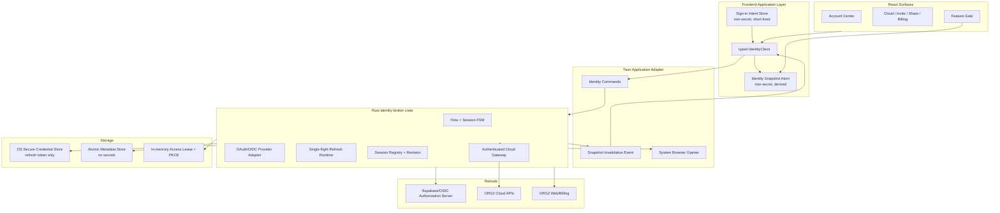
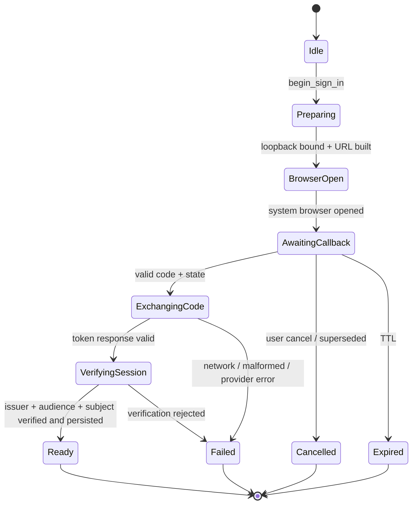
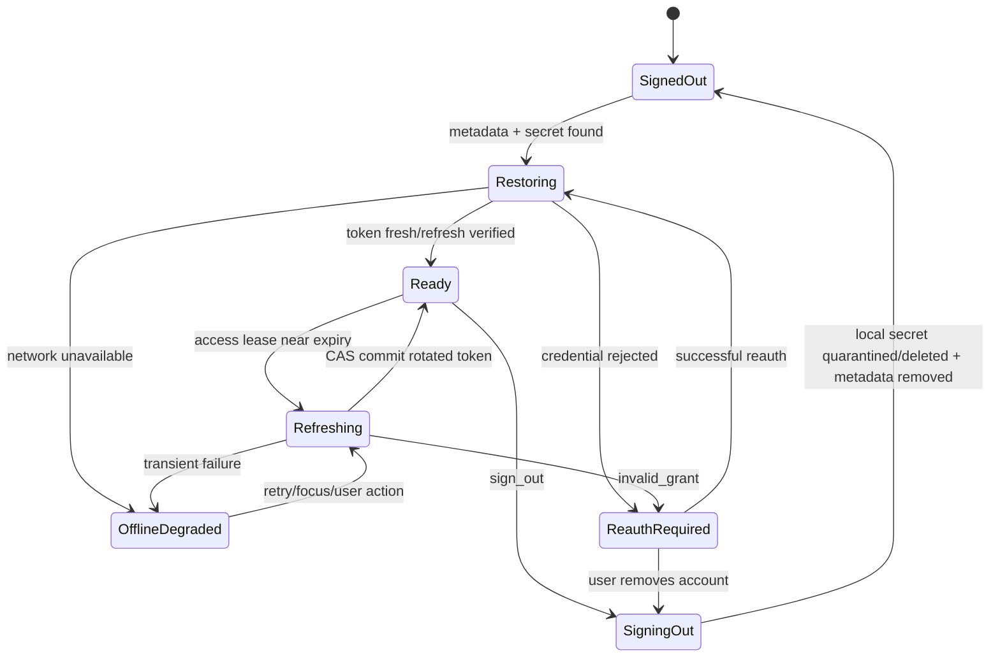

# ORG2 Identity & Authentication 重构实施计划

> 状态：Proposed  
> 日期：2026-08-17  
> 范围：ORG2 Desktop 产品身份、ORG2 Cloud、Hosted Service、浏览器登录回调、会话刷新、退出与账号切换  
> 不直接包含：模型 Provider 凭证格式重写、Git 凭证重写、完整 Cloud API Rust 化；但要求这些身份域不再影响产品身份

## 0. 执行摘要

本计划的目标不是“换一个登录页”，而是把 ORG2 现有的多套登录逻辑收敛成一个可验证、可恢复、可分域的身份系统。

目标产品行为：

1. 本地 IDE 永远可以在未登录状态使用；云、协作、订阅等能力在使用时按需登录。
2. ORG2 Cloud、Hosted Service、GitHub、Codex/Claude 等身份互不连坐；某个 Provider 的 401 不会让整个 IDE 退出。
3. 桌面登录统一使用系统浏览器、一次性 Authorization Code、PKCE S256、随机 `state` 和 `127.0.0.1` 随机端口。
4. Refresh Token、PKCE verifier 不进入 URL、React、Jotai、localStorage、Tauri Store、日志、事件或普通 IPC 响应。
5. Rust `IdentityBroker` 是登录流程、刷新、切换、退出和安全存储的唯一写入者。
6. 前端只持有不敏感的会话投影；迁移期可以按需取得短期 Access Token，最终由 Rust Cloud Gateway 代发认证请求。
7. 所有异步登录与刷新都携带 `flowId`、`sessionId`、`generation/revision`，迟到结果不能复活旧会话。

推荐按 7 个独立可发布阶段落地。双人配置（1 Rust/platform + 1 frontend/cloud）预计 6–8 周；单人顺序执行预计 10–12 周。估算是工程规划口径，不是发布日期承诺。

---

## 1. 先冻结的产品与安全决策

下面是实施默认值。只有出现明确相反的产品约束才调整。

| ID   | 决策             | 默认选择                                                            | 原因                                                      |
| ---- | ---------------- | ------------------------------------------------------------------- | --------------------------------------------------------- |
| D-01 | IDE 是否强制登录 | 否，本地优先、功能触发                                              | 符合开发工具预期，也保留 BYOK                             |
| D-02 | 产品主身份       | `Org2Cloud`                                                         | 组织、订阅、分享、协作都已围绕它建设                      |
| D-03 | Hosted Service   | 作为 `HostedServiceLegacy` 独立 realm 渐进迁移                      | 未确认两个后端的 issuer/subject 相同前禁止静默合并        |
| D-04 | OAuth grant      | Authorization Code + PKCE S256                                      | 桌面 public client 无法保护 client secret                 |
| D-05 | 浏览器           | 系统默认浏览器                                                      | 不在嵌入式 WebView 中完成产品 OAuth                       |
| D-06 | 回调             | `http://127.0.0.1:<random>/callback`                                | 避免固定端口与自定义 scheme 抢占；监听仅存在于当前 flow   |
| D-07 | 安全存储         | OS Keychain/Credential Manager/Secret Service；不可用时不持久化登录 | 不允许静默退回明文 JSON                                   |
| D-08 | Stronghold       | 仅作为显式、需要解锁口令的 fallback                                 | 避免把固定/可推导密码当加密密钥                           |
| D-09 | Access Token     | 迁移期只在 renderer 内存短暂停留；目标态不经 renderer               | 先移除长期 Refresh Token 暴露，再逐步缩小短期 bearer 面积 |
| D-10 | 刷新失败         | 网络错误保留会话；明确 `invalid_grant` 才进入 Reauth                | 离线不能等同于退出                                        |
| D-11 | 多账号           | 数据模型原生支持；首版 UI 可只激活一个 Cloud 账号                   | 避免以后再次改持久化与 API                                |
| D-12 | 降级             | 老版本可能要求重新登录，不把 Token 写回明文以支持 downgrade         | 安全升级优先于无感降级                                    |

### 1.1 开工前必须回答、但不阻塞计划编写的问题

1. 是否已有需要保留登录态的外部用户？默认按“有”设计一次安全迁移。
2. Hosted Service 与 ORG2 Cloud 是否共享同一个 Supabase project、issuer 和 subject？默认按“不共享”处理。
3. ORG2 Cloud Web 登录服务是否与桌面仓库同步发布？新桌面流程必须等服务端 Code + PKCE contract 可用后才默认开启。
4. Linux 无 Secret Service 时是否允许提示用户设置 Stronghold 解锁口令？默认提供“本次使用”和“设置安全存储”两个选项，不写明文。

---

## 2. 完成定义：全局验收清单

每个阶段必须映射到下面至少一个条目；所有 P0/P1 条目完成后，才可以宣布登录重构完成。

### 2.1 产品行为

- [ ] 未登录用户可以启动 ORG2、打开本地项目、使用 BYOK 和本地 Agent。
- [ ] Cloud、协作、邀请、分享、订阅入口按需发起同一条产品登录流程。
- [ ] 登录完成后恢复原始 `intent`，包括 route、dialog、org、invite/share 等非敏感参数。
- [ ] 登录取消、超时、断网或浏览器打开失败不会把用户困在无限 loading。
- [ ] 切换账号时，旧身份的数据在新身份数据加载前就被清空或按身份隔离。
- [ ] 退出 ORG2 Cloud 不会删除 GitHub、Codex、Claude 等外部连接。
- [ ] GitHub、Agent API 或 Hosted Service 的 401 不会触发无关 realm 的全局退出。
- [ ] 过期登录能从触发点进入 reauth，成功后返回原任务。
- [ ] 多窗口、remount、focus、应用重启都从同一 Broker snapshot 恢复，不重新发明登录状态。

### 2.2 OAuth 与安全

- [ ] 产品登录回调只包含 `code`、`state` 或标准错误；URL 中没有 Access/Refresh Token。
- [ ] PKCE 使用 CSPRNG verifier、S256 challenge；verifier 只存在于 Rust pending flow 内存。
- [ ] `state` 至少 256 bit 随机、严格匹配、单次消费、十分钟内过期。
- [ ] Loopback 只绑定 `127.0.0.1`/`::1`，使用 OS 分配随机端口，在 flow 完成/取消/过期后关闭。
- [ ] Code 只能兑换一次，并绑定 client、redirect URI、PKCE verifier。
- [ ] Token 响应校验 schema、issuer、audience、expiry；用户 subject 通过可信端点或已验证 JWT 获得。
- [ ] Refresh Token 和 PKCE verifier 不出现在 localStorage、sessionStorage、Tauri `LazyStore`、普通 JSON 文件、URL、日志、诊断和前端事件中。
- [ ] Secret 类型的 `Debug`/`Display` 默认输出 `<redacted>`，wire snapshot 测试证明公开 DTO 无 secret 字段。
- [ ] 安全存储不可用时明确降级为 memory-only 或要求重新登录，不退回明文持久化。
- [ ] 退出会使当前 generation 失效；正在进行的 refresh/code exchange 无法重新写回会话。

### 2.3 并发与恢复

- [ ] 每个 session 同时最多一个 refresh；所有请求共享同一个结果。
- [ ] Refresh Token 轮换采用 compare-and-set/revision，迟到结果不能覆盖更新后的凭证。
- [ ] sign-out、account switch、endpoint switch 会同步 bump generation。
- [ ] 旧 callback、重复 callback、旧 refresh completion 被稳定忽略并留下脱敏诊断。
- [ ] 网络/超时错误保留最近成功身份投影，标记 `offline_degraded`；明确 400/401 `invalid_grant` 才转 `reauth_required`。
- [ ] App 在 callback 前退出后，pending flow 不持久化；重启显示可重新登录，而不是恢复半个 flow。

### 2.4 架构与代码库

- [ ] 登录、刷新、退出、切换各自只有一个业务 dispatcher/source of truth。
- [ ] `AuthGuard` 不再从 Token 是否存在推断“已认证”。
- [ ] `org2CloudAuthAtom` 不再持久化 Access/Refresh Token。
- [ ] `shared-service-auth.json` 不再保存或镜像任何 Token/PKCE verifier。
- [ ] `useServiceAuth` 与 `tokenRefresh.ts` 的重复 refresh coordinator 被删除。
- [ ] 固定端口 54031 的 Atlas/Authing legacy Login Modal 和无业务入口 atom 被删除。
- [ ] 产品身份、外部连接、模型凭证都有明确 realm/owner，代码中无裸全局 `isAuthenticated`。
- [ ] 新增 realm 时没有 catch-all 自动继承另一个 realm 的行为。
- [ ] 所有生产、冷启动、focus、多窗口、测试入口执行相同的 Broker 初始化步骤。

### 2.5 质量门禁

- [ ] `pnpm typecheck` 通过。
- [ ] 登录相关 Vitest 全部通过，且包含真实状态转移测试，不只有 helper 测试。
- [ ] `cargo check --workspace --all-targets` 通过。
- [ ] `cargo clippy --workspace --all-targets -- -D warnings` 通过。
- [ ] `cargo test -p identity-broker` 通过。
- [ ] macOS、Windows、Linux 的安全存储 contract suite 通过；不可用分支也有测试。
- [ ] 渲染 E2E 通过系统浏览器/loopback 的生产入口完成登录，不以 debug endpoint 代替用户动作。
- [ ] CI secret-boundary 扫描确认公开 DTO、事件、日志与持久化 fixture 不含 secret 字段。

---

## 3. 当前基线与根因

### 3.1 当前存在的身份域

| 当前域               | 入口/状态 owner                                     | Token owner                                 | 主要问题                                                              |
| -------------------- | --------------------------------------------------- | ------------------------------------------- | --------------------------------------------------------------------- |
| Hosted Service       | `AppLogin`、`useServiceAuth`、Supabase JS           | localStorage + shared Tauri Store           | 与应用路由和全局 session-expired 逻辑耦合；有两个 refresh coordinator |
| ORG2 Cloud           | `useOrg2CloudSignIn`、deep-link handler、Jotai atom | localStorage/Tauri Store 中的完整 auth JSON | callback 直接携带 Access/Refresh Token；刷新散落在调用方              |
| Legacy Atlas/Authing | Global Login Modal、`/api/v2/login`                 | direct localStorage writes                  | 固定端口 54031；从业务入口追踪看属于 dead/aspirational path           |
| GitHub/Linear sync   | Rust project-management OAuth                       | connection token store                      | 流程相对清晰，但凭证存储仍不是产品 Identity Broker                    |
| Codex/Claude/Kiro    | Key Vault/provider adapters                         | `credentials.json` 或 provider 自身存储     | 是工具凭证，不应驱动产品登录或全局 logout                             |

### 3.2 当前关键调用路径

```text
Settings / Add Org / Invite / Share
  -> useOrg2CloudSignIn
  -> JS starts tauri-plugin-oauth loopback
  -> system browser
  -> callback URL fragment contains access_token + refresh_token
  -> useDeepLinkHandler
  -> completeOrg2CloudSignIn
  -> decode JWT sub without local signature verification
  -> persist whole auth object in Jotai storage
  -> every Cloud caller composes ensureFreshSession + CAS
```

```text
Hosted route guard / login page
  -> useServiceAuth
  -> Supabase JS PKCE
  -> App AuthCallback writes atoms + localStorage
  -> useServiceAuth refresh coordinator
  -> HTTP tokenRefresh.ts has a second refresh coordinator
  -> generic non-hosted 401 may emit global SESSION_EXPIRED_EVENT
```

### 3.3 根因总结

1. **“身份已登录”与“某个 Token 存在”混为一谈。** 存在 refresh token 被当成已认证，但身份可能尚未恢复或已被服务端撤销。
2. **Secret owner 在 renderer。** React/Jotai/localStorage 同时承担 UI、会话、凭证存储和刷新协调。
3. **身份域缺少类型边界。** generic API target 的 401 被映射为全局产品退出。
4. **同一行为有多个 dispatcher。** Hosted refresh、Cloud refresh、callback completion、logout 清理各有平行实现。
5. **异步 flow 缺少完整 generation。** 已有 Cloud CAS 很好，但 login switch 仍存在 100ms timing workaround，callback dedup 也依赖字符串截断/集合。
6. **入口初始化不完全同构。** bundled/dev origin 通过共享文件和 WebKit import 修补，而不是从 renderer 之外的稳定 owner 恢复。

---

## 4. 术语收敛

### 4.1 过载术语表

| 旧术语          | 当前多重含义                                               | 目标术语                                                                         |
| --------------- | ---------------------------------------------------------- | -------------------------------------------------------------------------------- |
| `auth`          | 产品登录、Cloud session、Provider 凭证、API header         | `product_identity`、`external_connection`、`provider_credential`、`access_lease` |
| `session`       | Chat session、Agent session、OAuth session、browser cookie | `identity_session` 用于登录；其他域保留完整前缀                                  |
| `login`         | 登录 ORG2、连接 GitHub、捕获 Cursor session                | `sign_in`、`connect_provider`、`capture_provider_session`                        |
| `token`         | Access、Refresh、device code、bridge magiclink             | 使用完整名字，不暴露裸 `token` 字段                                              |
| `user`          | ORG2 Cloud subject、GitHub account、模型账户               | `cloud_subject`、`provider_account`、`identity_account`                          |
| `hosted`        | Hosted Service API、Cloud web、远端 workspace              | `hosted_service_legacy`、`cloud_web`、`remote_workspace`                         |
| `bridge`        | 浏览器 billing 登录、跨 origin storage、IPC                | `browser_session_handoff`、`legacy_auth_migration`、`identity_ipc`               |
| `authenticated` | Token 存在、服务端已验证、可刷新                           | `credential_present`、`verified`、`refreshable` 分开表达                         |

### 4.2 Canonical 类型

```rust
enum IdentityRealm {
    Org2Cloud,
    HostedServiceLegacy,
}

struct IdentitySessionId(Uuid);
struct IdentityFlowId(Uuid);
struct SessionRevision(u64);

enum IdentitySessionStatus {
    Restoring,
    Ready,
    OfflineDegraded,
    ReauthRequired,
    SigningOut,
}
```

外部 Provider 暂不塞进产品 session enum；它们实现相同的高层 `IdentityProvider` 契约，但保留独立 realm 和凭证模型。

---

## 5. 目标架构



### 5.1 依赖方向

```text
React surface
  -> typed IdentityClient
  -> Tauri command adapter
  -> identity-broker domain interfaces
  -> OAuth / secure-store / HTTP infrastructure adapters
```

禁止：

- Broker 导入 React/Jotai 或路由概念。
- UI 直接调用 OAuth token endpoint。
- UI 直接写入身份持久化。
- shared HTTP handler 根据裸 401 修改多个 realm。
- Provider adapter 使用 `_ => Org2Cloud` 之类的 catch-all fallback。

### 5.2 状态 ownership

| 值                        | Owner                      | 生命周期        | 持久化                                | Reader                               |
| ------------------------- | -------------------------- | --------------- | ------------------------------------- | ------------------------------------ |
| Refresh Token             | Secure Credential Store    | 跨重启          | OS secure store                       | Broker refresh runtime only          |
| Access Token              | Broker Access Lease        | 短期            | 否                                    | Broker Gateway；迁移期有限 IPC lease |
| PKCE verifier/state       | Pending Flow Registry      | 一次登录        | 否                                    | Broker OAuth adapter only            |
| Identity session metadata | Broker Session Registry    | 跨重启          | 非敏感 atomic JSON                    | Broker + public snapshot             |
| Active session per realm  | Broker Registry            | 跨重启          | 是                                    | snapshot / feature gates             |
| Flow phase/generation     | Broker FSM                 | 一次登录        | 否                                    | snapshot                             |
| Sign-in intent            | Frontend application layer | 当前用户动作    | session memory；只存 allowlisted data | completion router                    |
| Cloud cache               | 各 Cloud domain cache      | identity-scoped | 按现有策略                            | Cloud UI                             |
| UI loading/error          | derived from snapshot      | render lifetime | 否                                    | UI                                   |

---

## 6. 登录与会话状态机

### 6.1 登录 Flow FSM



每次 `begin_sign_in`：

1. 同步生成新 `flowId` 和递增 `generation`。
2. 取消同 realm 的旧 pending flow。
3. 绑定 loopback 后才打开浏览器。
4. 所有 callback/exchange completion 必须匹配 `flowId + generation`。
5. terminal 后立即关闭 listener、zeroize verifier、删除 pending entry。

### 6.2 Identity Session FSM



### 6.3 状态对应 UI

| 状态                  | UI 表现                          | 允许动作               | 禁止动作               |
| --------------------- | -------------------------------- | ---------------------- | ---------------------- |
| SignedOut             | Cloud 入口显示“登录”             | 登录；继续本地使用     | Cloud 写操作           |
| Preparing/BrowserOpen | 按钮 loading，提示正在打开浏览器 | 取消                   | 重复创建新 listener    |
| AwaitingCallback      | “等待浏览器完成”；提供重开/取消  | 取消、重开同一 URL     | 开第二个相同 flow      |
| Exchanging/Verifying  | “正在完成登录”                   | 取消仅使结果失效       | 账号切换、Cloud 写操作 |
| Ready                 | 显示账号与组织                   | Cloud 能力、切换、退出 | 无                     |
| Refreshing            | 保留上次 UI，写操作等待单飞结果  | 取消当前业务动作       | 创建第二个 refresh     |
| OfflineDegraded       | 显示离线；保留只读缓存           | 重试、退出、本地工作   | 未授权 Cloud 写入      |
| ReauthRequired        | 就地提示“重新连接”               | reauth、退出           | 自动无限重试           |
| SigningOut            | 账号行 busy                      | 无或重试清理           | 新 Cloud 操作          |

---

## 7. OAuth Code + PKCE 线协议

### 7.1 推荐服务端 contract

优先使用 Supabase OAuth 2.1 Server 注册 ORG2 Desktop 为 public client：

```text
token_endpoint_auth_method = none
grant_types = [authorization_code, refresh_token]
response_types = [code]
code_challenge_method = S256
redirect_uris = loopback IP redirect with variable port support
```

如果现有 Supabase project 暂不能使用 OAuth 2.1 Server，则允许使用 GoTrue 的 PKCE sign-in/exchange contract，但下面不变量不能变化：回调只有 code，verifier 在 Rust，Token 只返回 Broker。

### 7.2 开始登录

```http
GET /authorize?
  response_type=code&
  client_id=org2-desktop&
  redirect_uri=http%3A%2F%2F127.0.0.1%3A49152%2Fcallback&
  code_challenge=<base64url-sha256>&
  code_challenge_method=S256&
  state=<256-bit-random>&
  scope=openid%20profile%20email%20offline_access
```

具体 scopes 以最小权限为准；Cloud 业务权限继续由 RLS/组织角色判断，不能把所有业务权限塞进 OAuth scope。

### 7.3 回调

成功：

```http
GET /callback?code=<single-use-code>&state=<exact-state>
```

拒绝：

```http
GET /callback?error=access_denied&error_description=<safe-text>&state=<exact-state>
```

Loopback responder 返回固定 HTML，不反射 query，不加载第三方脚本，不包含 Token。

### 7.4 Token exchange

```http
POST /auth/v1/oauth/token
Content-Type: application/x-www-form-urlencoded

grant_type=authorization_code
&code=<code>
&client_id=org2-desktop
&redirect_uri=<exact-loopback-uri>
&code_verifier=<original-verifier>
```

响应经过严格 schema 校验；未知字段可忽略，但缺少 required 字段、错误类型或非 JSON success 必须失败。日志只记录 status、provider error code 和 request correlation id。

### 7.5 Session verification

Token 兑换成功不直接等于 UI Ready。Broker 必须：

1. 校验 `expires_in/expires_at` 范围与本地时钟。
2. 校验 issuer 与发起 flow 的 endpoint snapshot 一致。
3. 校验 audience/client。
4. 通过 JWKS 签名校验或受信 `/user` endpoint 获得 subject；不能仅 base64 decode `sub`。
5. 如有 OIDC `nonce`，验证 nonce。
6. 将 refresh secret 写入 secure store，读回确认，再原子提交非敏感 session metadata。
7. 最后 bump snapshot revision 并发 invalidation event。

---

## 8. Rust Identity Broker 技术规格

### 8.1 建议目录

```text
src-tauri/crates/identity-broker/
├── Cargo.toml
└── src/
    ├── lib.rs
    ├── types.rs
    ├── errors.rs
    ├── broker.rs
    ├── registry.rs
    ├── credential_store.rs
    ├── access_lease.rs
    ├── refresh_runtime.rs
    ├── oauth/
    │   ├── mod.rs
    │   ├── pkce.rs
    │   ├── loopback.rs
    │   └── org2_cloud.rs
    ├── migration.rs
    └── tests/

src-tauri/src/identity/
├── mod.rs
├── commands.rs
├── runtime.rs
└── events.rs
```

`identity-broker` 不依赖 Tauri；`src-tauri/src/identity` 负责 AppHandle、system browser、command 和 invalidation event。

### 8.2 Public command surface

```rust
identity_get_snapshot() -> IdentitySnapshot
identity_begin_sign_in(BeginSignInInput) -> SignInFlowView
identity_cancel_sign_in(CancelSignInInput) -> IdentitySnapshot
identity_begin_reauth(BeginReauthInput) -> SignInFlowView
identity_set_active_session(SetActiveSessionInput) -> IdentitySnapshot
identity_sign_out(SignOutInput) -> IdentitySnapshot
identity_open_authenticated_web(OpenAuthenticatedWebInput) -> OpenedWebView
identity_retry_restore(RetryRestoreInput) -> IdentitySnapshot
```

迁移期临时 command：

```rust
identity_get_access_lease(GetAccessLeaseInput) -> RendererAccessLease
```

它必须：

- 只允许 allowlisted realm/audience；
- 返回短期 Access Token，不返回 Refresh Token；
- 不接受任意 URL，避免变成 Token exfiltration oracle；
- 有调用点 inventory 和删除门槛；
- 在目标态由 typed Rust Cloud Gateway 替代后删除。

### 8.3 Public snapshot DTO

```rust
struct IdentitySnapshot {
    revision: u64,
    sessions: Vec<IdentitySessionView>,
    active_sessions: BTreeMap<IdentityRealm, IdentitySessionId>,
    flows: Vec<SignInFlowView>,
    secure_store_status: SecureStoreStatus,
}

struct IdentitySessionView {
    session_id: IdentitySessionId,
    realm: IdentityRealm,
    issuer: String,
    subject: String,
    display_name: Option<String>,
    primary_email: Option<String>,
    avatar_url: Option<String>,
    scopes: Vec<String>,
    expires_at_unix: Option<i64>,
    status: IdentitySessionStatus,
    generation: u64,
}
```

Public DTO 禁止出现以下字段名或同义字段：

```text
refresh_token, code_verifier, client_secret, id_token,
session_token, raw_token_response, authorization_header
```

### 8.4 Secret storage

`CredentialStore` 接口：

```rust
trait CredentialStore: Send + Sync {
    fn put_refresh_credential(&self, key: &CredentialRef, secret: SecretBytes) -> Result<()>;
    fn get_refresh_credential(&self, key: &CredentialRef) -> Result<Option<SecretBytes>>;
    fn delete_refresh_credential(&self, key: &CredentialRef) -> Result<()>;
    fn health(&self) -> SecureStoreStatus;
}
```

实现：

1. macOS：Keychain。
2. Windows：Credential Manager。
3. Linux：Secret Service；无可用 session 时返回 `Unavailable`。
4. 测试：Memory/Fault-injection store。
5. 可选：Stronghold password-unlocked backend，不给 JavaScript capability。

建议 service/account key：

```text
service = ai.orgii.identity.<runtime-profile>
account = v1/<realm>/<session-id>/refresh
```

非敏感 metadata：

```text
~/.orgii/identity/sessions-v1.json
```

采用 schema version、atomic temp+fsync+rename、owner-only permissions 和进程锁。文件只存 `credentialRef`，不存 secret。

### 8.5 Refresh runtime

Refresh key：

```text
(session_id, session_revision, issuer, audience)
```

算法：

1. Access lease 距到期大于 skew，直接返回。
2. 同 key 已有 in-flight refresh，await 同一 future。
3. 从 secure store 读取当前 refresh credential。
4. 发起一次 refresh；15 秒 timeout，transport error 采用有上限退避。
5. 成功返回 rotated refresh token 时，先 CAS 检查 session revision/generation。
6. CAS 仍匹配才写 secure store、更新 access lease、递增 revision。
7. 已被 sign-out/switch/reauth supersede 时 zeroize 响应并丢弃。
8. 400/401 `invalid_grant` 转 `ReauthRequired`；timeout/DNS/5xx 转 `OfflineDegraded`。

现有 `commitRefreshedAuth`/`clearRejectedAuth` 的稳定身份 CAS 语义应迁移到 Rust，而不是丢失。

### 8.6 Sign-out 顺序

1. bump session generation，使所有 in-flight work 失效。
2. active session 指针立即移除，Cloud cache 开始按 identity 清理。
3. 远端 revoke best effort、有界 timeout，不阻塞本地退出。
4. 删除 secure credential；失败则写不含 secret 的 quarantine tombstone，禁止该 credential 再被读取，并后台/下次启动重试删除。
5. 删除 metadata，发布 snapshot revision。
6. 不清理其他 realm。

---

## 9. Frontend 技术规格

### 9.1 建议目录

```text
src/features/Identity/
├── identityClient.ts
├── identityTypes.ts
├── identitySnapshotAtom.ts
├── identityLifecycle.ts
├── signInIntent.ts
├── useIdentitySnapshot.ts
├── useBeginSignIn.ts
├── useReauthenticate.ts
├── IdentityFeatureGate.tsx
└── AccountCenter/
```

### 9.2 前端原则

- `identitySnapshotAtom` 只是 Broker snapshot 的镜像，不允许自行写登录事实。
- invalidation event 只携带 `{revision}`，收到后调用 `identity_get_snapshot`；事件本身不是事实源。
- UI 不解析 JWT，不交换 Code，不刷新 Token，不写 credential。
- 所有入口传 `SignInIntent`，完成后由单一 intent resolver 恢复操作。
- UI loading/error 完全由 flow/session phase 派生，不维护平行 `isLoggingIn`/`isRefreshing` booleans。

### 9.3 Sign-in intent

```ts
type SignInIntent =
  | { kind: "open_cloud_settings" }
  | { kind: "create_org" }
  | { kind: "accept_invite"; inviteId: string }
  | { kind: "import_share"; shareId: string }
  | { kind: "share_session"; sessionId: string }
  | { kind: "open_billing"; returnPath: "/billing" }
  | { kind: "resume_route"; path: SafeInternalPath };
```

只存 allowlisted、非 secret、可过期的 intent。外部 URL、raw query、Token、authorization code 不允许进入 intent。

### 9.4 Feature gate

`AuthGuard` 拆成：

1. `AppShellGate`：只处理初始化，不要求账号。
2. `IdentityFeatureGate realm="org2_cloud"`：只包 Cloud surface。
3. `EntitlementGate`：只处理订阅/组织权限，不与身份存在性混淆。

如果商业构建仍需首屏登录，`AppLogin` 只是一种 surface：它调用 Broker，并允许“本地模式”；不能直接持有 Token 或自建 refresh。

### 9.5 账号中心

首版至少展示：

- 当前 ORG2 Cloud 账号、状态、issuer/endpoint label。
- 重新连接、切换账号、退出。
- 离线、安全存储不可用、需要 reauth 的明确原因。
- 外部连接分组显示，避免让用户误以为“退出 ORG2”会退出所有 Provider。

---

## 10. Entry-point 初始化一致性矩阵

所有入口最终调用相同 Broker API；表中任一空白都必须有书面理由。

| 入口              | Broker init      | secure store health | metadata hydrate   | generation guard | intent restore      | cache identity reset |
| ----------------- | ---------------- | ------------------- | ------------------ | ---------------- | ------------------- | -------------------- |
| 正常桌面冷启动    | 必须             | 必须                | 必须               | 必须             | 若存在有效 intent   | 必须                 |
| bundled app focus | 已初始化         | 必须重检锁定状态    | snapshot refresh   | 必须             | 否                  | identity 变化时      |
| `tauri dev`       | 必须             | 必须                | 使用隔离 profile   | 必须             | 是                  | 必须                 |
| 第二窗口          | 复用 app runtime | 复用                | snapshot           | 必须             | window-local intent | 必须                 |
| Settings 登录     | 复用             | 已验证              | 已完成             | 必须             | open settings       | 完成后               |
| Add Org           | 复用             | 已验证              | 已完成             | 必须             | create org          | 完成后               |
| Invite/Share      | 复用             | 已验证              | 已完成             | 必须             | invite/share        | 完成后               |
| Billing           | 复用             | 已验证              | 已完成             | 必须             | billing             | 否                   |
| E2E               | 生产 init        | fake secure store   | production hydrate | 必须             | 真实 UI             | 必须                 |

`debug_import_bundled_org2_cloud_auth` 在迁移完成后删除。Dev 与 bundled 的共享策略由 runtime profile 决定，不再读取 WebKit localStorage 数据库。

---

## 11. Session resolver 对称性

每次获取身份必须解析同一个完整 tuple；不能从不同来源拼接 issuer、subject 和 credential。

| 字段            | explicit session id             | active realm index | metadata record        | secure credential      | fallback                     |
| --------------- | ------------------------------- | ------------------ | ---------------------- | ---------------------- | ---------------------------- |
| realm           | session record 校验             | active key         | 必须匹配               | 不参与                 | 无跨 realm fallback          |
| issuer          | session record                  | active session     | authoritative          | credential ref 绑定    | 无默认生产 issuer            |
| subject         | session record                  | active session     | authoritative          | 不从 Token decode 覆盖 | 无                           |
| endpoint        | session record                  | active session     | authoritative snapshot | 不参与                 | 无当前全局 endpoint fallback |
| audience/scopes | operation 要求 + session record | active session     | 必须满足               | 不参与                 | 不足则重新授权               |
| credential ref  | session record                  | active session     | authoritative          | exact lookup           | 不扫描“最近一个 Token”       |

禁止 resolver 在 custom endpoint session 缺字段时回退到 production endpoint；这会把 Token 发送到错误 issuer。

---

## 12. 错误模型

```rust
enum IdentityErrorCode {
    BrowserOpenFailed,
    LoopbackBindFailed,
    FlowExpired,
    FlowCancelled,
    FlowSuperseded,
    StateMismatch,
    AuthorizationDenied,
    CodeExchangeFailed,
    TokenResponseInvalid,
    IssuerMismatch,
    AudienceMismatch,
    SubjectVerificationFailed,
    SecureStoreUnavailable,
    SecureStoreLocked,
    MetadataCorrupt,
    NetworkUnavailable,
    ProviderUnavailable,
    RefreshRejected,
    ReauthenticationRequired,
    SessionNotFound,
    ScopeInsufficient,
}
```

错误还包含：

```text
retryable: bool
realm
flowId/sessionId（如果安全）
correlationId
safeMessageKey
```

不包含：raw HTTP body、authorization code、Token、verifier、完整 email。前端根据 code 映射 i18n 文案，不展示未经清洗的 provider error。

---

## 13. 边界与异常矩阵

| 场景                        | 期望状态/行为                                                     | 持久化影响                         | 回归测试 seam                            |
| --------------------------- | ----------------------------------------------------------------- | ---------------------------------- | ---------------------------------------- |
| 双击登录                    | 第二次只聚焦/复用当前 flow，或显式 supersede；不能开两个 listener | 一个 pending flow                  | Broker concurrency test + UI integration |
| A flow 后立即 B flow        | A generation 失效；A callback 被忽略                              | 只保存 B                           | stale callback test                      |
| state 不匹配                | flow Failed；不 exchange                                          | 无                                 | loopback integration                     |
| callback 重复               | 第二次得到已消费/无 pending                                       | 无                                 | replay test                              |
| 浏览器打开失败              | listener 关闭，回到 SignedOut                                     | 无                                 | opener failure test                      |
| 用户关闭浏览器              | 到 TTL 后 Expired，UI 可重试                                      | 无                                 | fake clock                               |
| exchange 断网               | Failed/Retryable；可从头重试                                      | 无 Token 写入                      | mock transport                           |
| exchange 成功但 verify 失败 | 不提交 session，secret zeroize                                    | 无                                 | malformed/JWT test                       |
| secure store 写失败         | 登录不进入 Ready                                                  | metadata 不提交                    | fault store                              |
| metadata 写失败             | 删除刚写入 credential 或 quarantine                               | 无可用 session                     | fault store                              |
| 启动时离线                  | Restoring -> OfflineDegraded；本地 IDE 正常                       | 保留 session                       | restore integration                      |
| Access 过期、Refresh 正常   | 单飞 refresh，CAS commit                                          | rotated credential                 | concurrency test                         |
| Refresh transport timeout   | OfflineDegraded，不退出                                           | 不覆盖旧 credential                | timeout test                             |
| `invalid_grant`             | ReauthRequired                                                    | 保留账号 metadata，credential 禁用 | rejection test                           |
| refresh 中退出              | logout generation 胜出                                            | 旧 completion 丢弃                 | stale completion test                    |
| refresh 中切账号            | 新 active session 胜出                                            | 旧 completion 丢弃                 | switch race test                         |
| 切 custom endpoint          | 不复用旧 issuer session                                           | 新 identity scope                  | endpoint isolation test                  |
| App 在 callback 前退出      | OS 关闭 listener；重启 SignedOut/已有 session                     | 不恢复 pending                     | process restart E2E                      |
| App 在 credential 写后崩溃  | recovery 扫描 orphan/quarantine                                   | 不自动信任不完整 session           | crash recovery test                      |
| Keychain 被锁定             | 显示 locked，允许重试；不清空账号                                 | 无                                 | backend contract                         |
| 多窗口收到 invalidation     | revision 较新的 snapshot 胜出                                     | 单一 registry                      | multi-window test                        |
| Cloud 401                   | 只标记对应 Cloud session                                          | 其他 realm 不变                    | negative isolation test                  |
| GitHub/Agent 401            | 只进入对应 connection repair                                      | 产品身份不变                       | request handler test                     |
| Billing handoff             | 一次性 browser token；桌面 Refresh Token 不离开                   | browser 自己的 cookie lifecycle    | bridge test                              |
| Invite 登录完成             | 恢复 invite intent，一次消费                                      | intent 删除                        | rendered E2E                             |
| 退出时 revoke 失败          | 本地退出完成，记录可重试诊断                                      | local credential 已禁用            | revoke failure test                      |
| 系统时钟偏差                | 使用 server expiry/Date header 容差，极端偏差要求 reauth          | 不无限 refresh                     | clock-skew test                          |

---

## 14. 安全威胁模型

| 威胁                          | 现有暴露                             | 目标防护                                                 | 验证                    |
| ----------------------------- | ------------------------------------ | -------------------------------------------------------- | ----------------------- |
| 回调 URL 泄漏                 | URL fragment 带 Access/Refresh Token | callback 只有一次性 code；PKCE proof-of-possession       | URL fixture secret scan |
| 自定义 scheme 被别的 app 抢占 | deep link 可被同 scheme app 接收     | loopback IP + PKCE；可选 claimed HTTPS                   | interception test       |
| 固定端口抢占                  | legacy 54031 可预测                  | `127.0.0.1:0`，先 bind 后 authorize                      | bind race test          |
| 恶意网页打 localhost          | localhost endpoint 可被探测          | 随机路径/state、单请求、无 CORS、PKCE、短 TTL            | foreign request test    |
| Renderer XSS                  | localStorage 中长期 secret           | Refresh/PKCE 不进 renderer；目标态 Access 也由 Rust 代发 | IPC/storage audit       |
| 日志与诊断泄漏                | string error 可能携带响应            | secret types redacted、safe error union                  | snapshot/log tests      |
| Refresh replay/race           | 多协调器可能轮换冲突                 | 单飞 + revision CAS + rotation                           | high-concurrency test   |
| 账号切换数据串线              | async completion 写回旧状态          | session generation + identity-keyed cache                | switch E2E              |
| 错误 issuer/audience          | endpoint 与 Token 分散保存           | session tuple 原子绑定，无 fallback                      | resolver matrix test    |
| 安全存储不可用                | 可能回退普通文件                     | fail explicit / memory-only                              | platform test           |
| 旧版本降级                    | 可能重新暴露 secret                  | 不回写；降级后重新登录                                   | release test            |
| 供应链/插件读取 secret        | JS plugin/store API 可访问           | Rust-only secure backend，无 JS capability               | Tauri capability audit  |

---

## 15. 分阶段实施计划

每一阶段一个或多个单一职责 PR；单 PR 尽量不超过约 20 个文件。每阶段开始记录 baseline，结束必须有可运行验证和回滚说明。

### Phase 0：删除死路径并建立边界基线（2–3 天）

**目标：** 先减少登录实现数量，不改变当前主流程协议。

工作包：

1. 从真实业务入口重新确认 `loginModalVisibleAtom` 没有 writer。
2. 删除固定 54031 端口的 legacy Login Modal、对应 lazy mount、dead atoms 和只服务该路径的 `/api/v2/login` wrapper。
3. 生成登录入口 inventory：Cloud、Hosted、billing、invite/share、startup、focus、401、logout、reauth、dev import。
4. 增加 secret boundary 静态检查脚本，扫描公开 DTO/event/localStorage keys。
5. 给现有关键行为补 characterization tests，锁定“网络失败不退出”和 Cloud CAS 行为。

主要文件候选：

- `src/scaffold/ModalSystem/variants/Login/index.tsx`
- `src/modules/shared/layouts/GlobalModals.tsx`
- `src/store/ui/uiAtom.ts`
- `src/api/http/auth/login.ts`
- `scripts/quality/check-identity-secret-boundaries.mjs`

Exit：

- `rg "54031|loginModalVisibleAtom|completeLogin" src` 无生产命中，或每个保留命中都有业务入口证据。
- 主 Hosted/Cloud 登录行为无变化，相关 Vitest 通过。

回滚：纯删除可恢复；不涉及持久化格式。

### Phase 1：Rust Broker 与安全存储最小闭环（5–7 天）

**目标：** 创建 Broker 时同时接入一个真实 Cloud session restore/sign-out 路径，避免“只建抽象不接线”。

工作包：

1. 新建 `identity-broker` crate、typed errors、session registry、CredentialStore trait。
2. 实现 Memory/Fault store 与至少当前开发平台的 OS secure backend；其他平台先以 contract tests 保证接口。
3. 接入 `identity_get_snapshot`、`identity_sign_out`、`identity_retry_restore`。
4. 实现 legacy Cloud credential migrator：从 shared auth store 读取、验证、写 secure store、read-back，最后清除 legacy secret。
5. 前端新增 typed IdentityClient 和 snapshot atom；App 初始化先 hydrate snapshot，再 mount Cloud consumers。
6. 保留旧登录入口，但 Cloud startup/auth display 从 Broker snapshot 派生。

Exit：

- 至少一个现有 ORG2 Cloud session 可迁移、重启恢复和退出。
- secure store 写失败不会删除 legacy credential，也不会宣称迁移成功。
- sign-out 时迟到 restore 不会复活 session。

回滚：feature flag 可切回 legacy reader；已经安全迁移的用户在旧版本需要重新登录，不恢复明文 Token。

### Phase 2：ORG2 Cloud Code + PKCE（5–8 天，含 Web 配合）

**目标：** 完全替换 Token-fragment callback。

服务端工作：

1. 注册 ORG2 Desktop public client。
2. 支持 Authorization Code + PKCE S256、loopback variable port、exact redirect validation。
3. Code 单次、短期、绑定 client/redirect/challenge。
4. 保留旧 fragment flow 一个受监控兼容窗口；新客户端默认只走 code flow。

桌面工作：

1. Rust 生成 verifier/challenge/state，绑定 `127.0.0.1:0`。
2. Tauri adapter 在 listener ready 后打开系统浏览器。
3. Rust 接收 callback、校验 state、exchange、verify、persist。
4. invalidation event 驱动 UI 读取 snapshot，并恢复 sign-in intent。
5. 删除 Cloud auth callback fragment parser、JS loopback coordinator 和 deep-link 中的 Token completion 分支。

主要删除候选：

- `src/features/Org2Cloud/authCallback.ts`
- `src/features/Org2Cloud/completeSignIn.ts` 中的 callback Token commit
- `src/features/Org2Cloud/org2CloudAuthLoopback.ts`
- `useDeepLinkHandler` 的 Cloud Token fragment 分支

Exit：

- 抓取实际回调 URL，只有 code/state/error。
- state mismatch、重复 callback、过期 callback、浏览器失败、exchange 网络失败均有行为测试。
- Access/Refresh Token 从不进入 deep-link/loopback event。

回滚：服务端兼容旧客户端；新客户端 feature flag 可暂回旧入口，但不能把已迁移 secure credential 写回 URL。

### Phase 3：刷新单一 owner，移除 Renderer Refresh Token（5–7 天）

**目标：** Broker 成为 Cloud refresh 唯一 owner。

工作包：

1. 实现 Rust access lease cache、single-flight refresh、rotation CAS 和 rejection classification。
2. `org2CloudAuthAtom` 缩成 non-secret session projection；移除 persisted access/refresh token。
3. 将 `refreshOrg2CloudAuthForAction` 替换为 `IdentityClient.withAccessLease` 迁移 facade。
4. 系统性扫描所有 `ensureFreshSession`、`.refreshToken`、`.accessToken` Cloud call sites，按功能批次迁移。
5. Realtime 等暂时需要 JS bearer 的路径仅获得短期 access lease；不允许 refresh token。
6. 删除 renderer 的 Cloud refresh implementation 和 CAS writer；保留行为测试并迁到 Broker。

Exit：

- `rg "refreshToken" src/features/Org2Cloud` 只允许 wire response type/test fixture，无运行时 secret owner。
- localStorage/Tauri Store snapshot 无 Cloud Access/Refresh Token。
- 100 个并发 Cloud 请求只触发一次 refresh。
- sign-out/switch race 测试证明旧 refresh 不会复活会话。

回滚：Broker 可继续提供 short access lease；不恢复 refresh token 到 renderer。

### Phase 4：Hosted Service 收敛与应用 Gate 解耦（4–6 天）

**目标：** 消灭第二套 refresh/orchestration，并把“产品身份”从“是否能进入 IDE”中拆开。

工作包：

1. 将 Hosted Supabase PKCE adapter 接入 Broker，realm 为 `HostedServiceLegacy`。
2. 合并 `useServiceAuth` 与 `tokenRefresh.ts` 的 refresh 行为到 Broker。
3. `AppLogin/AuthCallback` 不再写 atom/localStorage；只调用 Broker 或被系统浏览器 loopback 替代。
4. `AuthGuard/AuthRedirect` 改为 snapshot/feature gate；本地 App shell 不需要登录。
5. `HOSTED_LOGIN_ENABLED` 只控制 Hosted 功能/商业 surface，不改变底层 identity semantics。
6. 如果确认 Hosted 与 Cloud issuer/subject 相同，提供显式 server-side account linking；否则持续分域。

Exit：

- Hosted refresh 只有一个 Rust coordinator。
- 不存在“任意 refresh token 存在即 authenticated”的判断。
- 本地路由在 Hosted 服务不可用时仍可进入。

回滚：Hosted adapter 可 feature-flag off；Cloud 和本地 IDE 不受影响。

### Phase 5：401 分域、账号切换与 reauth 闭环（4–6 天）

**目标：** 完成用户可感知的一致性和身份隔离。

工作包：

1. 用 typed `AuthFailure { realm, sessionId, reason }` 替换 global `SESSION_EXPIRED_EVENT`。
2. generic `requestHandler` 不再直接 logout；每个 client adapter 解释自己的 401/403。
3. 复用 Codex reauthentication 的“定位账号 -> Key Vault/Identity readiness -> 自动开始 -> 返回原任务”模式。
4. 账号切换使用 Broker command + generation，不再等待 100ms。
5. identity 变化先执行 cache eviction/invalidation，再让新身份 surface 可见。
6. 增加 Account Center 与 realm-specific repair UI。

Exit：

- Cloud 401、Hosted 401、GitHub 401、Agent 401 的隔离矩阵全部通过。
- account A 慢请求不能写入 account B cache。
- reauth 完成能恢复 Cloud action，不丢 invite/share intent。

回滚：typed failure adapter 可逐 client 开启；不能恢复 global logout。

### Phase 6：迁移收尾与旧存储删除（3–5 天）

**目标：** 删除兼容层，确保没有第二事实源。

工作包：

1. 统计迁移成功率和 reauth 率达到门槛后，删除 `sharedAuthStorage` 的 secret keys 和镜像逻辑。
2. 删除 `debug_import_bundled_org2_cloud_auth` 与 WebKit localStorage 扫描。
3. 删除 `serviceAuth` 的 Token CRUD、processed code substring dedup、old session events。
4. 删除迁移期 `LegacySessionEnvelope` command。
5. 若 Hosted 已合并，删除 `HostedServiceLegacy` adapter；否则保留清晰独立 realm，不保留兼容别名。
6. 运行全仓 secret/string/class sweep，记录保留项与理由。

Exit：

- `rg "hosted_refresh_token|orgii.supabase.auth|code-verifier|shared-service-auth.json" src src-tauri` 无运行时持久化命中。
- 本地 Token 文件 fixture 与 release artifact secret scan 通过。
- downgrade 文档明确：可能重新登录，但本地项目数据不受影响。

回滚：代码可回滚；凭证格式不降级，用户最多重新登录。

### Phase 7：Rust Cloud Gateway 与发布硬化（5–10 天，可拆子阶段）

**目标：** 删除 renderer Access Token lease，完成最小攻击面目标态。

工作包：

1. 按 Cloud API domain 建 typed Rust gateway，不提供 arbitrary authenticated fetch。
2. 第一批迁移 org/profile/entitlement/billing bridge 等控制面请求。
3. 第二批迁移 sync/storage 请求；流式大对象保持 bounded streaming，不经 JSON/base64 放大。
4. Realtime 选择 Rust transport 或明确的短期 socket ticket，避免长期 bearer 在 renderer。
5. 删除 `identity_get_access_lease` IPC command。
6. 完成三平台 E2E、beta rollout、kill switch、runbook 和 incident telemetry。

Exit：

- renderer 无 Access/Refresh Token。
- 所有认证 HTTP 由 allowlisted typed gateway 发起。
- Cloud 大对象传输性能不低于基线，内存峰值有预算。

回滚：逐 gateway domain 回切短期 access lease；Refresh Token 仍只在 Broker，安全底线不回滚。

---

## 16. PR 切分与依赖


每个 PR 必须：

- 一个问题/目标，不混入无关 UI 或架构清理。
- 同时包含跨 Rust/TypeScript 的两端接线，不留下未使用 abstraction。
- 描述以 `Problem`、`Solution`、`Potential risks` 开头。
- 写明实际测试命令、未测试平台、迁移与 rollback。
- 在 Draft 状态保留到相关服务端 contract 和风险验证完成。

---

## 17. 测试策略

### 17.1 Rust unit/contract tests

1. PKCE RFC vector、verifier 长度/字符集、S256 only。
2. state/flow TTL、重复 callback、supersession、cancel cleanup。
3. Loopback 只绑定 IP literal、随机端口、单请求、关闭时机。
4. OAuth wire form 实际序列化 snapshot；确认无 secret 进入公开 DTO。
5. Token response malformed、issuer/audience/subject mismatch。
6. Secure store success、locked、unavailable、write/read/delete failure。
7. Registry atomic write、corrupt metadata、orphan/quarantine recovery。
8. Refresh single-flight、rotation、reuse window、transport retry、permanent rejection。
9. sign-out/switch 与 refresh/code exchange race。
10. error/debug redaction。

### 17.2 Frontend tests

1. snapshot revision 只前进，不接受旧 event/snapshot。
2. 每个 FSM 状态的按钮、文案、allowed actions。
3. login intent allowlist、过期、一次消费和安全 redirect。
4. local-first route gate。
5. OfflineDegraded 保留缓存但禁用写操作。
6. ReauthRequired 就地恢复原任务。
7. 账号切换先清旧缓存后显示新账号。
8. 负向隔离：GitHub/Agent failure 不改变产品 snapshot。

### 17.3 Rendered E2E

E2E 使用 mock OAuth/OIDC server 作为外部依赖，但必须通过生产 UI 按钮、生产 Tauri command、真实 loopback 和生产 snapshot hydration 驱动；debug helper 只负责配置 mock endpoint/检查结果，不能直接写登录成功状态。

场景：

1. 未登录启动 -> 本地 IDE ready。
2. Settings 登录 -> 系统浏览器 -> callback -> Account Center ready。
3. Invite 登录 -> 自动恢复 invite dialog。
4. callback state mismatch -> 安全失败 -> 可重试。
5. 登录中取消 -> listener 清理 -> 再登录成功。
6. 重启恢复 -> 不打开浏览器 -> Cloud ready。
7. 离线重启 -> OfflineDegraded -> 网络恢复后 Ready。
8. refresh rotation -> 多个请求只 refresh 一次。
9. refresh 中退出 -> 不复活。
10. A/B 切换 -> 旧数据不闪现。
11. Hosted/GitHub 401 -> Cloud 仍 Ready。
12. secure store locked -> 显示修复路径，不写明文。
13. Billing browser handoff -> browser 独立 session，桌面 refresh credential 未读取到 renderer。

### 17.4 平台矩阵

| 平台            | 浏览器/loopback | secure store       | 冷启动恢复 | 安装/升级             | 无 secure backend   |
| --------------- | --------------- | ------------------ | ---------- | --------------------- | ------------------- |
| macOS           | 必测            | Keychain           | 必测       | bundled + dev profile | 模拟 locked         |
| Windows         | 必测            | Credential Manager | 必测       | installer upgrade     | 模拟 API failure    |
| Linux GNOME/KDE | 必测            | Secret Service     | 必测       | package upgrade       | 实机无 DBus session |

---

## 18. CI 与静态门禁

建议新增：

```text
pnpm check:identity-secret-boundaries
pnpm test:identity
cargo test -p identity-broker
```

静态门禁扫描：

1. Public Rust DTO / TS types 中禁止 secret field names。
2. `localStorage.setItem`/Tauri Store 写入禁止 auth/token/verifier keys。
3. logger 参数中禁止 Secret 类型被格式化。
4. `triggerSessionExpired`/global logout 调用必须为零。
5. OAuth callback parser 不得接受 fragment bearer。
6. 生产 loopback 不得包含固定端口或 `localhost` host。
7. `identity_get_access_lease` 调用点只能在登记清单内，并要求最终为零。
8. 新 realm 的 match 必须显式处理，禁止 `_` 映射到另一个 realm。

每阶段验证模板：

```bash
pnpm typecheck
pnpm lint:file <changed-ts-files>
pnpm vitest run <identity-and-affected-tests>
cd src-tauri && cargo test -p identity-broker
cd src-tauri && cargo check --workspace --all-targets
cd src-tauri && cargo clippy --workspace --all-targets -- -D warnings
```

最后两项可在 CI 跑全量，但 PR 本地至少跑 changed crate 与 app command registration check。

---

## 19. 迁移与发布策略

### 19.1 迁移状态机

```text
NotStarted
  -> LegacyDetected
  -> SecureStoreChecked
  -> CredentialImported
  -> SessionVerified
  -> LegacySecretDeleted
  -> Complete
```

失败保留精确状态，重启可幂等继续。只有 `SessionVerified` 后才能删除 legacy secret。任何日志/marker 只记录 credential reference/hash，不记录 secret。

### 19.2 发布波次

1. **Internal：** Broker shadow snapshot，旧登录为主；观察 init/secure-store health。
2. **Dev/Beta：** 新 PKCE flow 默认，旧 server flow 仍兼容；Renderer Refresh Token 已移除。
3. **Stable 10%：** migration + realm-specific errors；监控 reauth/rollback。
4. **Stable 100%：** 删除旧 token-fragment 发放能力前，确认最低兼容客户端策略。
5. **Cleanup release：** 删除 legacy desktop parser/store/migrator。

### 19.3 Kill switch

Kill switch 只允许：

- 暂停新登录入口并提示重试；
- 回到旧 server authorize 页面但仍返回 code + PKCE；
- 暂时回退 Rust Gateway 到短期 renderer access lease。

Kill switch 不允许恢复：

- Token fragment callback；
- Refresh Token 写入 localStorage/Tauri Store；
- generic 401 global logout；
- 固定端口 legacy modal。

### 19.4 关键指标

只记录脱敏 metadata：

- `sign_in_started/completed/cancelled/failed` 按 realm、platform、error category。
- login P50/P95 duration。
- callback timeout/state mismatch 率。
- secure store unavailable/locked 率。
- migration success/reauth required 率。
- refresh success/transient/permanent rejection 率。
- stale callback/refresh completion discarded 计数。
- global logout isolation regression 计数应为零。

禁止记录 email、subject、Token、code、verifier、完整 authorize/callback URL。

---

## 20. 运维与故障处理 Runbook

### 登录普遍失败

1. 检查 authorize endpoint/client registration/redirect allowlist。
2. 检查 callback 是否使用 IP literal 和有效随机端口。
3. 查看 error category 与 correlation id，不请求用户提供完整 callback URL。
4. 服务端可临时保持旧 client 兼容，但不恢复 fragment Token。

### 大量 `state_mismatch`

1. 检查多个 flow 是否被重复创建。
2. 检查 browser redirect 是否丢 query。
3. 检查 loopback helper/代理是否重写 URL。
4. 不放宽 state 校验；先关闭入口或回滚客户端 flow coordinator。

### Refresh rejection 激增

1. 区分 transport/5xx 与 `invalid_grant`。
2. 检查是否存在重复 refresh coordinator 或 rotation CAS 失败。
3. 检查 Supabase refresh reuse interval 和 server clock。
4. 只对确切 session 提示 reauth，不全局退出。

### Secure store 不可用

1. 平台 health 检查定位 locked/unavailable/permission denied。
2. 允许 memory-only 当前会话或显式 Stronghold unlock。
3. 不把 secret 写回 JSON。
4. 恢复后允许用户重试持久化；失败不影响本地 IDE。

---

## 21. 架构审计 10 层覆盖

| 层                       | 本计划覆盖                                            | 实施验收                                             |
| ------------------------ | ----------------------------------------------------- | ---------------------------------------------------- |
| 1. Compilation           | 每阶段 TS/Rust/Clippy 门禁                            | 零新增 warning/error                                 |
| 2. Dead code/dedup       | Phase 0 删除 legacy modal；Phase 3/4 删除重复 refresh | 业务入口 call-chain + 全仓 sweep                     |
| 3. Naming                | realm/session/token 术语收敛                          | 旧名 grep 清零或有保留理由                           |
| 4. Semantic overloading  | 第 4 节术语表                                         | 新类型使用完整 domain 名称                           |
| 5. Default branches      | 禁止 realm catch-all                                  | exhaustive match tests                               |
| 6. Cross-domain leakage  | 产品身份、Provider connection、Key Vault 分域         | 401/logout isolation tests                           |
| 7. New developer clarity | 单一 Broker、明确目录与 owner                         | 架构 README + typed API                              |
| 8. Wire protocol         | 第 7/8/12/14 节                                       | 实际 authorize/token/callback/IPC snapshot           |
| 9. Init parity           | 第 10 节 entry matrix                                 | production/dev/window/E2E 同初始化                   |
| 10. Resolver symmetry    | 第 11 节 tuple matrix                                 | issuer/subject/endpoint/credential 无非对称 fallback |

---

## 22. 明确不做与后续边界

本计划不把以下工作偷偷混入同一 PR：

1. 不重写 Codex/Claude/Kiro 的 Provider OAuth；只确保它们不驱动产品全局 logout。
2. 不把 Git credential、GitHub Issue connection 与 ORG2 Cloud subject 自动合并。
3. 不为了登录重构同时更换整个 Supabase 数据层。
4. 不引入任意 URL 的“带认证代理”command。
5. 不把 authorization/entitlement/workspace trust 混成一个 `isAuthenticated`。
6. 不承诺旧客户端可以读取新安全存储；降级最多要求重新登录。

Phase 7 完成以后，Provider OAuth 可以基于同一个 `CredentialStore`/flow runtime 迁移，但必须保留 provider-specific realm、scope 和 repair UI。

---

## 23. 官方基线参考

- RFC 8252, OAuth 2.0 for Native Apps: https://www.rfc-editor.org/info/rfc8252/
- RFC 9700, OAuth 2.0 Security Best Current Practice: https://www.rfc-editor.org/info/rfc9700/
- Supabase OAuth 2.1 Server: https://supabase.com/docs/guides/auth/oauth-server
- Supabase OAuth 2.1 Flows: https://supabase.com/docs/guides/auth/oauth-server/oauth-flows
- Tauri Stronghold: https://v2.tauri.app/plugin/stronghold/
- Rust keyring ecosystem: https://docs.rs/crate/keyring/latest
- VS Code Authentication API: https://code.visualstudio.com/api/references/vscode-api
- Zed Authentication: https://zed.dev/docs/authentication

---

## 24. 开工顺序（一页版）

1. 先确认 4 个决策问题，但按本文默认值即可开始 Phase 0。
2. 删除无业务入口的第三套 legacy Login。
3. 建 Rust Broker，并立即接入 Cloud restore/sign-out。
4. 服务端与桌面一起上线 Code + PKCE，callback 不再带 Token。
5. 把 refresh/rotation/CAS 移入 Broker，Refresh Token 离开 renderer。
6. 收敛 Hosted Service，拆掉全局 App auth gate。
7. 401 按 realm 处理，完成切账号与 reauth-return。
8. 删除 shared auth store、WebKit import 和所有旧 secret keys。
9. 最后用 typed Rust Cloud Gateway 移除 renderer Access Token。
10. 三平台 E2E、分批发布、观察指标，达标后关闭旧服务端 flow。

完成标志不是“新目录存在”，而是：登录只有一个 dispatcher、secret 只有一个安全 owner、每个 realm 独立失败、每个异步结果都有 generation、所有入口与测试走同一条生产路径。
