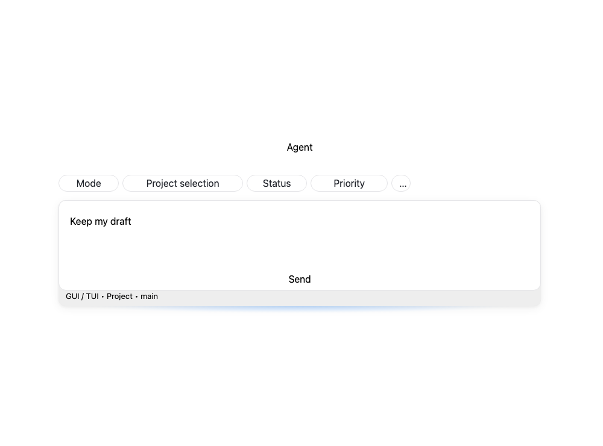
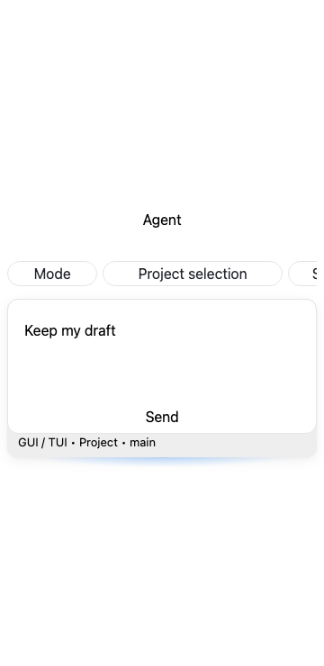
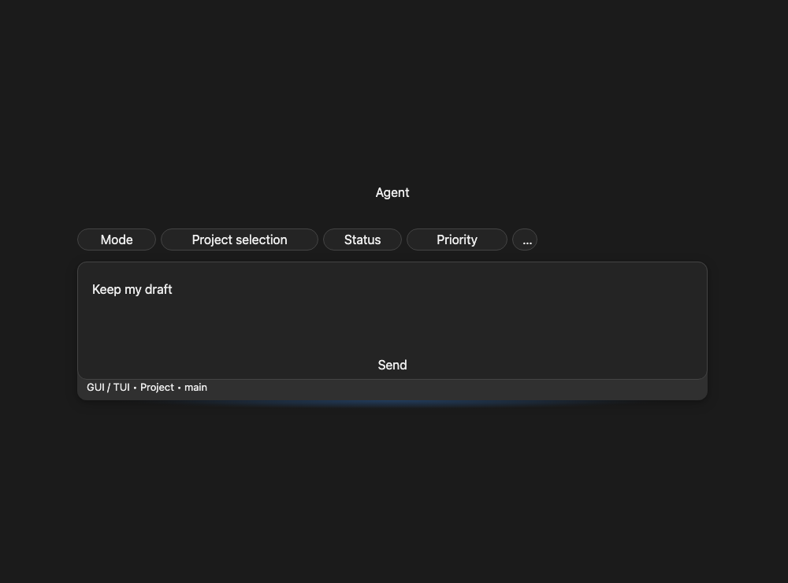

# Creator refactoring stack verification

This series has one integration responsibility: make Session, Work Item, and Project creation use consistent surfaces, layout controls, and a reusable Work Item selector. Review layers isolate shared composer presentation, the selector/modal extraction, and global creator placement. Unrelated effort controls, chat-history behavior, inbox changes, icons, and repository audit-only work are excluded.

## Acceptance and architecture

| Layer                  | Result                                                                                                                                                                                                                    |
| ---------------------- | ------------------------------------------------------------------------------------------------------------------------------------------------------------------------------------------------------------------------- |
| 1 — Compilation        | Each review layer passes full TypeScript; the final integration passes 100 tests in 22 suites, changed-file lint/formatting, circular checking, and test placement                                                        |
| 2 — Structure          | Shared ComposerShell and utility styles own edge shadows; the reusable modal owns selection; shared session atoms own layout preferences. Variant-local picker/model copies and expansion state are removed               |
| 3 — Naming             | Input placement, repository trail placement, and picker selection are distinct concepts with separate types/owners                                                                                                        |
| 4 — Semantics          | Layout changes preserve draft DOM and values. Picker Add commits selection; Cancel/close does not. The redundant top-row Add work item control is removed, while Solve Work Item remains                                  |
| 5 — Defaults           | Input defaults Bottom. Unset trail placement is Up for Bottom and Down for Middle. A later explicit trail choice lasts until an actual input-placement change                                                             |
| 6 — Boundaries         | Shared Modal handles focus/dismissal, picker returns selected options, and the attachment consumer performs insertion. Shared config/state do not depend on the creator component                                         |
| 7 — Readability        | One shell, selector, and layout preference replace presentation-specific branches; existing comments explain shadow ownership and draft-preserving ancestry                                                               |
| 8 — Serialization      | Existing input/trail storage keys and values are retained. No backend schema, API, IPC, provider payload, or Work Item persistence format changes                                                                         |
| 9 — Entry-point parity | Agent launchpad/embedded creators read shared placement; Manual Work Item/Project reuse CreatorContentLayout; organization/import forms read the same preference. Card/pill/button selector presentations share one modal |
| 10 — Resolver symmetry | One linked action writes input placement and resets its trail override; one resolved trail atom serves the menu and creator. One selector projection serves local/provider options                                        |

All ten layers were reviewed. Rust, provider ingestion, network payload inspection, session initialization, and multi-instance transport are unchanged and intentionally outside this frontend-only validation. Rollback is a code revert; no migration or historical data cleanup is required.

## Verification

- Shared-surface layer: **34 tests, eight suites**, full `pnpm typecheck`, ESLint, Prettier, Sass compilation and isolated headless shadow checks passed.
- Picker/modal layer: **49 tests, eight suites**, full `pnpm typecheck`, ESLint and Prettier passed. The model and model tests are byte-identical relocations. Tests cover cross-filter selection, payload preservation, duplicate insertion, disabled-to-enabled Tab boundaries, search focus, backdrop/Escape/cancel, pending-focus cancellation, late responses after close, repository changes, retry, and existing cache bounds.
- Integration: **100 tests, 22 suites**, full `pnpm typecheck`, changed-file ESLint/Prettier, `pnpm check:circular` (6,341 modules), `pnpm check:test-placement`, `node --check config/tailwind.config.js`, and `git diff --check` passed. All eight menu labels are present in all 13 locales.
- Isolated headless checks exercise seven shared surfaces in light/dark themes at 360/1,000px, preserving colors, dimensions, focus rings, draft values, and a single grouped shadow. Creator checks at 360/520/1,000px verify horizontal wheel input scrolls only the pills row, leaves the editor fixed, and preserves drafts in Agent and Manual layouts.

Exact test paths and commands are listed in the integration PR's Verification section. All commits use Harry19081's GitHub noreply address and run the repository hooks without bypassing them.

## UI evidence and limitations

The images below are **isolated geometry fixtures**, not native app screenshots. They use the production creator view/scaffold, shell and compiled styles, with editor internals, icons, hero content, provider services and controls stubbed. They show bounded input geometry, independent row overflow, and shadow placement. They do not establish native menu behavior, actual provider data rendering, or full production visual parity.

Native Tauri interaction, live-provider loading/error visuals, macOS/Windows WebView differences, and visible/hidden/repeated-open CPU/RSS measurements were not run because desktop control requires explicit opt-in. Unit and headless evidence does not imply a runtime performance improvement.

UI audit totals across the surface, picker, placement and header-menu reports: **0 fix, 29 keep with reason, 0 abstract**. Performance guard: unit-level resource ownership and cleanup verified; **blocked for native desktop measurements**. The PRs remain reviewable with that limitation disclosed.
