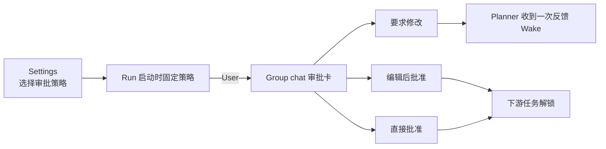

# Agent Org Planner Approval 前端 UI 审计

日期：2026-07-13
范围：Agent Org 创建/编辑页的审批策略、Group chat 审批卡、run phase 与任务展示。
说明：仓库路由要求的 `frontend-ui-audit` skill 在 workspace 和用户目录都不存在，因此本报告按 AGENTS.md 要求手工执行同等检查，未伪称运行了缺失 skill。

## 审计表

| Line                                   | Element                | Verdict | Reason                                                                                       | Suggested change |
| -------------------------------------- | ---------------------- | ------- | -------------------------------------------------------------------------------------------- | ---------------- |
| `PlanApprovalPolicySelector.tsx:17`    | 审批策略选择器         | keep    | 复用项目 `Select` 与现有表单 section；三种策略用 typed union，不用自由文本。                 | 无。             |
| `AgentTeamFormSections.tsx:266`        | 创建 Agent Org         | fixed   | 创建时可选择 Coordinator / User / Automatic，默认 Coordinator。                              | 无。             |
| `OrgDetailView.tsx:85-199`             | 编辑 Agent Org         | fixed   | 编辑和创建使用同一字段与 selector，避免只在 wizard 生效。                                    | 无。             |
| `AgentOrgOverviewPanel.tsx:287`        | 用户审批区域           | keep    | 只有 policy=user 且存在 pending approval 才显示；不把 Coordinator 审批重复展示给用户。       | 无。             |
| `AgentOrgPlanApprovalCard.tsx:21`      | 审批卡                 | keep    | 使用项目 Button、Textarea、Markdown；显示计划标题与成员 display name，不暴露内部 member id。 | 无。             |
| `AgentOrgPlanApprovalCard.tsx:72`      | 卡片状态标识           | keep    | 稳定 test id 与 approval id 方便 E2E，不影响视觉。                                           | 无。             |
| `AgentOrgPlanApprovalCard.tsx:97,112`  | 编辑与反馈输入         | keep    | 有 `aria-label`、disabled 和 loading；长内容限制高度并可滚动。                               | 无。             |
| `AgentOrgPlanApprovalCard.tsx:126`     | 错误反馈               | keep    | command 失败在卡内以 `role=alert` 显示，不会静默吞错。                                       | 无。             |
| `AgentOrgPlanApprovalCard.tsx:142-191` | 要求修改 / 编辑 / 批准 | fixed   | 三条用户动作各自明确；空反馈不能发送、空计划不能批准、提交中防重复点击。                     | 无。             |
| `org_tasks.rs:118` + UI badge          | `AwaitingPlanApproval` | fixed   | 等审批时 Run 仍是 Running，界面显示“等待计划审批”，不会误显示 Paused 或 Done。               | 无。             |
| `sessions.json` / `integrations.json`  | 中英文文案             | keep    | 新标签、提示、策略说明同时提供英文和中文。                                                   | 无。             |
| Group chat approval E2E                | rendered interaction   | fixed   | E2E 真实打开 overview，并点击要求修改、输入反馈、重新提交、编辑、批准，再检查 task 解锁。    | 无。             |

## 设计一致性

## 统计

- fix：6
- keep with reason：6
- 需要抽象：0
- 未解决的阻塞级 UI 问题：0

没有新增任意色值、任意 spacing 或另一套按钮/输入组件。审批卡有明确 loading、disabled、错误与无内容保护；对用户而言，它是 Group chat 任务概览的一部分，不会跳到 Planner session 要求用户手动切换 mode。
