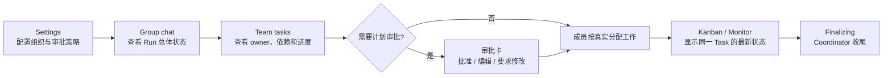

# Agent Org #272 最终前端 UI 审计

日期：2026-07-14
范围：本分支修改的 Agent Org Settings、Group chat overview、Plan approval、Task block、Kanban、Monitor 与中英文文案。
说明：仓库指定的 `frontend-ui-audit` skill 在 workspace 和用户目录均不存在，因此按 AGENTS.md 的同等检查项手工审计，没有伪称运行缺失 skill。

## 审计表

| Line                                          | Element                  | Verdict          | Reason                                                                                               | Suggested change |
| --------------------------------------------- | ------------------------ | ---------------- | ---------------------------------------------------------------------------------------------------- | ---------------- |
| `PlanApprovalPolicySelector.tsx`              | 审批策略                 | keep             | 使用现有 Select，typed 三选一；创建和编辑共用，不存在两套 UI。                                       | 无。             |
| `AgentOrgPlanApprovalCard.tsx`                | 用户审批卡               | keep             | 有 loading、disabled、空输入保护、`aria-label`、卡内错误和明确的批准/编辑/退回动作。                 | 无。             |
| `AgentOrgOverviewPanel.tsx`                   | Run 总览与 phase         | fixed            | Waiting for approval、Finalizing、Paused、Waiting for work 不再互相冒充；用户能看出系统为什么安静。  | 无。             |
| `OrgTaskBlock/index.tsx`                      | Task tool 结果           | fixed            | 可预期的权限/依赖纠正使用结构化 guidance，不再渲染成吓人的红色系统失败卡。                           | 无。             |
| `TodoKanban.tsx` + `orgTaskOutcome.ts`        | 看板状态                 | fixed            | Completed/Cancelled/Open 从真实 Task event 投影；同一任务后续事件覆盖旧状态，避免历史卡片永久 Open。 | 无。             |
| `AgentEventBubbles.tsx` / `MessageViewer.tsx` | 成员事件                 | keep             | 关键协作状态可读，内部恢复细节不作为普通失败轰炸用户。                                               | 无。             |
| Agent Org 创建/编辑成员选择                   | CLI member               | fixed            | 未完成的 CLI transport 从可运行选择中排除；旧定义仍能打开并删除。                                    | 无。             |
| `sessions.json` / `integrations.json`         | 中英文文案               | keep             | 新状态、审批、错误和策略说明中英文同步。                                                             | 无。             |
| Group chat E2E                                | rendered production path | keep             | Debug helper 只搭建前置数据；审批、暂停、恢复和任务展示通过真实 UI 操作验证。                        | 无。             |
| arbitrary styles / accessibility sweep        | 变更 TSX                 | keep with reason | 未新增另一套按钮、输入或选择器；没有发现任意色值/spacing 扩散；交互控件具备可访问名称和禁用态。      | 无。             |

## 用户现在看到的流程

## 统计

- fix：4
- keep：5
- keep with reason：1
- 需要抽象：0
- 未解决的阻塞级 UI 问题：0

结论：**可提交**。界面没有引入新的设计系统分叉；状态展示与后端事实对齐，等待审批、暂停和收尾都能用用户能理解的方式呈现。
