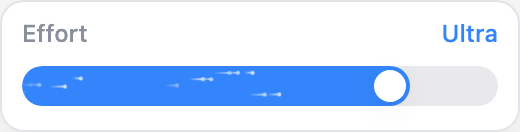
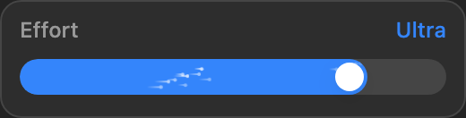
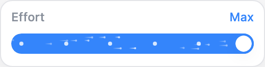

# EffortSlider UI audit

| Line                                                         | Element                                                 | Verdict          | Reason                                                                                                                                                                                                                                                                                                                                                                                                                                                                         | Suggested change |
| ------------------------------------------------------------ | ------------------------------------------------------- | ---------------- | ------------------------------------------------------------------------------------------------------------------------------------------------------------------------------------------------------------------------------------------------------------------------------------------------------------------------------------------------------------------------------------------------------------------------------------------------------------------------------ | ---------------- |
| `src/components/ModelPropertiesDropdown/EffortSlider.tsx:64` | Compact inline heading                                  | keep with reason | Effort and the selected level share one row with standard text, spacing, and color tokens. This compact control label intentionally replaces the taller standalone dropdown section heading. The complete effort section is 56px tall; unused Faster/Smarter copy remains removed in all 13 locales.                                                                                                                                                                           | None.            |
| `src/components/ModelPropertiesDropdown/EffortSlider.tsx:80` | Filled track and thumb                                  | keep with reason | Uses primary/fill/shadow tokens. The white thumb deliberately stays white in both themes to preserve contrast against the accent fill.                                                                                                                                                                                                                                                                                                                                         | None.            |
| `src/components/ModelPropertiesDropdown/EffortSlider.tsx:95` | Native range input                                      | keep with reason | No existing range primitive exists in the design system. Native range owns keyboard, pointer, touch, bounds, and focus. Decorative layers have no pointer or accessibility semantics; localized label and formatted level remain accessible.                                                                                                                                                                                                                                   | None.            |
| `src/components/ModelPropertiesDropdown/EffortSlider.scss:1` | Contained thumb, stage dots, and continuous comet field | keep with reason | A 16px thumb stays inset 2px inside the 20px rail at both endpoints, within a 28px interaction area. Stage dots align with discrete levels and appear during dragging. Per the user's clarification, 18 small particles continuously cross the fill while visible; Fast doubles their speed. Component-specific particle dimensions/phases are artwork, not missing design tokens. Reduced motion disables animation and transitions while retaining informational stage dots. | None.            |
| `src/components/ModelPropertiesDropdown/index.tsx:459`       | Shared variant-popover integration                      | keep with reason | All consumers use this one effort control. Fast speed reflects the reachable draft Fast variant; the Options heading is removed while Switch, Button, variant resolution, and Apply/Cancel behavior are unchanged.                                                                                                                                                                                                                                                             | None.            |

Verdict totals: **0 fix**, **5 keep with reason**, **0 abstract**.

Verification: 15 focused tests passed, changed-file ESLint and Sass compilation passed. Isolated Chromium checks measured the compact geometry, verified continuous movement of all 18 particles without dragging or Fast, and confirmed that Fast halves every particle's duration. Checks also exercised keyboard stepping, bidirectional mouse dragging, touch taps/swipe, focus styling, thumb containment, stage-dot alignment, narrow viewport layout, visibility gating, reduced motion, and three unmount/remount cycles. Light/dark screenshots of the production component were visually inspected in an isolated preview with representative theme variables. This is not a native Tauri screenshot or Core UI E2E run; native performance profiling remains unverified. The isolated PR checkout passes the full TypeScript check; unrelated Input/Textarea tests from the shared working tree are not part of this branch.

Visual evidence from the isolated production-component harness:

| Light                                            | Dark (Fast)                                    |
| ------------------------------------------------ | ---------------------------------------------- |
|  |  |

[Continuous Fast-mode recording](effort-slider/animation.webm). These previews use fixture translation/theme context; they are not native Tauri captures.
