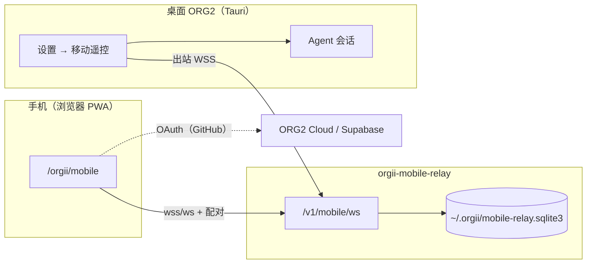

# Mobile Remote 开发与生产体验指南

> 面向同事快速上手 **移动遥控（Mobile Remote）** 功能。  
> 相关 PR：[#1150](https://github.com/org2AI/ORG2/pull/1150)（分支 `junyu/mobile-remote-control`）

Mobile Remote 让手机通过 PWA 遥控桌面 ORG2 上的 Agent 会话。桌面通过 **出站 WebSocket** 连接 Relay，手机经 Relay 与桌面通信，无需在路由器上开放入站端口。

---

## 架构概览



**三端职责：**

| 组件                            | 作用                                                |
| ------------------------------- | --------------------------------------------------- |
| **前端 dev server**（:1998）    | 提供桌面 UI 与 Mobile PWA（`/orgii/mobile`）        |
| **orgii-mobile-relay**（:8787） | 配对、设备授权、手机↔桌面消息转发（payload-opaque） |
| **Tauri 桌面**                  | 连接 Relay、生成配对码、执行 Agent 操作             |

---

## 前置条件

| 工具                             | 说明                                               |
| -------------------------------- | -------------------------------------------------- |
| [pnpm](https://pnpm.io/) 9.15    | `npm install -g pnpm@9.15`                         |
| [Rust](https://rustup.rs/) 1.85+ | `rustup toolchain install stable`                  |
| Node.js 20+                      | 与 [CONTRIBUTING](../.github/CONTRIBUTING.md) 一致 |
| **不需要 Xcode**                 | Mobile Remote 是浏览器 PWA，不是原生 iOS 应用      |

```bash
# 仓库根目录
pnpm install
```

---

## 本地开发（Development）

### 方式 A：一键启动（推荐初次体验）

```bash
pnpm run tauri:dev
```

`tauri:dev` 会启动前端 dev server 并打开 Tauri 桌面。macOS / Linux 默认使用 **rspack** bundler；Windows 默认 webpack。可用 `pnpm run tauri:dev:webpack` 强制 webpack。

### 方式 B：分终端启动（调试 Relay 时更清晰）

适合需要单独观察 relay 日志、或避免 Tauri 重复拉起 dev server 的场景。

**终端 1 — 前端 dev server：**

```bash
pnpm run dev:frontend
# 或 rspack：pnpm run dev:frontend:rspack
```

**终端 2 — 本地 Relay：**

```bash
cd src-tauri
ORGII_RELAY_DESKTOP_TOKEN=123456789012345678901234 cargo run -p orgii-mobile-relay
```

Relay 默认监听 `127.0.0.1:8787`，数据库写入 `~/.orgii/mobile-relay.sqlite3`（避免写在 `src-tauri/` 内触发 Tauri dev 文件监听导致桌面退出——此问题已在 PR 中修复）。

**终端 3 — 仅 Tauri 桌面（`beforeDevCommand` 置空模式）：**

```bash
pnpm run tauri:dev:only
```

`tauri:dev:only` 不会再次启动 webpack/rspack，需确保终端 1 的 dev server 已在运行。

### 访问 URL

| 用途                           | URL                                 |
| ------------------------------ | ----------------------------------- |
| 桌面 Web UI                    | http://localhost:1998/              |
| Mobile PWA（本机浏览器）       | http://localhost:1998/orgii/mobile  |
| Mobile PWA（手机，同一 Wi-Fi） | http://\<mac-ip\>:1998/orgii/mobile |

查看 Mac 局域网 IP：

```bash
ipconfig getifaddr en0   # Wi-Fi
# 或：系统设置 → 网络
```

> **提示：** dev server 默认绑定 `localhost`。若手机无法访问 Mac IP，可尝试在前端启动时增加 host 绑定（例如 webpack-dev-server 的 `--host 0.0.0.0`），并确认 Mac 防火墙允许入站 1998。

---

## 桌面配置（设置 → 移动遥控）

1. 打开 **设置 → 移动遥控**
2. 开启 **移动遥控**
3. 在 **户外连接** 区域：
   - 开启 **连接公网 Relay**（本地开发时也通过 relay 走完整配对流程）
   - 选择预设 **「本地」** → Relay 地址应为：
     ```
     ws://127.0.0.1:8787/v1/mobile/ws
     ```
   - **桌面访问密钥** 填写：
     ```
     123456789012345678901234
     ```
     必须与 relay 启动时的 `ORGII_RELAY_DESKTOP_TOKEN` **完全一致**（至少 24 字符）
4. 确认 **Relay 状态** 为「已连接」或「正在连接」
5. 点击 **生成户外配对码**，出现 QR 码与配对载荷文本

预设 URL 定义见 `src/config/mobileRemoteRelay.ts`。

---

## 手机端流程

### 1. 打开 PWA

在手机浏览器（Safari / Chrome）打开：

```
http://<mac-ip>:1998/orgii/mobile
```

本机调试可用 `http://localhost:1998/orgii/mobile`。

### 2. GitHub 登录

首次进入会要求 **使用 GitHub 继续**（ORG2 Cloud / Supabase OAuth）。

本地 dev 时，`scripts/dev/webpack-server.js`（及 `rspack-server.js`）内置了 `/v1/mobile/auth/session` stub，对 `POST` / `DELETE` 返回 `204`，无需真实后端即可完成登录流程调试。

### 3. 配对

1. 在欢迎页点击 **扫描或粘贴配对码**
2. 扫描桌面设置中的 QR，或粘贴 **配对载荷** 文本
3. 核对 **安全短语**（SAS）与桌面一致后，在桌面点击 **短语一致，确认配对**
4. 配对成功后，手机可查看会话列表并发送消息

---

## 快速上手 Checklist

- [ ] `pnpm install` 完成
- [ ] 前端 dev server 运行于 **:1998**（`pnpm run dev:frontend` 或 `pnpm run tauri:dev`）
- [ ] Relay 已启动，`ORGII_RELAY_DESKTOP_TOKEN` 已设置
- [ ] 桌面 **设置 → 移动遥控**：已开启、预设「本地」、token 与 relay 一致、Relay 已连接
- [ ] 桌面已 **生成户外配对码**
- [ ] 手机打开 `http://<host>:1998/orgii/mobile`，完成 GitHub 登录
- [ ] 手机扫码/粘贴配对码，桌面确认 SAS 短语
- [ ] 手机会话列表可见桌面 session

---

## 常见问题与排查

| 现象                                  | 可能原因                                                                         | 处理                                                                                                                       |
| ------------------------------------- | -------------------------------------------------------------------------------- | -------------------------------------------------------------------------------------------------------------------------- |
| `Connection refused` / 无法连接 Relay | dev server 或 relay 未启动                                                       | 确认终端 1（:1998）和终端 2（:8787）均在运行                                                                               |
| `invalid desktop token`               | 桌面密钥与 relay 不一致                                                          | 检查设置中的「桌面访问密钥」与 `ORGII_RELAY_DESKTOP_TOKEN` 完全相同                                                        |
| 选择「生产」预设后连接失败            | Relay 未连通或 **桌面访问密钥** 与 Workers 上 `ORGII_RELAY_DESKTOP_TOKEN` 不一致 | 确认预设地址为下文生产 URL；向部署负责人索取 token                                                                         |
| 配对后桌面意外退出                    | 旧版 relay DB 写在 `src-tauri/` 触发文件监听                                     | 已修复：DB 默认在 `~/.orgii/mobile-relay.sqlite3`；拉取最新分支即可                                                        |
| `/orgii/mobile` 显示桌面 UI           | dev bundler 未加载 mobile 入口                                                   | 确认使用 webpack/rspack 配置（含 `mobile` entry 与 `/orgii/mobile` → `mobile.html` rewrite）；勿用仅编译 `main` 的简化配置 |
| 手机打不开 Mac IP:1998                | dev server 只监听 localhost                                                      | 尝试 host `0.0.0.0` 绑定；检查防火墙与同一 Wi-Fi                                                                           |
| OAuth 登录卡住                        | dev stub 未生效                                                                  | 确认通过 `webpack-server.js` / `rspack-server.js` 启动，而非静态文件服务                                                   |

---

## 生产环境（Production）

### 当前已部署实例（Cloudflare Workers）

团队已在 Cloudflare Workers 上部署 `orgii-mobile-relay`，同时托管 **Mobile PWA** 静态资源与 **Relay WebSocket**。

| 用途                                | URL                                                                    |
| ----------------------------------- | ---------------------------------------------------------------------- |
| 健康检查                            | https://orgii-mobile-relay.superficial-jasper.workers.dev/healthz      |
| Mobile PWA（手机浏览器）            | https://orgii-mobile-relay.superficial-jasper.workers.dev/orgii/mobile |
| Relay WebSocket（桌面「生产」预设） | `wss://orgii-mobile-relay.superficial-jasper.workers.dev/v1/mobile/ws` |

探测结果（供参考）：

- `/healthz` 返回 `{"ok":true,"protocolVersion":1}`
- `/orgii/mobile` 返回 **200 `text/html`**，为打包后的 Mobile PWA 壳（`ORG2 Mobile Remote`），非重定向
- `/v1/mobile/ws` 在无会话时返回 **401** `auth_required`（说明 WebSocket 路径正确，需 OAuth / 桌面 token 后建连）

> **`relay.orgii.ai`** 仍为规划中的自定义域名，当前未作为默认预设；代码默认生产主机见 `src/config/mobileRemoteRelay.ts` 中的 `MOBILE_REMOTE_RELAY_PRODUCTION_HOST`。

### 桌面使用「生产」预设

1. **设置 → 移动遥控** → 开启移动遥控与 **连接公网 Relay**
2. 预设选择 **「生产」** → Relay 地址应为：
   ```
   wss://orgii-mobile-relay.superficial-jasper.workers.dev/v1/mobile/ws
   ```
3. **桌面访问密钥** 必须与 Workers 部署时配置的 **`ORGII_RELAY_DESKTOP_TOKEN`** 完全一致（≥24 字符）。该值在 Cloudflare Worker 的 **Secrets / 环境变量** 中设置，**不会**出现在仓库里；请向部署负责人索取，勿使用本地 dev 用的 `123456789012345678901234`（除非 Workers 上配置的正是该值）。
4. **生成户外配对码**，手机打开上表中的 **Mobile PWA** URL，GitHub 登录后扫码/粘贴配对。

本地联调仍请用 **「本地」** 预设与自启 relay，不必走 Workers。

### 自托管 Relay

Relay 实现位于 `src-tauri/crates/mobile-relay-server/`（crate 名 `orgii-mobile-relay`）。

**1. 构建并运行（需 TLS 终止，生产用 wss://）：**

```bash
cd src-tauri

# 必填：至少 24 字符
export ORGII_RELAY_DESKTOP_TOKEN="<your-secret-token>"

# 可选
export ORGII_RELAY_LISTEN="0.0.0.0:8787"
export ORGII_RELAY_PUBLIC_WS_URL="wss://relay.example.com/v1/mobile/ws"
export ORGII_RELAY_PUBLIC_APP_URL="https://relay.example.com/orgii/mobile"

cargo run -p orgii-mobile-relay --release
```

通常在前置反向代理（Caddy / nginx）后终止 TLS，对外暴露 `wss://`。

**2. 部署 Mobile PWA**

将包含 `mobile` entry 的前端构建产物部署到 HTTPS 域名，路径需支持 `/orgii/mobile`（与 `public/mobile.html` + history fallback 一致）。

**3. 桌面「生产」预设**

- Relay 地址：`wss://<your-relay-host>/v1/mobile/ws`
- 桌面访问密钥：与服务器 `ORGII_RELAY_DESKTOP_TOKEN` 一致

**4. 覆盖默认生产 Relay URL（构建时）**

若需指向其他 relay 主机（非默认 Workers 实例），在构建前端时设置：

```bash
REACT_APP_MOBILE_RELAY_PRODUCTION_URL=wss://your-relay.example.com/v1/mobile/ws pnpm build
```

定义见 `src/config/mobileRemoteRelay.ts`，rspack/webpack 均已透传该环境变量。

### 正式上线 checklist

- [ ] 部署 `orgii-mobile-relay`（TLS、持久化 `~/.orgii/` 或 `ORGII_RELAY_DATABASE`）
- [ ] （可选）自定义域名 CNAME 到 Workers（例如未来的 `relay.orgii.ai`）
- [ ] 配置强随机 `ORGII_RELAY_DESKTOP_TOKEN`（≥24 字符），桌面与服务器一致
- [ ] 部署 HTTPS 版 Mobile PWA（`/orgii/mobile`）
- [ ] 配置 `REACT_APP_MOBILE_RELAY_PRODUCTION_URL`（仅当默认 Workers URL 需覆盖时；仓库内无 `.env.example` 条目，见 `config/rspack.config.js` / `config/webpack.config.js` 透传）
- [ ] 端到端验证：配对 → SAS 确认 → 会话列表 → 发消息 / 停止 session

---

## 相关代码路径

| 路径                                                                    | 说明                                      |
| ----------------------------------------------------------------------- | ----------------------------------------- |
| `src/modules/MobileRemote/`                                             | Mobile PWA UI                             |
| `src/mobileRemoteEntry.tsx`                                             | PWA 入口（独立于桌面 `src/index.tsx`）    |
| `src/config/mobileRemoteRelay.ts`                                       | 本地/生产 Relay URL 预设                  |
| `src/modules/MainApp/Settings/sections/MobileRemoteSettingsSection.tsx` | 桌面设置 UI                               |
| `src-tauri/crates/mobile-relay-server/`                                 | Relay 服务                                |
| `config/webpack.config.js` / `config/rspack.config.js`                  | `mobile` entry 与 `/orgii/mobile` rewrite |
| `scripts/dev/webpack-server.js`                                         | dev auth session stub                     |

---

## 参考

- PR：[#1150 — Mobile Remote control](https://github.com/org2AI/ORG2/pull/1150)
- 通用开发环境：[CONTRIBUTING.md](../.github/CONTRIBUTING.md)
