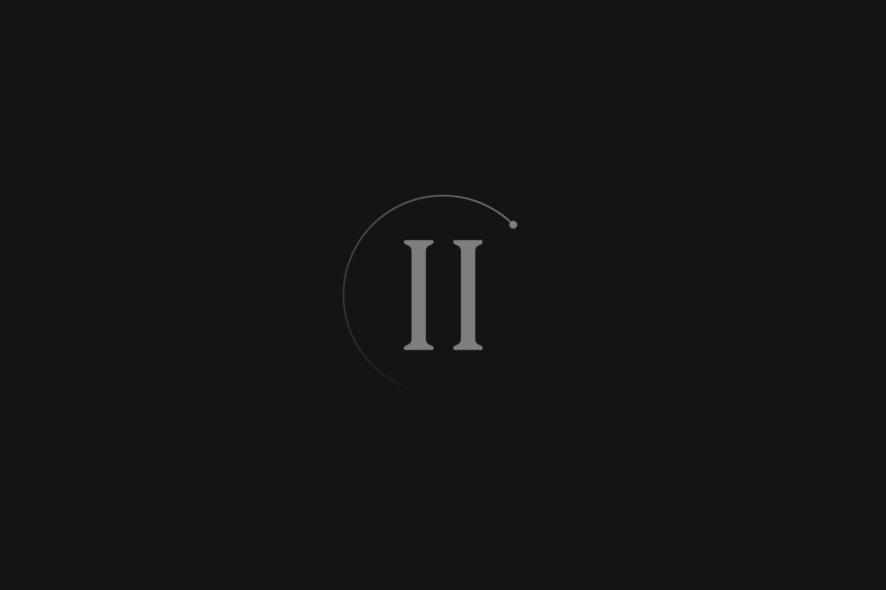
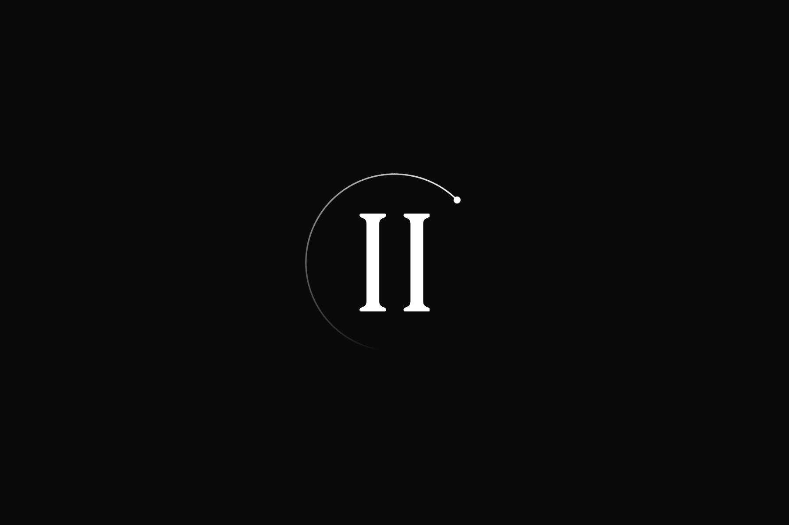
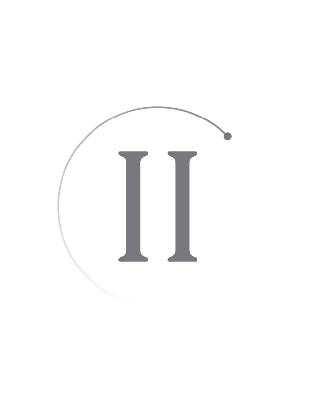
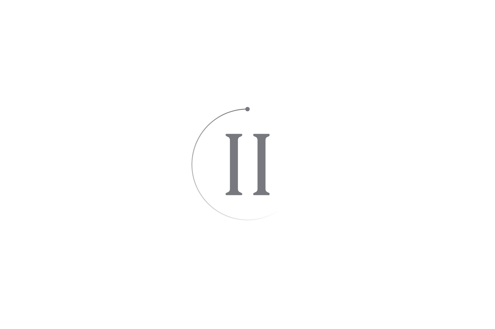
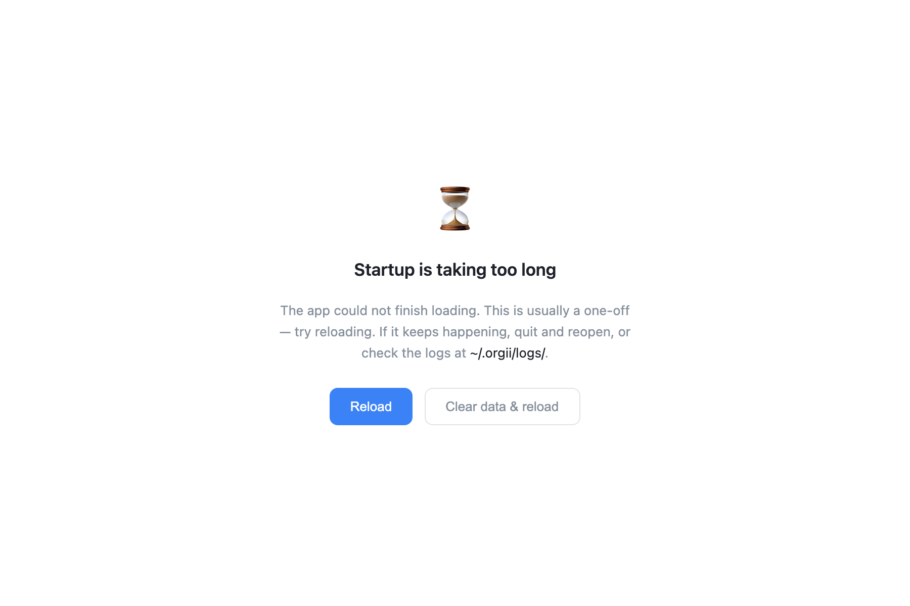

# Splash comet trail

Scope: `public/index.html`. A 216-degree (60%) fading stroke with an 8px round head rotates around the existing stationary splash glyph once every 1.8 seconds. The trail and head use pseudo-elements on the same animated parent, so the head adds no animation or lifecycle resource. Only the trail is masked, keeping the ball fully visible at the leading tip. The glyph, palette resolution, startup deadlines, and dismissal paths are unchanged.

| Area               | Verdict | Evidence                                                                                                     | Change or reason kept                                                                                                                         | Verification                                                                                                                                                                    |
| ------------------ | ------- | ------------------------------------------------------------------------------------------------------------ | --------------------------------------------------------------------------------------------------------------------------------------------- | ------------------------------------------------------------------------------------------------------------------------------------------------------------------------------- |
| Background work    | fix     | One CSS animation, one visibility listener, and one MutationObserver owned by the initial splash             | Pause while hidden; disconnect the observer and listener on removal, emergency hiding, or watchdog replacement; skip detached session windows | JSDOM visible/hidden/return checks, including initially hidden startup; five disposal cycles per exit path; headless Chromium reports zero document animations after each exit  |
| Memory             | keep    | Fixed-size decorative element and a constant number of lifecycle resources; no growing collections or caches | Observe only direct body children and the splash's own style/children, never the React subtree                                                | Instrumented listener and observer counts return to zero on all three exit paths, across five cycles each                                                                       |
| Scope/isolation    | keep    | Animation is local to the document and has no identity, network, or persistence state                        | Existing secondary-window preflight also suppresses the comet; no lifecycle resources are created there                                       | JSDOM verifies zero listeners/observers for a detached session; headless Chromium verifies no displayed comet or active animation                                               |
| Rendering/hot path | keep    | Static conic gradient and radial mask; only transform animates; no JavaScript frame loop                     | Preserve the stationary 112px glyph; disable animation for reduced motion                                                                     | Actual transform changes measured in headless Chromium across light, dark, high-contrast, and 320px-wide layouts; centered geometry and zero reduced-motion animations asserted |

Relevant lifecycle states covered: visible startup, initially hidden startup, hidden/visible return, normal first-paint removal, emergency hiding, watchdog error replacement, repeated disposal, and secondary-window suppression. Network, provider, account, endpoint, and session-data transitions do not apply to this decorative element.

Verification performed:

- `node --test scripts/dev/startup-watchdog.test.cjs`: all 9 existing startup checks passed
- `node /tmp/orgii-splash-comet-qa/verify-lifecycle.cjs`: visibility, disposal, watchdog replacement, and secondary-window checks passed against the actual HTML in JSDOM
- `node /tmp/orgii-splash-comet-qa/verify-render.cjs`: headless Chromium rendering, rotation, centered geometry, reduced motion, secondary-window suppression, and terminal animation cleanup passed; no browser JavaScript exceptions
- Headless screenshots inspected for light, dark, high-contrast, and narrow layouts
- `pnpm exec prettier public/index.html docs/org2-performance-guard-2026-08-31/SplashComet.md --check`: passed
- `git diff --check -- public/index.html docs/org2-performance-guard-2026-08-31/SplashComet.md`: passed

TypeScript, React, and Rust were not changed, so their compilation and lint suites were not run. The temporary verification scripts are not production dependencies. Screenshots below are review evidence captured from the PR worktree, not runtime assets. Native Tauri/WebKit visual behavior and CPU/RSS were not measured: desktop control was not authorized. Headless Chromium evidence does not establish native compositor cost or a performance improvement.

## Visual evidence

Headless Chromium screenshots of the actual splash HTML. The animated samples are frozen at the same point in the orbit for comparison. Reduced motion and the startup error panel are captured in their own states.

| Light                                          | Dark                                         |
| ---------------------------------------------- | -------------------------------------------- |
|  |  |

| High contrast                                                  | Narrow (320px viewport)                          |
| -------------------------------------------------------------- | ------------------------------------------------ |
|  |  |

| Reduced motion                                                          | Startup error                                                             |
| ----------------------------------------------------------------------- | ------------------------------------------------------------------------- |
|  |  |

Performance verdict: blocked for native performance validation only. Automated animation and resource-lifecycle checks pass; native visible/hidden CPU/RSS and WebKit rendering remain unverified. Implementation is complete without requiring desktop control.
