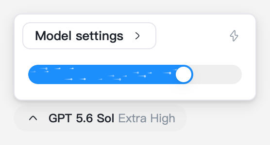
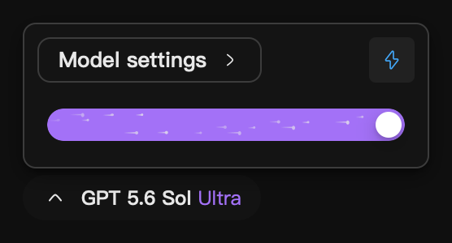
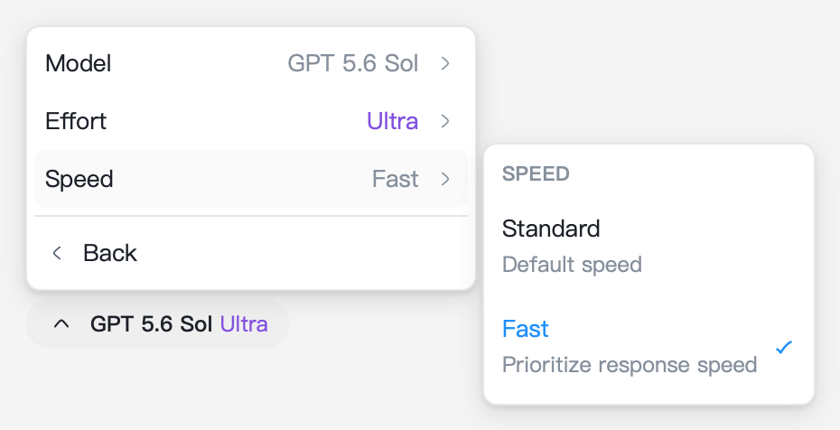
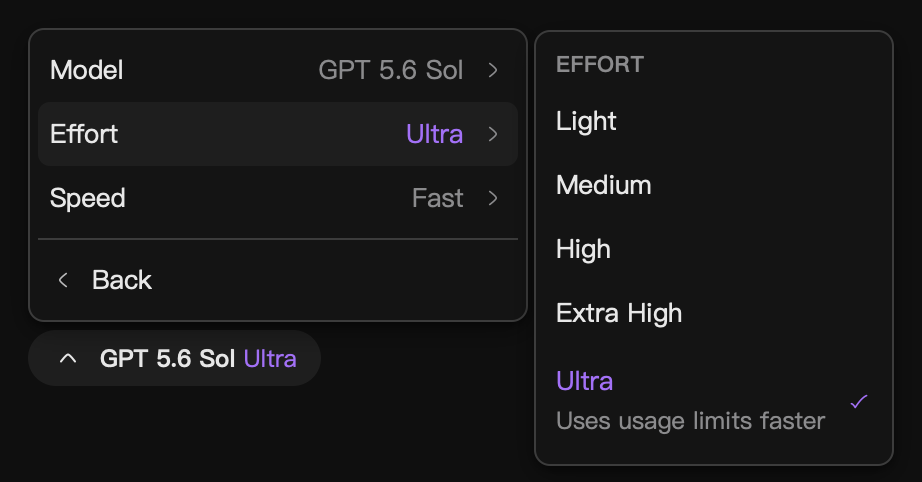
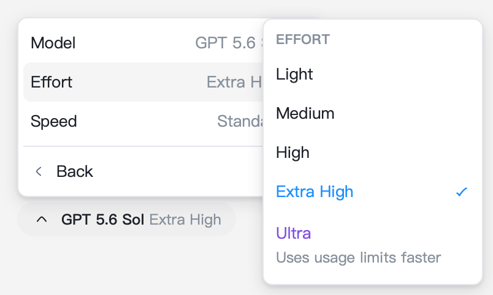

# Combined model settings verification

Scope: one model/effort pill for editable model families, its compact slider and detailed settings menu, and unchanged fallback controls for families without selectable levels.

## Automated checks

All 45 tests pass:

```sh
pnpm test src/components/ModelSelectorPill/ModelSelectorPill.test.ts src/components/Dropdown/ActionMenuSurface.test.ts src/components/ModelPropertiesDropdown/EffortSlider.test.ts src/components/ModelPropertiesDropdown/ModelPropertiesDropdown.test.ts src/components/SelectorPill/index.test.ts src/util/__tests__/variantEditOptions.test.ts src/components/Button/index.test.ts
```

Coverage includes the forwarded model-picker anchor, one transparent trigger with a leading icon swap, compact/detailed transitions, immediate effort/Fast application, unavailable Fast, preserved selected Max, purple Ultra, keyboard submenus and focus restoration, fallback controls, repeated listener/overlay cleanup, and the existing native slider gesture/visibility behavior.

## Rendered component checks

A temporary Playwright fixture bundles the production controls, dropdown engine, resolver, styles, and theme tokens. Account hooks, translation, and icon loading use deterministic fixtures. These are component checks, not the packaged Tauri application or a logged-in account.

Commands run from the isolated PR checkout:

```sh
node ../artifacts/verify-ui.cjs webkit
node ../artifacts/verify-ui.cjs chromium
```

Both engines pass native thumb dragging with an outside release, one save per gesture, range keyboard input, immediate Fast changes, purple Ultra, stable left alignment after label changes, mouse and keyboard flyouts, model-picker callback handoff, dismissal, and overlay disposal.

The fixture is a temporary verification artifact outside the repository. The following screenshots show the actual production components in that fixture.

### Compact controls





### Detailed controls





### Narrow viewport



At this width the flyout overlaps part of its parent to remain inside the viewport; the options remain selectable and keyboard/Escape navigation works.

## Limits

- Packaged Tauri, real account-default writes, and the full model palette after callback handoff were not exercised. Computer Use was not invoked.
- The settings popup renders synchronously from existing account metadata and adds no loading, empty, or error state. Tests cover the existing fallback when no levels are selectable.
- No dependencies, lockfiles, backend behavior, capability metadata, persistence format, or migrations change in this PR. The existing variant resolver and apply callback remain authoritative.
